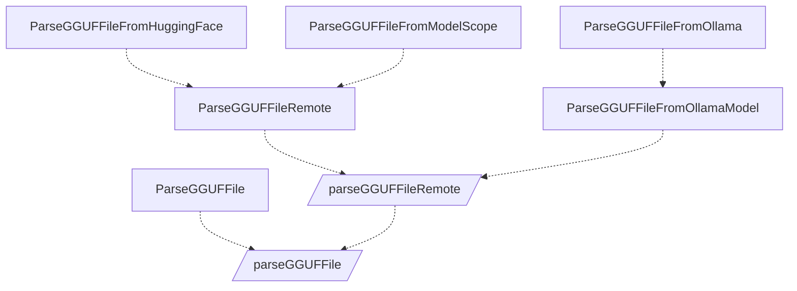

# GGUF Parser

> tl;dr, Go parser for the [GGUF](https://github.com/ggerganov/ggml/blob/master/docs/gguf.md).

[](https://goreportcard.com/report/github.com/thxcode/gguf-parser-go)
[](https://github.com/thxcode/gguf-parser-go/actions)
[](https://github.com/thxcode/gguf-parser-go#license)
[](https://github.com/thxcode/gguf-parser-go/releases)

[GGUF](https://github.com/ggerganov/ggml/blob/master/docs/gguf.md) is a file format for storing models for inference
with GGML and executors based on GGML. GGUF is a binary format that is designed for fast loading and saving of models,
and for ease of reading. Models are traditionally developed using PyTorch or another framework, and then converted to
GGUF for use in GGML.

GGUF Parser provides some functions to parse the GGUF file in Go for the following purposes:

- Read metadata from the GGUF file without downloading the whole model remotely.
- Estimate the model usage.

Import the package as below.

```shell
go get github.com/thxcode/gguf-parser-go
```

If you need one-shot command-line, try [gguf-parser](./cmd/gguf-parser) from [releases](https://github.com/thxCode/gguf-parser-go/releases) or `go install github.com/thxcode/gguf-parser-go/cmd/gguf-parser` from HEAD.

## Calls



## Examples

### Load model

```go
import (
    "github.com/davecgh/go-spew/spew"
    . "github.com/thxcode/gguf-parser-go"
)

f, err := ParseGGUFFile("path/to/model.gguf")
if err != nil {
    panic(err)
}

spew.Dump(f)

```

#### Use MMap

```go
f, err := ParseGGUFFile("path/to/model.gguf", UseMMap())
if err != nil {
    panic(err)
}

```

#### Skip large metadata

```go
f, err := ParseGGUFFile("path/to/model.gguf", SkipLargeMetadata())
if err != nil {
    panic(err)
}

```

### Load model from remote

```go
import (
    "context"
    "github.com/davecgh/go-spew/spew"
    . "github.com/thxcode/gguf-parser-go"
)

f, err := ParseGGUFFileRemote(context.Background(), "https://example.com/model.gguf")
if err != nil {
    panic(err)
}

spew.Dump(f)

```

#### Adjust requesting buffer size

```go
f, err := ParseGGUFFileRemote(context.Background(), "https://example.com/model.gguf", UseBufferSize(1 * 1024 * 1024) /* 1M */)
if err != nil {
    panic(err)
}

```

### View information

```go
// Model
spew.Dump(f.Model())

// Architecture
spew.Dump(f.Architecture())

// Tokenizer
spew.Dump(f.Tokenizer())

```

### Estimate usage in [llama.cpp](https://github.com/ggerganov/llama.cpp)

> The evaluation result is close to those run with `llama-cli`([examples/main/main.cpp](https://github.com/ggerganov/llama.cpp/blob/master/examples/main/main.cpp)).

```go
es := f.EstimateLLaMACppUsage()
spew.Dump(es)

// Since the estimated result is detail and lack of context,
// you can summarize the result as below.
s := es.Summarize(true /* load via mmap */, 0, 0 /* no unified memory RAM, VRAM footprint */)
spew.Dump(s)

```

#### Estimate with larger prompt

```go
es := f.EstimateLLaMACppUsage(WithContextSize(4096) /* Use 4k context */))
spew.Dump(es)

// Since the estimated result is detail and lack of context,
// you can summarize the result as below.
s := es.Summarize(true /* load via mmap */, 0, 0 /* no unified memory RAM, VRAM footprint */)
spew.Dump(s)

```

#### Estimate with specific offload layers

```go
es := f.EstimateLLaMACppUsage(WithOffloadLayers(10) /* Offload last 10 layers to GPU */))
spew.Dump(es)

// Since the estimated result is detail and lack of context,
// you can summarize the result as below.
s := es.Summarize(true /* load via mmap */, 0, 0 /* no unified memory RAM, VRAM footprint */)
spew.Dump(s)

```

## License

MIT
