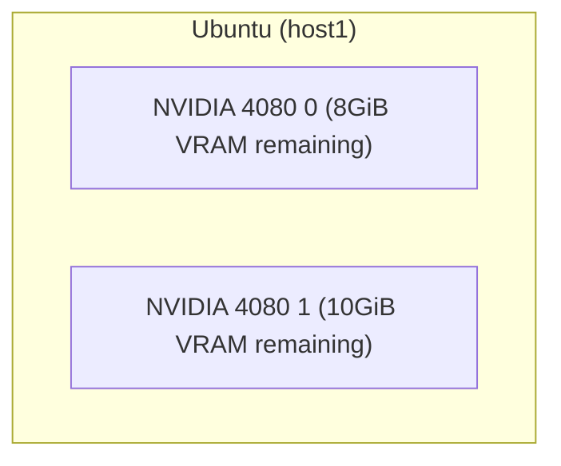

# GGUF Parser

> tl;dr, Review/Check [GGUF](https://github.com/ggerganov/ggml/blob/master/docs/gguf.md) files and estimate the memory
> usage.

[](https://goreportcard.com/report/github.com/gpustack/gguf-parser-go)
[](https://github.com/gpustack/gguf-parser-go/actions)
[](https://github.com/gpustack/gguf-parser-go#license)
[](https://github.com/gpustack/gguf-parser-go/releases)
[](https://hub.docker.com/r/gpustack/gguf-parser)
[](https://github.com/gpustack/gguf-parser-go/releases/latest)

[GGUF](https://github.com/ggerganov/ggml/blob/master/docs/gguf.md) is a file format for storing models for inference
with GGML and executors based on GGML. GGUF is a binary format that is designed for fast loading and saving of models,
and for ease of reading. Models are traditionally developed using PyTorch or another framework, and then converted to
GGUF for use in GGML.

GGUF Parser helps in reviewing and estimating the usage and maximum tokens per second of a GGUF format model without
download it.

## Key Features

- **No File Required**: GGUF Parser uses chunking reading to parse the metadata of remote GGUF file, which means you
  don't need to download the entire file and load it.
- **Accurate Prediction**: The evaluation results of GGUF Parser usually deviate from the actual usage by about 100MiB.
- **Quick Verification**: You can provide device metrics to calculate the maximum tokens per second (TPS) without
  running the model.
- **Type Screening**: GGUF Parser can distinguish what the GGUF file used for, such as Embedding, Reranking, LoRA, etc.
- **Fast**: GGUF Parser is written in Go, which is fast and efficient.

## Agenda

- [Notes](#notes)
- [Installation](#installation)
- [Overview](#overview)
    + [Parse](#parse)
        * [Local File](#parse-local-file)
        * [Remote File](#parse-remote-file)
        * [From HuggingFace](#parse-from-huggingface)
        * [From ModelScope](#parse-from-modelscope)
        * [From Ollama Library](#parse-from-ollama-library)
        * [Others](#others)
            * [Image Model](#parse-image-model)
            * [None Model](#parse-none-model)
    + [Estimate](#estimate)
        * [Across Multiple GPU devices](#across-multiple-gpu-devices)
        * [Maximum Tokens Per Second](#maximum-tokens-per-second)
        * [Full Layers Offload (default)](#full-layers-offload-default)
        * [Zero Layers Offload](#zero-layers-offload)
        * [Specific Layers Offload](#specific-layers-offload)
        * [Specific Context Size](#specific-context-size)
        * [Enable Flash Attention](#enable-flash-attention)
        * [Disable MMap](#disable-mmap)
        * [With Adapter](#with-adapter)
        * [Get Proper Offload Layers](#get-proper-offload-layers)

## Notes

- **Since v0.13.0 (BREAKING CHANGE)**, GGUF Parser can parse files
  for [StableDiffusion.Cpp](https://github.com/leejet/stable-diffusion.cpp) or StableDiffusion.Cpp like application.
- Experimentally, GGUF Parser can estimate the maximum tokens per second(`MAX TPS`) for a (V)LM model according to the
  `--device-metric` options.
- GGUF Parser distinguishes the remote devices from `--tensor-split` via `--rpc`.
    + For one host multiple GPU devices, you can use `--tensor-split` to get the estimated memory usage of each GPU.
    + For multiple hosts multiple GPU devices, you can use `--tensor-split` and `--rpc` to get the estimated memory
      usage of each GPU. Since v0.11.0, `--rpc` flag masks the devices specified by `--tensor-split` in front.
- Table result usage:
    + `DISTRIBUTABLE` indicates the GGUF file supports distribution inference or not, if the file doesn't support
      distribution inference, you can not offload it
      with [RPC servers](https://github.com/ggerganov/llama.cpp/tree/master/examples/rpc).
    + `RAM` indicates the system memory usage.
    + `VRAM *` indicates the local GPU memory usage.
    + `RPC * (V)RAM` indicates the remote memory usage. The kind of memory is determined by which backend the RPC server
      uses, check the running logs for more details.
    + `UMA` indicates the memory usage of Apple macOS only. `NONUMA` adapts to other cases, including none GPU devices.
    + `LAYERS`(`I`/`T`/`O`) indicates the count for input layers, transformer layers, and output layers. Input layers
      are not offloaded at present.

## Installation

Install from [releases](https://github.com/gpustack/gguf-parser-go/releases).

## Overview

### Parse

#### Parse Local File

```shell
$ gguf-parser --path="~/.cache/lm-studio/models/NousResearch/Hermes-2-Pro-Mistral-7B-GGUF/Hermes-2-Pro-Mistral-7B.Q5_K_M.gguf"
+-------------------------------------------------------------------------------------------+
| METADATA                                                                                  |
+-------+-------+-------+----------------+---------------+----------+------------+----------+
|  TYPE |  NAME |  ARCH |  QUANTIZATION  | LITTLE ENDIAN |   SIZE   | PARAMETERS |    BPW   |
+-------+-------+-------+----------------+---------------+----------+------------+----------+
| model | jeffq | llama | IQ3_XXS/Q5_K_M |      true     | 4.78 GiB |   7.24 B   | 5.67 bpw |
+-------+-------+-------+----------------+---------------+----------+------------+----------+

+---------------------------------------------------------------------------------------------------------------------------------------------------+
| ARCHITECTURE                                                                                                                                      |
+-----------------+---------------+---------------+------------------+--------------------+--------+------------------+------------+----------------+
| MAX CONTEXT LEN | EMBEDDING LEN | EMBEDDING GQA | ATTENTION CAUSAL | ATTENTION HEAD CNT | LAYERS | FEED FORWARD LEN | EXPERT CNT | VOCABULARY LEN |
+-----------------+---------------+---------------+------------------+--------------------+--------+------------------+------------+----------------+
|      32768      |      4096     |       4       |       true       |         32         |   32   |       14336      |      0     |      32032     |
+-----------------+---------------+---------------+------------------+--------------------+--------+------------------+------------+----------------+

+-------------------------------------------------------------------------------------------------------------------------------------------------------+
| TOKENIZER                                                                                                                                             |
+-------+-------------+------------+------------------+-----------+-----------+-----------+-----------+---------------+-----------------+---------------+
| MODEL | TOKENS SIZE | TOKENS LEN | ADDED TOKENS LEN | BOS TOKEN | EOS TOKEN | EOT TOKEN | EOM TOKEN | UNKNOWN TOKEN | SEPARATOR TOKEN | PADDING TOKEN |
+-------+-------------+------------+------------------+-----------+-----------+-----------+-----------+---------------+-----------------+---------------+
| llama |  450.50 KiB |    32032   |        N/A       |     1     |   32000   |    N/A    |    N/A    |      N/A      |       N/A       |      N/A      |
+-------+-------------+------------+------------------+-----------+-----------+-----------+-----------+---------------+-----------------+---------------+

+-----------------------------------------------------------------------------------------------------------------------------------------------------------------------------------------------------------------------------------------------+
| ESTIMATE                                                                                                                                                                                                                                      |
+-------+--------------+--------------------+-----------------+-----------+----------------+-------------+---------------+----------------+----------------+----------------------------------------------+-------------------------------------+
|  ARCH | CONTEXT SIZE | BATCH SIZE (L / P) | FLASH ATTENTION | MMAP LOAD | EMBEDDING ONLY |  RERANKING  | DISTRIBUTABLE | OFFLOAD LAYERS | FULL OFFLOADED |                      RAM                     |                VRAM 0               |
|       |              |                    |                 |           |                |             |               |                |                +--------------------+------------+------------+----------------+--------+-----------+
|       |              |                    |                 |           |                |             |               |                |                | LAYERS (I + T + O) |     UMA    |   NONUMA   | LAYERS (T + O) |   UMA  |   NONUMA  |
+-------+--------------+--------------------+-----------------+-----------+----------------+-------------+---------------+----------------+----------------+--------------------+------------+------------+----------------+--------+-----------+
| llama |     32768    |     2048 / 512     |     Disabled    |  Enabled  |       No       | Unsupported |   Supported   |   33 (32 + 1)  |       Yes      |      1 + 0 + 0     | 168.25 MiB | 318.25 MiB |     32 + 1     |  4 GiB | 11.16 GiB |
+-------+--------------+--------------------+-----------------+-----------+----------------+-------------+---------------+----------------+----------------+--------------------+------------+------------+----------------+--------+-----------+

$ # Retrieve the model's metadata via split file,
$ # which needs all split files has been downloaded.
$ gguf-parser --path="~/.cache/lm-studio/models/Qwen/Qwen2-72B-Instruct-GGUF/qwen2-72b-instruct-q6_k-00001-of-00002.gguf"
+------------------------------------------------------------------------------------------------------------+
| METADATA                                                                                                   |
+-------+-------------------------+-------+--------------+---------------+-----------+------------+----------+
|  TYPE |           NAME          |  ARCH | QUANTIZATION | LITTLE ENDIAN |    SIZE   | PARAMETERS |    BPW   |
+-------+-------------------------+-------+--------------+---------------+-----------+------------+----------+
| model | 72b.5000B--cmix31-ba... | qwen2 |  IQ1_S/Q6_K  |      true     | 59.92 GiB |   72.71 B  | 7.08 bpw |
+-------+-------------------------+-------+--------------+---------------+-----------+------------+----------+

+---------------------------------------------------------------------------------------------------------------------------------------------------+
| ARCHITECTURE                                                                                                                                      |
+-----------------+---------------+---------------+------------------+--------------------+--------+------------------+------------+----------------+
| MAX CONTEXT LEN | EMBEDDING LEN | EMBEDDING GQA | ATTENTION CAUSAL | ATTENTION HEAD CNT | LAYERS | FEED FORWARD LEN | EXPERT CNT | VOCABULARY LEN |
+-----------------+---------------+---------------+------------------+--------------------+--------+------------------+------------+----------------+
|      32768      |      8192     |       8       |       true       |         64         |   80   |       29568      |      0     |     152064     |
+-----------------+---------------+---------------+------------------+--------------------+--------+------------------+------------+----------------+

+-------------------------------------------------------------------------------------------------------------------------------------------------------+
| TOKENIZER                                                                                                                                             |
+-------+-------------+------------+------------------+-----------+-----------+-----------+-----------+---------------+-----------------+---------------+
| MODEL | TOKENS SIZE | TOKENS LEN | ADDED TOKENS LEN | BOS TOKEN | EOS TOKEN | EOT TOKEN | EOM TOKEN | UNKNOWN TOKEN | SEPARATOR TOKEN | PADDING TOKEN |
+-------+-------------+------------+------------------+-----------+-----------+-----------+-----------+---------------+-----------------+---------------+
|  gpt2 |   2.47 MiB  |   152064   |        N/A       |   151643  |   151645  |    N/A    |    N/A    |      N/A      |       N/A       |     151643    |
+-------+-------------+------------+------------------+-----------+-----------+-----------+-----------+---------------+-----------------+---------------+

+-----------------------------------------------------------------------------------------------------------------------------------------------------------------------------------------------------------------------------------------------+
| ESTIMATE                                                                                                                                                                                                                                      |
+-------+--------------+--------------------+-----------------+-----------+----------------+-------------+---------------+----------------+----------------+----------------------------------------------+-------------------------------------+
|  ARCH | CONTEXT SIZE | BATCH SIZE (L / P) | FLASH ATTENTION | MMAP LOAD | EMBEDDING ONLY |  RERANKING  | DISTRIBUTABLE | OFFLOAD LAYERS | FULL OFFLOADED |                      RAM                     |                VRAM 0               |
|       |              |                    |                 |           |                |             |               |                |                +--------------------+------------+------------+----------------+--------+-----------+
|       |              |                    |                 |           |                |             |               |                |                | LAYERS (I + T + O) |     UMA    |   NONUMA   | LAYERS (T + O) |   UMA  |   NONUMA  |
+-------+--------------+--------------------+-----------------+-----------+----------------+-------------+---------------+----------------+----------------+--------------------+------------+------------+----------------+--------+-----------+
| qwen2 |     32768    |     2048 / 512     |     Disabled    |  Enabled  |       No       | Unsupported |  Unsupported  |   81 (80 + 1)  |       Yes      |      1 + 0 + 0     | 291.38 MiB | 441.38 MiB |     80 + 1     | 10 GiB | 73.47 GiB |
+-------+--------------+--------------------+-----------------+-----------+----------------+-------------+---------------+----------------+----------------+--------------------+------------+------------+----------------+--------+-----------+

```

#### Parse Remote File

```shell
$ gguf-parser --url="https://huggingface.co/NousResearch/Nous-Hermes-2-Mixtral-8x7B-DPO-GGUF/resolve/main/Nous-Hermes-2-Mixtral-8x7B-DPO.Q3_K_M.gguf"
+------------------------------------------------------------------------------------------+
| METADATA                                                                                 |
+-------+----------+-------+--------------+---------------+--------+------------+----------+
|  TYPE |   NAME   |  ARCH | QUANTIZATION | LITTLE ENDIAN |  SIZE  | PARAMETERS |    BPW   |
+-------+----------+-------+--------------+---------------+--------+------------+----------+
| model | emozilla | llama |  Q4_K/Q3_K_M |      true     | 21 GiB |   46.70 B  | 3.86 bpw |
+-------+----------+-------+--------------+---------------+--------+------------+----------+

+---------------------------------------------------------------------------------------------------------------------------------------------------+
| ARCHITECTURE                                                                                                                                      |
+-----------------+---------------+---------------+------------------+--------------------+--------+------------------+------------+----------------+
| MAX CONTEXT LEN | EMBEDDING LEN | EMBEDDING GQA | ATTENTION CAUSAL | ATTENTION HEAD CNT | LAYERS | FEED FORWARD LEN | EXPERT CNT | VOCABULARY LEN |
+-----------------+---------------+---------------+------------------+--------------------+--------+------------------+------------+----------------+
|      32768      |      4096     |       4       |       true       |         32         |   32   |       14336      |      8     |      32002     |
+-----------------+---------------+---------------+------------------+--------------------+--------+------------------+------------+----------------+

+-------------------------------------------------------------------------------------------------------------------------------------------------------+
| TOKENIZER                                                                                                                                             |
+-------+-------------+------------+------------------+-----------+-----------+-----------+-----------+---------------+-----------------+---------------+
| MODEL | TOKENS SIZE | TOKENS LEN | ADDED TOKENS LEN | BOS TOKEN | EOS TOKEN | EOT TOKEN | EOM TOKEN | UNKNOWN TOKEN | SEPARATOR TOKEN | PADDING TOKEN |
+-------+-------------+------------+------------------+-----------+-----------+-----------+-----------+---------------+-----------------+---------------+
| llama |  449.91 KiB |    32002   |        N/A       |     1     |   32000   |    N/A    |    N/A    |       0       |       N/A       |       2       |
+-------+-------------+------------+------------------+-----------+-----------+-----------+-----------+---------------+-----------------+---------------+

+----------------------------------------------------------------------------------------------------------------------------------------------------------------------------------------------------------------------------------------------------+
| ESTIMATE                                                                                                                                                                                                                                           |
+-------+--------------+--------------------+-----------------+-------------+----------------+-------------+---------------+----------------+----------------+----------------------------------------------+----------------------------------------+
|  ARCH | CONTEXT SIZE | BATCH SIZE (L / P) | FLASH ATTENTION |  MMAP LOAD  | EMBEDDING ONLY |  RERANKING  | DISTRIBUTABLE | OFFLOAD LAYERS | FULL OFFLOADED |                      RAM                     |                 VRAM 0                 |
|       |              |                    |                 |             |                |             |               |                |                +--------------------+------------+------------+----------------+-----------+-----------+
|       |              |                    |                 |             |                |             |               |                |                | LAYERS (I + T + O) |     UMA    |   NONUMA   | LAYERS (T + O) |    UMA    |   NONUMA  |
+-------+--------------+--------------------+-----------------+-------------+----------------+-------------+---------------+----------------+----------------+--------------------+------------+------------+----------------+-----------+-----------+
| llama |     32768    |     2048 / 512     |     Disabled    | Unsupported |       No       | Unsupported |   Supported   |   33 (32 + 1)  |       Yes      |      1 + 0 + 0     | 269.10 MiB | 419.10 MiB |     32 + 1     | 24.94 GiB | 27.41 GiB |
+-------+--------------+--------------------+-----------------+-------------+----------------+-------------+---------------+----------------+----------------+--------------------+------------+------------+----------------+-----------+-----------+

$ # Retrieve the model's metadata via split file

$ gguf-parser --url="https://huggingface.co/MaziyarPanahi/Meta-Llama-3.1-405B-Instruct-GGUF/resolve/main/Meta-Llama-3.1-405B-Instruct.Q2_K.gguf-00001-of-00009.gguf"
+-------------------------------------------------------------------------------------------------------------+
| METADATA                                                                                                    |
+-------+-------------------------+-------+--------------+---------------+------------+------------+----------+
|  TYPE |           NAME          |  ARCH | QUANTIZATION | LITTLE ENDIAN |    SIZE    | PARAMETERS |    BPW   |
+-------+-------------------------+-------+--------------+---------------+------------+------------+----------+
| model | Models Meta Llama Me... | llama |     Q2_K     |      true     | 140.81 GiB |  410.08 B  | 2.95 bpw |
+-------+-------------------------+-------+--------------+---------------+------------+------------+----------+

+---------------------------------------------------------------------------------------------------------------------------------------------------+
| ARCHITECTURE                                                                                                                                      |
+-----------------+---------------+---------------+------------------+--------------------+--------+------------------+------------+----------------+
| MAX CONTEXT LEN | EMBEDDING LEN | EMBEDDING GQA | ATTENTION CAUSAL | ATTENTION HEAD CNT | LAYERS | FEED FORWARD LEN | EXPERT CNT | VOCABULARY LEN |
+-----------------+---------------+---------------+------------------+--------------------+--------+------------------+------------+----------------+
|      131072     |     16384     |       8       |       true       |         128        |   126  |       53248      |      0     |     128256     |
+-----------------+---------------+---------------+------------------+--------------------+--------+------------------+------------+----------------+

+-------------------------------------------------------------------------------------------------------------------------------------------------------+
| TOKENIZER                                                                                                                                             |
+-------+-------------+------------+------------------+-----------+-----------+-----------+-----------+---------------+-----------------+---------------+
| MODEL | TOKENS SIZE | TOKENS LEN | ADDED TOKENS LEN | BOS TOKEN | EOS TOKEN | EOT TOKEN | EOM TOKEN | UNKNOWN TOKEN | SEPARATOR TOKEN | PADDING TOKEN |
+-------+-------------+------------+------------------+-----------+-----------+-----------+-----------+---------------+-----------------+---------------+
|  gpt2 |    2 MiB    |   128256   |        N/A       |   128000  |   128009  |    N/A    |    N/A    |      N/A      |       N/A       |      N/A      |
+-------+-------------+------------+------------------+-----------+-----------+-----------+-----------+---------------+-----------------+---------------+

+-------------------------------------------------------------------------------------------------------------------------------------------------------------------------------------------------------------------------------------------------+
| ESTIMATE                                                                                                                                                                                                                                        |
+-------+--------------+--------------------+-----------------+-----------+----------------+-------------+---------------+----------------+----------------+----------------------------------------------+---------------------------------------+
|  ARCH | CONTEXT SIZE | BATCH SIZE (L / P) | FLASH ATTENTION | MMAP LOAD | EMBEDDING ONLY |  RERANKING  | DISTRIBUTABLE | OFFLOAD LAYERS | FULL OFFLOADED |                      RAM                     |                 VRAM 0                |
|       |              |                    |                 |           |                |             |               |                |                +--------------------+------------+------------+----------------+---------+------------+
|       |              |                    |                 |           |                |             |               |                |                | LAYERS (I + T + O) |     UMA    |   NONUMA   | LAYERS (T + O) |   UMA   |   NONUMA   |
+-------+--------------+--------------------+-----------------+-----------+----------------+-------------+---------------+----------------+----------------+--------------------+------------+------------+----------------+---------+------------+
| llama |    131072    |     2048 / 512     |     Disabled    |  Enabled  |       No       | Unsupported |   Supported   |  127 (126 + 1) |       Yes      |      1 + 0 + 0     | 652.53 MiB | 802.53 MiB |     126 + 1    | 126 GiB | 299.79 GiB |
+-------+--------------+--------------------+-----------------+-----------+----------------+-------------+---------------+----------------+----------------+--------------------+------------+------------+----------------+---------+------------+

```

#### Parse From HuggingFace

> [!NOTE]
>
> Allow using `HF_ENDPOINT` to override the default HuggingFace endpoint: `https://huggingface.co`.

```shell
$ gguf-parser --hf-repo="bartowski/Qwen2-VL-2B-Instruct-GGUF" --hf-file="Qwen2-VL-2B-Instruct-f16.gguf" --hf-mmproj-file="mmproj-Qwen2-VL-2B-Instruct-f32.gguf" --visual-max-image-size 1344
+-----------------------------------------------------------------------------------------------------------+
| METADATA                                                                                                  |
+-------+----------------------+---------+--------------+---------------+----------+------------+-----------+
|  TYPE |         NAME         |   ARCH  | QUANTIZATION | LITTLE ENDIAN |   SIZE   | PARAMETERS |    BPW    |
+-------+----------------------+---------+--------------+---------------+----------+------------+-----------+
| model | Qwen2 VL 2B Instruct | qwen2vl |      F16     |      true     | 2.88 GiB |   1.54 B   | 16.00 bpw |
+-------+----------------------+---------+--------------+---------------+----------+------------+-----------+

+---------------------------------------------------------------------------------------------------------------------------------------------------+
| ARCHITECTURE                                                                                                                                      |
+-----------------+---------------+---------------+------------------+--------------------+--------+------------------+------------+----------------+
| MAX CONTEXT LEN | EMBEDDING LEN | EMBEDDING GQA | ATTENTION CAUSAL | ATTENTION HEAD CNT | LAYERS | FEED FORWARD LEN | EXPERT CNT | VOCABULARY LEN |
+-----------------+---------------+---------------+------------------+--------------------+--------+------------------+------------+----------------+
|      32768      |      1536     |       6       |       true       |         12         |   28   |       8960       |      0     |     151936     |
+-----------------+---------------+---------------+------------------+--------------------+--------+------------------+------------+----------------+

+-------------------------------------------------------------------------------------------------------------------------------------------------------+
| TOKENIZER                                                                                                                                             |
+-------+-------------+------------+------------------+-----------+-----------+-----------+-----------+---------------+-----------------+---------------+
| MODEL | TOKENS SIZE | TOKENS LEN | ADDED TOKENS LEN | BOS TOKEN | EOS TOKEN | EOT TOKEN | EOM TOKEN | UNKNOWN TOKEN | SEPARATOR TOKEN | PADDING TOKEN |
+-------+-------------+------------+------------------+-----------+-----------+-----------+-----------+---------------+-----------------+---------------+
|  gpt2 |   2.47 MiB  |   151936   |        N/A       |   151643  |   151645  |    N/A    |    N/A    |      N/A      |       N/A       |     151643    |
+-------+-------------+------------+------------------+-----------+-----------+-----------+-----------+---------------+-----------------+---------------+

+---------------------------------------------------------------------------------------------------------------------------------------------------------------------------------------------------------------------------------------------------+
| ESTIMATE                                                                                                                                                                                                                                          |
+---------+--------------+--------------------+-----------------+-----------+----------------+-------------+---------------+----------------+----------------+--------------------------------------------+-----------------------------------------+
|   ARCH  | CONTEXT SIZE | BATCH SIZE (L / P) | FLASH ATTENTION | MMAP LOAD | EMBEDDING ONLY |  RERANKING  | DISTRIBUTABLE | OFFLOAD LAYERS | FULL OFFLOADED |                     RAM                    |                  VRAM 0                 |
|         |              |                    |                 |           |                |             |               |                |                +--------------------+----------+------------+----------------+------------+-----------+
|         |              |                    |                 |           |                |             |               |                |                | LAYERS (I + T + O) |    UMA   |   NONUMA   | LAYERS (T + O) |     UMA    |   NONUMA  |
+---------+--------------+--------------------+-----------------+-----------+----------------+-------------+---------------+----------------+----------------+--------------------+----------+------------+----------------+------------+-----------+
| qwen2vl |     32768    |     2048 / 512     |     Disabled    |  Enabled  |       No       | Unsupported |   Supported   |   29 (28 + 1)  |       Yes      |      1 + 0 + 0     | 2.66 GiB | 334.55 MiB |     28 + 1     | 896.59 MiB | 12.63 GiB |
+---------+--------------+--------------------+-----------------+-----------+----------------+-------------+---------------+----------------+----------------+--------------------+----------+------------+----------------+------------+-----------+


$ # Retrieve the model's metadata via split file

$ gguf-parser --hf-repo="etemiz/Llama-3.1-405B-Inst-GGUF" --hf-file="llama-3.1-405b-IQ1_M-00019-of-00019.gguf"
+------------------------------------------------------------------------------------------------------------+
| METADATA                                                                                                   |
+-------+-------------------------+-------+--------------+---------------+-----------+------------+----------+
|  TYPE |           NAME          |  ARCH | QUANTIZATION | LITTLE ENDIAN |    SIZE   | PARAMETERS |    BPW   |
+-------+-------------------------+-------+--------------+---------------+-----------+------------+----------+
| model | Meta-Llama-3.1-405B-... | llama |     IQ1_M    |      true     | 88.61 GiB |  410.08 B  | 1.86 bpw |
+-------+-------------------------+-------+--------------+---------------+-----------+------------+----------+

+---------------------------------------------------------------------------------------------------------------------------------------------------+
| ARCHITECTURE                                                                                                                                      |
+-----------------+---------------+---------------+------------------+--------------------+--------+------------------+------------+----------------+
| MAX CONTEXT LEN | EMBEDDING LEN | EMBEDDING GQA | ATTENTION CAUSAL | ATTENTION HEAD CNT | LAYERS | FEED FORWARD LEN | EXPERT CNT | VOCABULARY LEN |
+-----------------+---------------+---------------+------------------+--------------------+--------+------------------+------------+----------------+
|      131072     |     16384     |       8       |       true       |         128        |   126  |       53248      |      0     |     128256     |
+-----------------+---------------+---------------+------------------+--------------------+--------+------------------+------------+----------------+

+-------------------------------------------------------------------------------------------------------------------------------------------------------+
| TOKENIZER                                                                                                                                             |
+-------+-------------+------------+------------------+-----------+-----------+-----------+-----------+---------------+-----------------+---------------+
| MODEL | TOKENS SIZE | TOKENS LEN | ADDED TOKENS LEN | BOS TOKEN | EOS TOKEN | EOT TOKEN | EOM TOKEN | UNKNOWN TOKEN | SEPARATOR TOKEN | PADDING TOKEN |
+-------+-------------+------------+------------------+-----------+-----------+-----------+-----------+---------------+-----------------+---------------+
|  gpt2 |    2 MiB    |   128256   |        N/A       |   128000  |   128009  |    N/A    |    N/A    |      N/A      |       N/A       |      N/A      |
+-------+-------------+------------+------------------+-----------+-----------+-----------+-----------+---------------+-----------------+---------------+

+-----------------------------------------------------------------------------------------------------------------------------------------------------------------------------------------------------------------------------------+
| ESTIMATE                                                                                                                                                                                                                          |
+-------+--------------+--------------------+-----------------+-----------+----------------+---------------+----------------+----------------+----------------------------------------------+---------------------------------------+
|  ARCH | CONTEXT SIZE | BATCH SIZE (L / P) | FLASH ATTENTION | MMAP LOAD | EMBEDDING ONLY | DISTRIBUTABLE | OFFLOAD LAYERS | FULL OFFLOADED |                      RAM                     |                 VRAM 0                |
|       |              |                    |                 |           |                |               |                |                +--------------------+------------+------------+----------------+---------+------------+
|       |              |                    |                 |           |                |               |                |                | LAYERS (I + T + O) |     UMA    |   NONUMA   | LAYERS (T + O) |   UMA   |   NONUMA   |
+-------+--------------+--------------------+-----------------+-----------+----------------+---------------+----------------+----------------+--------------------+------------+------------+----------------+---------+------------+
| llama |    131072    |     2048 / 512     |     Disabled    |  Enabled  |       No       |   Supported   |  127 (126 + 1) |       Yes      |      1 + 0 + 0     | 652.53 MiB | 802.53 MiB |     126 + 1    | 126 GiB | 247.59 GiB |
+-------+--------------+--------------------+-----------------+-----------+----------------+---------------+----------------+----------------+--------------------+------------+------------+----------------+---------+------------+

```

#### Parse From ModelScope

> [!NOTE]
>
> Allow using `MS_ENDPOINT` to override the default ModelScope endpoint: `https://modelscope.cn`.

```shell
$ gguf-parser --ms-repo="shaowenchen/chinese-alpaca-2-13b-16k-gguf" --ms-file="chinese-alpaca-2-13b-16k.Q5_K.gguf"
+------------------------------------------------------------------------------------------+
| METADATA                                                                                 |
+-------+------+-------+----------------+---------------+----------+------------+----------+
|  TYPE | NAME |  ARCH |  QUANTIZATION  | LITTLE ENDIAN |   SIZE   | PARAMETERS |    BPW   |
+-------+------+-------+----------------+---------------+----------+------------+----------+
| model |  ..  | llama | IQ3_XXS/Q5_K_M |      true     | 8.76 GiB |   13.25 B  | 5.68 bpw |
+-------+------+-------+----------------+---------------+----------+------------+----------+

+---------------------------------------------------------------------------------------------------------------------------------------------------+
| ARCHITECTURE                                                                                                                                      |
+-----------------+---------------+---------------+------------------+--------------------+--------+------------------+------------+----------------+
| MAX CONTEXT LEN | EMBEDDING LEN | EMBEDDING GQA | ATTENTION CAUSAL | ATTENTION HEAD CNT | LAYERS | FEED FORWARD LEN | EXPERT CNT | VOCABULARY LEN |
+-----------------+---------------+---------------+------------------+--------------------+--------+------------------+------------+----------------+
|      16384      |      5120     |       1       |       true       |         N/A        |   40   |       13824      |      0     |      55296     |
+-----------------+---------------+---------------+------------------+--------------------+--------+------------------+------------+----------------+

+-------------------------------------------------------------------------------------------------------------------------------------------------------+
| TOKENIZER                                                                                                                                             |
+-------+-------------+------------+------------------+-----------+-----------+-----------+-----------+---------------+-----------------+---------------+
| MODEL | TOKENS SIZE | TOKENS LEN | ADDED TOKENS LEN | BOS TOKEN | EOS TOKEN | EOT TOKEN | EOM TOKEN | UNKNOWN TOKEN | SEPARATOR TOKEN | PADDING TOKEN |
+-------+-------------+------------+------------------+-----------+-----------+-----------+-----------+---------------+-----------------+---------------+
| llama |  769.83 KiB |    55296   |        N/A       |     1     |     2     |    N/A    |    N/A    |      N/A      |       N/A       |      N/A      |
+-------+-------------+------------+------------------+-----------+-----------+-----------+-----------+---------------+-----------------+---------------+

+--------------------------------------------------------------------------------------------------------------------------------------------------------------------------------------------------------------------------------------------------+
| ESTIMATE                                                                                                                                                                                                                                         |
+-------+--------------+--------------------+-----------------+-----------+----------------+-------------+---------------+----------------+----------------+----------------------------------------------+----------------------------------------+
|  ARCH | CONTEXT SIZE | BATCH SIZE (L / P) | FLASH ATTENTION | MMAP LOAD | EMBEDDING ONLY |  RERANKING  | DISTRIBUTABLE | OFFLOAD LAYERS | FULL OFFLOADED |                      RAM                     |                 VRAM 0                 |
|       |              |                    |                 |           |                |             |               |                |                +--------------------+------------+------------+----------------+-----------+-----------+
|       |              |                    |                 |           |                |             |               |                |                | LAYERS (I + T + O) |     UMA    |   NONUMA   | LAYERS (T + O) |    UMA    |   NONUMA  |
+-------+--------------+--------------------+-----------------+-----------+----------------+-------------+---------------+----------------+----------------+--------------------+------------+------------+----------------+-----------+-----------+
| llama |     16384    |     2048 / 512     |     Disabled    |  Enabled  |       No       | Unsupported |   Supported   |   41 (40 + 1)  |       Yes      |      1 + 0 + 0     | 144.95 MiB | 294.95 MiB |     40 + 1     | 12.50 GiB | 22.96 GiB |
+-------+--------------+--------------------+-----------------+-----------+----------------+-------------+---------------+----------------+----------------+--------------------+------------+------------+----------------+-----------+-----------+

```

#### Parse From Ollama Library

> [!NOTE]
>
> Allow using `--ol-base-url` to override the default Ollama registry endpoint: `https://registry.ollama.ai`.

```shell
$ gguf-parser --ol-model="llama3.1"
+-----------------------------------------------------------------------------------------------------------+
| METADATA                                                                                                  |
+-------+-------------------------+-------+--------------+---------------+----------+------------+----------+
|  TYPE |           NAME          |  ARCH | QUANTIZATION | LITTLE ENDIAN |   SIZE   | PARAMETERS |    BPW   |
+-------+-------------------------+-------+--------------+---------------+----------+------------+----------+
| model | Meta Llama 3.1 8B In... | llama |     Q4_0     |      true     | 4.33 GiB |   8.03 B   | 4.64 bpw |
+-------+-------------------------+-------+--------------+---------------+----------+------------+----------+

+---------------------------------------------------------------------------------------------------------------------------------------------------+
| ARCHITECTURE                                                                                                                                      |
+-----------------+---------------+---------------+------------------+--------------------+--------+------------------+------------+----------------+
| MAX CONTEXT LEN | EMBEDDING LEN | EMBEDDING GQA | ATTENTION CAUSAL | ATTENTION HEAD CNT | LAYERS | FEED FORWARD LEN | EXPERT CNT | VOCABULARY LEN |
+-----------------+---------------+---------------+------------------+--------------------+--------+------------------+------------+----------------+
|      131072     |      4096     |       4       |       true       |         32         |   32   |       14336      |      0     |     128256     |
+-----------------+---------------+---------------+------------------+--------------------+--------+------------------+------------+----------------+

+-------------------------------------------------------------------------------------------------------------------------------------------------------+
| TOKENIZER                                                                                                                                             |
+-------+-------------+------------+------------------+-----------+-----------+-----------+-----------+---------------+-----------------+---------------+
| MODEL | TOKENS SIZE | TOKENS LEN | ADDED TOKENS LEN | BOS TOKEN | EOS TOKEN | EOT TOKEN | EOM TOKEN | UNKNOWN TOKEN | SEPARATOR TOKEN | PADDING TOKEN |
+-------+-------------+------------+------------------+-----------+-----------+-----------+-----------+---------------+-----------------+---------------+
|  gpt2 |    2 MiB    |   128256   |        N/A       |   128000  |   128009  |    N/A    |    N/A    |      N/A      |       N/A       |      N/A      |
+-------+-------------+------------+------------------+-----------+-----------+-----------+-----------+---------------+-----------------+---------------+

+-----------------------------------------------------------------------------------------------------------------------------------------------------------------------------------------------------------------------------------------------+
| ESTIMATE                                                                                                                                                                                                                                      |
+-------+--------------+--------------------+-----------------+-----------+----------------+-------------+---------------+----------------+----------------+----------------------------------------------+-------------------------------------+
|  ARCH | CONTEXT SIZE | BATCH SIZE (L / P) | FLASH ATTENTION | MMAP LOAD | EMBEDDING ONLY |  RERANKING  | DISTRIBUTABLE | OFFLOAD LAYERS | FULL OFFLOADED |                      RAM                     |                VRAM 0               |
|       |              |                    |                 |           |                |             |               |                |                +--------------------+------------+------------+----------------+--------+-----------+
|       |              |                    |                 |           |                |             |               |                |                | LAYERS (I + T + O) |     UMA    |   NONUMA   | LAYERS (T + O) |   UMA  |   NONUMA  |
+-------+--------------+--------------------+-----------------+-----------+----------------+-------------+---------------+----------------+----------------+--------------------+------------+------------+----------------+--------+-----------+
| llama |    131072    |     2048 / 512     |     Disabled    |  Enabled  |       No       | Unsupported |   Supported   |   33 (32 + 1)  |       Yes      |      1 + 0 + 0     | 403.62 MiB | 553.62 MiB |     32 + 1     | 16 GiB | 29.08 GiB |
+-------+--------------+--------------------+-----------------+-----------+----------------+-------------+---------------+----------------+----------------+--------------------+------------+------------+----------------+--------+-----------+

$ # Ollama Model includes the preset params and other artifacts, like multimodal projectors or LoRA adapters, 
$ # you can get the usage of Ollama running by using `--ol-usage` option.

$ gguf-parser --ol-model="llama3.1" --ol-usage
+-----------------------------------------------------------------------------------------------------------+
| METADATA                                                                                                  |
+-------+-------------------------+-------+--------------+---------------+----------+------------+----------+
|  TYPE |           NAME          |  ARCH | QUANTIZATION | LITTLE ENDIAN |   SIZE   | PARAMETERS |    BPW   |
+-------+-------------------------+-------+--------------+---------------+----------+------------+----------+
| model | Meta Llama 3.1 8B In... | llama |     Q4_0     |      true     | 4.33 GiB |   8.03 B   | 4.64 bpw |
+-------+-------------------------+-------+--------------+---------------+----------+------------+----------+

+---------------------------------------------------------------------------------------------------------------------------------------------------+
| ARCHITECTURE                                                                                                                                      |
+-----------------+---------------+---------------+------------------+--------------------+--------+------------------+------------+----------------+
| MAX CONTEXT LEN | EMBEDDING LEN | EMBEDDING GQA | ATTENTION CAUSAL | ATTENTION HEAD CNT | LAYERS | FEED FORWARD LEN | EXPERT CNT | VOCABULARY LEN |
+-----------------+---------------+---------------+------------------+--------------------+--------+------------------+------------+----------------+
|      131072     |      4096     |       4       |       true       |         32         |   32   |       14336      |      0     |     128256     |
+-----------------+---------------+---------------+------------------+--------------------+--------+------------------+------------+----------------+

+-------------------------------------------------------------------------------------------------------------------------------------------------------+
| TOKENIZER                                                                                                                                             |
+-------+-------------+------------+------------------+-----------+-----------+-----------+-----------+---------------+-----------------+---------------+
| MODEL | TOKENS SIZE | TOKENS LEN | ADDED TOKENS LEN | BOS TOKEN | EOS TOKEN | EOT TOKEN | EOM TOKEN | UNKNOWN TOKEN | SEPARATOR TOKEN | PADDING TOKEN |
+-------+-------------+------------+------------------+-----------+-----------+-----------+-----------+---------------+-----------------+---------------+
|  gpt2 |    2 MiB    |   128256   |        N/A       |   128000  |   128009  |    N/A    |    N/A    |      N/A      |       N/A       |      N/A      |
+-------+-------------+------------+------------------+-----------+-----------+-----------+-----------+---------------+-----------------+---------------+

+--------------------------------------------------------------------------------------------------------------------------------------------------------------------------------------------------------------------------------------------------+
| ESTIMATE                                                                                                                                                                                                                                         |
+-------+--------------+--------------------+-----------------+-----------+----------------+-------------+---------------+----------------+----------------+----------------------------------------------+----------------------------------------+
|  ARCH | CONTEXT SIZE | BATCH SIZE (L / P) | FLASH ATTENTION | MMAP LOAD | EMBEDDING ONLY |  RERANKING  | DISTRIBUTABLE | OFFLOAD LAYERS | FULL OFFLOADED |                      RAM                     |                 VRAM 0                 |
|       |              |                    |                 |           |                |             |               |                |                +--------------------+------------+------------+----------------+------------+----------+
|       |              |                    |                 |           |                |             |               |                |                | LAYERS (I + T + O) |     UMA    |   NONUMA   | LAYERS (T + O) |     UMA    |  NONUMA  |
+-------+--------------+--------------------+-----------------+-----------+----------------+-------------+---------------+----------------+----------------+--------------------+------------+------------+----------------+------------+----------+
| llama |     2048     |     2048 / 512     |     Disabled    |  Enabled  |       No       | Unsupported |   Supported   |   33 (32 + 1)  |       Yes      |      1 + 0 + 0     | 151.62 MiB | 301.62 MiB |     32 + 1     | 256.50 MiB | 4.81 GiB |
+-------+--------------+--------------------+-----------------+-----------+----------------+-------------+---------------+----------------+----------------+--------------------+------------+------------+----------------+------------+----------+

```

#### Others

##### Parse Image Model

```shell
$ # Parse FLUX.1-dev Model
$ gguf-parser --hf-repo="gpustack/FLUX.1-dev-GGUF" --hf-file="FLUX.1-dev-FP16.gguf"
+----------------------------------------------------------------------------------------------+
| METADATA                                                                                     |
+-------+------+-----------+--------------+---------------+-----------+------------+-----------+
|  TYPE | NAME |    ARCH   | QUANTIZATION | LITTLE ENDIAN |    SIZE   | PARAMETERS |    BPW    |
+-------+------+-----------+--------------+---------------+-----------+------------+-----------+
| model |  N/A | diffusion |      F16     |      true     | 31.79 GiB |    17 B    | 16.06 bpw |
+-------+------+-----------+--------------+---------------+-----------+------------+-----------+

+-------------------------------------------------------------------------------------+
| ARCHITECTURE                                                                        |
+----------------+-------------------------------------------------+------------------+
| DIFFUSION ARCH |                   CONDITIONERS                  |    AUTOENCODER   |
+----------------+-------------------------------------------------+------------------+
|     FLUX.1     | OpenAI CLIP ViT-L/14 (F16), Google T5-xxl (F16) | FLUX.1 VAE (F16) |
+----------------+-------------------------------------------------+------------------+

+--------------------------------------------------------------------------------------------------------------------------+
| ESTIMATE                                                                                                                 |
+--------+-----------------+-------------+---------------+----------------+------------------------+-----------------------+
|  ARCH  | FLASH ATTENTION |  MMAP LOAD  | DISTRIBUTABLE | FULL OFFLOADED |           RAM          |         VRAM 0        |
|        |                 |             |               |                +-----------+------------+-----------+-----------+
|        |                 |             |               |                |    UMA    |   NONUMA   |    UMA    |   NONUMA  |
+--------+-----------------+-------------+---------------+----------------+-----------+------------+-----------+-----------+
| flux_1 |     Disabled    | Unsupported |  Unsupported  |       Yes      | 87.45 MiB | 237.45 MiB | 31.79 GiB | 41.06 GiB |
+--------+-----------------+-------------+---------------+----------------+-----------+------------+-----------+-----------+

$ # Parse FLUX.1-dev Model without offload Conditioner and Autoencoder
$ gguf-parser --hf-repo="gpustack/FLUX.1-dev-GGUF" --hf-file="FLUX.1-dev-FP16.gguf" --clip-on-cpu --vae-on-cpu
+----------------------------------------------------------------------------------------------+
| METADATA                                                                                     |
+-------+------+-----------+--------------+---------------+-----------+------------+-----------+
|  TYPE | NAME |    ARCH   | QUANTIZATION | LITTLE ENDIAN |    SIZE   | PARAMETERS |    BPW    |
+-------+------+-----------+--------------+---------------+-----------+------------+-----------+
| model |  N/A | diffusion |      F16     |      true     | 31.79 GiB |    17 B    | 16.06 bpw |
+-------+------+-----------+--------------+---------------+-----------+------------+-----------+

+-------------------------------------------------------------------------------------+
| ARCHITECTURE                                                                        |
+----------------+-------------------------------------------------+------------------+
| DIFFUSION ARCH |                   CONDITIONERS                  |    AUTOENCODER   |
+----------------+-------------------------------------------------+------------------+
|     FLUX.1     | OpenAI CLIP ViT-L/14 (F16), Google T5-xxl (F16) | FLUX.1 VAE (F16) |
+----------------+-------------------------------------------------+------------------+

+-------------------------------------------------------------------------------------------------------------------------+
| ESTIMATE                                                                                                                |
+--------+-----------------+-------------+---------------+----------------+-----------------------+-----------------------+
|  ARCH  | FLASH ATTENTION |  MMAP LOAD  | DISTRIBUTABLE | FULL OFFLOADED |          RAM          |         VRAM 0        |
|        |                 |             |               |                +-----------+-----------+-----------+-----------+
|        |                 |             |               |                |    UMA    |   NONUMA  |    UMA    |   NONUMA  |
+--------+-----------------+-------------+---------------+----------------+-----------+-----------+-----------+-----------+
| flux_1 |     Disabled    | Unsupported |  Unsupported  |       Yes      | 16.09 GiB | 16.24 GiB | 22.29 GiB | 25.05 GiB |
+--------+-----------------+-------------+---------------+----------------+-----------+-----------+-----------+-----------+

$ # Parse FLUX.1-dev Model with Autoencoder tiling
$ gguf-parser --hf-repo="gpustack/FLUX.1-dev-GGUF" --hf-file="FLUX.1-dev-FP16.gguf" --vae-tiling
+----------------------------------------------------------------------------------------------+
| METADATA                                                                                     |
+-------+------+-----------+--------------+---------------+-----------+------------+-----------+
|  TYPE | NAME |    ARCH   | QUANTIZATION | LITTLE ENDIAN |    SIZE   | PARAMETERS |    BPW    |
+-------+------+-----------+--------------+---------------+-----------+------------+-----------+
| model |  N/A | diffusion |      F16     |      true     | 31.79 GiB |    17 B    | 16.06 bpw |
+-------+------+-----------+--------------+---------------+-----------+------------+-----------+

+-------------------------------------------------------------------------------------+
| ARCHITECTURE                                                                        |
+----------------+-------------------------------------------------+------------------+
| DIFFUSION ARCH |                   CONDITIONERS                  |    AUTOENCODER   |
+----------------+-------------------------------------------------+------------------+
|     FLUX.1     | OpenAI CLIP ViT-L/14 (F16), Google T5-xxl (F16) | FLUX.1 VAE (F16) |
+----------------+-------------------------------------------------+------------------+

+--------------------------------------------------------------------------------------------------------------------------+
| ESTIMATE                                                                                                                 |
+--------+-----------------+-------------+---------------+----------------+------------------------+-----------------------+
|  ARCH  | FLASH ATTENTION |  MMAP LOAD  | DISTRIBUTABLE | FULL OFFLOADED |           RAM          |         VRAM 0        |
|        |                 |             |               |                +-----------+------------+-----------+-----------+
|        |                 |             |               |                |    UMA    |   NONUMA   |    UMA    |   NONUMA  |
+--------+-----------------+-------------+---------------+----------------+-----------+------------+-----------+-----------+
| flux_1 |     Disabled    | Unsupported |  Unsupported  |       Yes      | 87.45 MiB | 237.45 MiB | 31.79 GiB | 36.18 GiB |
+--------+-----------------+-------------+---------------+----------------+-----------+------------+-----------+-----------+

```

##### Parse None Model

```shell
$ # Parse Multi-Modal Projector
$ gguf-parser --hf-repo="xtuner/llava-llama-3-8b-v1_1-gguf" --hf-file="llava-llama-3-8b-v1_1-mmproj-f16.gguf"                                                                        
+-----------------------------------------------------------------------------------------------------------------+
| METADATA                                                                                                        |
+-----------+-------------------------+------+--------------+---------------+------------+------------+-----------+
|    TYPE   |           NAME          | ARCH | QUANTIZATION | LITTLE ENDIAN |    SIZE    | PARAMETERS |    BPW    |
+-----------+-------------------------+------+--------------+---------------+------------+------------+-----------+
| projector | openai/clip-vit-larg... | clip |      F16     |      true     | 595.49 MiB |  311.89 M  | 16.02 bpw |
+-----------+-------------------------+------+--------------+---------------+------------+------------+-----------+

+----------------------------------------------------------------------+
| ARCHITECTURE                                                         |
+----------------+---------------+--------+------------------+---------+
| PROJECTOR TYPE | EMBEDDING LEN | LAYERS | FEED FORWARD LEN | ENCODER |
+----------------+---------------+--------+------------------+---------+
|       mlp      |      1024     |   23   |       4096       |  Vision |
+----------------+---------------+--------+------------------+---------+

$ # Parse LoRA Adapter
$ gguf-parser --hf-repo="ngxson/test_gguf_lora_adapter" --hf-file="lora-Llama-3-Instruct-abliteration-LoRA-8B-f16.gguf"
+---------------------------------------------------------------------------------------------+
| METADATA                                                                                    |
+---------+------+-------+--------------+---------------+------------+------------+-----------+
|   TYPE  | NAME |  ARCH | QUANTIZATION | LITTLE ENDIAN |    SIZE    | PARAMETERS |    BPW    |
+---------+------+-------+--------------+---------------+------------+------------+-----------+
| adapter |  N/A | llama |      F16     |      true     | 168.08 MiB |   88.12 M  | 16.00 bpw |
+---------+------+-------+--------------+---------------+------------+------------+-----------+

+---------------------------+
| ARCHITECTURE              |
+--------------+------------+
| ADAPTER TYPE | LORA ALPHA |
+--------------+------------+
|     lora     |     32     |
+--------------+------------+

```

### Estimate

#### Across Multiple GPU Devices

Imaging you're preparing to run
the [hierholzer/Llama-3.1-70B-Instruct-GGUF](https://huggingface.co/hierholzer/Llama-3.1-70B-Instruct-GGUF) model file
across several hosts in your local network. Some of these hosts are equipped with GPU devices, while others do not have
any GPU capabilities.


##### Single Host Multiple GPU Devices

Let's assume you plan to run the model on `host1` only.



```shell
$ gguf-parser --hf-repo="hierholzer/Llama-3.1-70B-Instruct-GGUF" --hf-file="Llama-3.1-70B-Instruct-Q4_K_M.gguf" --skip-metadata --skip-architecture --skip-tokenizer --ctx-size=1024 --tensor-split="8,10" --in-short
+------------------------------------------------------------------------------------------------------------------------------+
| ESTIMATE                                                                                                                     |
+----------------------------------------------+--------------------------------------+----------------------------------------+
|                      RAM                     |                VRAM 0                |                 VRAM 1                 |
+--------------------+------------+------------+----------------+---------+-----------+----------------+-----------+-----------+
| LAYERS (I + T + O) |     UMA    |   NONUMA   | LAYERS (T + O) |   UMA   |   NONUMA  | LAYERS (T + O) |    UMA    |   NONUMA  |
+--------------------+------------+------------+----------------+---------+-----------+----------------+-----------+-----------+
|      1 + 0 + 0     | 238.08 MiB | 388.08 MiB |     36 + 0     | 144 MiB | 17.79 GiB |     44 + 1     | 22.01 GiB | 22.51 GiB |
+--------------------+------------+------------+----------------+---------+-----------+----------------+-----------+-----------+

```

Based on the output provided, serving the `hierholzer/Llama-3.1-70B-Instruct-GGUF` model on `host1` has the following
resource consumption:

| Host                  | Available RAM | Request RAM | Available VRAM | Request VRAM | Result     |
|-----------------------|---------------|-------------|----------------|--------------|------------|
| host1                 | ENOUGH        | 388.08 MiB  |                |              | :thumbsup: |
| host1 (NVIDIA 4080 0) |               |             | 8 GiB          | 17.79 GiB    |            |
| host1 (NVIDIA 4080 1) |               |             | 10 GiB         | 22.51 GiB    |            |

It appears that running the model on `host1` alone is not feasible.

##### Multiple Hosts Multiple GPU Devices

Next, let's consider the scenario where you plan to run the model on `host4`, while offloading all layers to `host1`,
`host2`,
and `host3`.


```shell
$ gguf-parser --hf-repo="hierholzer/Llama-3.1-70B-Instruct-GGUF" --hf-file="Llama-3.1-70B-Instruct-Q4_K_M.gguf" --skip-metadata --skip-architecture --skip-tokenizer --ctx-size=1024 --tensor-split="8,10,12,6" --rpc="host1:50052,host1:50053,host2:50052,host3:50052" --in-short
+------------------------------------------------------------------------------------------------------------------------------------------------------------------------------------------------------------------------------------------+
| ESTIMATE                                                                                                                                                                                                                                 |
+----------------------------------------------+----------------------------------------------+----------------------------------------------+----------------------------------------------+----------------------------------------------+
|                      RAM                     |                 RPC 0 (V)RAM                 |                 RPC 1 (V)RAM                 |                 RPC 2 (V)RAM                 |                 RPC 3 (V)RAM                 |
+--------------------+------------+------------+----------------+--------------+--------------+----------------+--------------+--------------+----------------+--------------+--------------+----------------+--------------+--------------+
| LAYERS (I + T + O) |     UMA    |   NONUMA   | LAYERS (T + O) |      UMA     |    NONUMA    | LAYERS (T + O) |      UMA     |    NONUMA    | LAYERS (T + O) |      UMA     |    NONUMA    | LAYERS (T + O) |      UMA     |    NONUMA    |
+--------------------+------------+------------+----------------+--------------+--------------+----------------+--------------+--------------+----------------+--------------+--------------+----------------+--------------+--------------+
|      1 + 0 + 0     | 238.08 MiB | 388.08 MiB |     18 + 0     |   8.85 GiB   |   9.28 GiB   |     23 + 0     |   10.88 GiB  |   11.32 GiB  |     27 + 0     |   12.75 GiB  |   13.19 GiB  |     12 + 1     |   6.87 GiB   |   7.38 GiB   |
+--------------------+------------+------------+----------------+--------------+--------------+----------------+--------------+--------------+----------------+--------------+--------------+----------------+--------------+--------------+

```

According to the output provided, serving the `hierholzer/Llama-3.1-70B-Instruct-GGUF` model on `host4` results in the
following resource consumption:

| Host                  | Available RAM | Request RAM | Available VRAM | Request VRAM | Result     |
|-----------------------|---------------|-------------|----------------|--------------|------------|
| host4                 | 11 GiB        | 388.08 MiB  |                |              | :thumbsup: |
| host1 (NVIDIA 4080 0) |               |             | 8 GiB          | 9.28 GiB     |            |
| host1 (NVIDIA 4080 1) |               |             | 10 GiB         | 11.32 GiB    |            |
| host2 (NVIDIA 4090)   |               |             | 12 GiB         | 13.19 GiB    |            |
| host3 (Apple M1 Max)  | ENOUGH        |             | 6 GiB          | 6.87 GiB     |            |

It seems that the model cannot be served on `host4`, even with all layers offloaded to `host1`, `host2`, and `host3`.

We should consider a different approach: running the model on `host3` while offloading all layers to `host1`, `host2`,
and `host4`.


```shell
$ gguf-parser --hf-repo="hierholzer/Llama-3.1-70B-Instruct-GGUF" --hf-file="Llama-3.1-70B-Instruct-Q4_K_M.gguf" --skip-metadata --skip-architecture --skip-tokenizer --ctx-size=1024 --tensor-split="11,12,8,10,6" --rpc="host4:50052,host2:50052,host1:50052,host1:50053" --in-short
+----------------------------------------------------------------------------------------------------------------------------------------------------------------------------------------------------------------------------------------------------------------------------------+
| ESTIMATE                                                                                                                                                                                                                                                                         |
+----------------------------------------------+----------------------------------------------+----------------------------------------------+----------------------------------------------+----------------------------------------------+---------------------------------------+
|                      RAM                     |                 RPC 0 (V)RAM                 |                 RPC 1 (V)RAM                 |                 RPC 2 (V)RAM                 |                 RPC 3 (V)RAM                 |                 VRAM 0                |
+--------------------+------------+------------+----------------+--------------+--------------+----------------+--------------+--------------+----------------+--------------+--------------+----------------+--------------+--------------+----------------+-----------+----------+
| LAYERS (I + T + O) |     UMA    |   NONUMA   | LAYERS (T + O) |      UMA     |    NONUMA    | LAYERS (T + O) |      UMA     |    NONUMA    | LAYERS (T + O) |      UMA     |    NONUMA    | LAYERS (T + O) |      UMA     |    NONUMA    | LAYERS (T + O) |    UMA    |  NONUMA  |
+--------------------+------------+------------+----------------+--------------+--------------+----------------+--------------+--------------+----------------+--------------+--------------+----------------+--------------+--------------+----------------+-----------+----------+
|      1 + 0 + 0     | 238.08 MiB | 388.08 MiB |     19 + 0     |   9.36 GiB   |   9.79 GiB   |     21 + 0     |   9.92 GiB   |   10.36 GiB  |     14 + 0     |   6.57 GiB   |   7.01 GiB   |     17 + 0     |   8.11 GiB   |   8.54 GiB   |      9 + 1     | 36.52 MiB | 5.91 GiB |
+--------------------+------------+------------+----------------+--------------+--------------+----------------+--------------+--------------+----------------+--------------+--------------+----------------+--------------+--------------+----------------+-----------+----------+

```

According to the output provided, serving the `hierholzer/Llama-3.1-70B-Instruct-GGUF` model on `host3` results in the
following resource consumption:

| Host                  | Available RAM | Request RAM | Available VRAM | Request VRAM | Result     |
|-----------------------|---------------|-------------|----------------|--------------|------------|
| host3 (Apple M1 Max)  | ENOUGH        | 238.08 MiB  |                |              | :thumbsup: |
| host4                 | 11 GiB        | 9.79 GiB    |                |              | :thumbsup: |
| host2 (NVIDIA 4090)   |               |             | 12 GiB         | 10.36 GiB    | :thumbsup: |
| host1 (NVIDIA 4080 0) |               |             | 8 GiB          | 7.01 GiB     | :thumbsup: |
| host1 (NVIDIA 4080 1) |               |             | 10 GiB         | 8.54 GiB     | :thumbsup: |
| host3 (Apple M1 Max)  |               |             | 6 GiB          | 36.52 MiB    | :thumbsup: |

Now, the model can be successfully served on `host3`, with all layers offloaded to `host1`, `host2`, and `host4`.

#### Maximum Tokens Per Second

The maximum TPS estimation for the GGUF Parser is determined by the model's parameter size, context size, model
offloaded layers, and devices on which the model runs. Among these factors, the device's specifications are particularly
important.

Inspired
by [LLM inference speed of light](https://zeux.io/2024/03/15/llm-inference-sol/), GGUF Parser use the **FLOPS** and
**bandwidth** of the device as evaluation metrics:

- When the device is a CPU, FLOPS refers to the performance of that CPU, while bandwidth corresponds to the DRAM
  bandwidth.
- When the device is a (i)GPU, FLOPS indicates the performance of that (i)GPU, and bandwidth corresponds to the VRAM
  bandwidth.
- When the device is a specific host, FLOPS depends on whether the CPU or (i)GPU of that host is being used, while
  bandwidth corresponds to the bandwidth connecting the main node to that host. **After all, a chain is only as strong
  as
  its weakest link.** If the connection bandwidth between the
  main node and the host is equal to or greater than the *RAM bandwidth, then the bandwidth should be taken as the *RAM
  bandwidth value.

##### CPU FLOPS Calculation

The performance of a single CPU cache can be calculated using the following formula:

$$ CPU\ FLOPS = Number\ of \ Cores \times Core\ Frequency \times Floating\ Point\ Operations\ per\ Cycle $$

The Apple M1 Max CPU features a total of 10 cores, consisting of 8 performance cores and 2 efficiency cores. The
performance cores operate at a clock speed of 3.2 GHz, while the efficiency cores run at 2.2 GHz. All cores support
the [ARM NEON instruction set](https://en.wikipedia.org/wiki/ARM_architecture_family#Advanced_SIMD_(Neon)), which
enables 128-bit SIMD operations, allowing multiple floating-point numbers to be processed simultaneously within a
single CPU cycle. Specifically, using single-precision (32-bit) floating-point numbers, each cycle can handle 4
floating-point operations.

The peak floating-point performance for a single performance core is calculated as follows:

$$ Peak\ Performance = 3.2\ GHz \times 4\ FLOPS = 12.8\ GFLOPS $$

For a single efficiency core, the calculation is:

$$ Peak\ Performance = 2.2\ GHz \times 4\ FLOPS = 8.8\ GFLOPS $$

Thus, the overall peak floating-point performance of the entire CPU can be determined by combining the contributions
from both types of cores:

$$ Peak\ Performance = 8\ Cores \times 12.8\ GFLOPS + 2\ Cores \times 8.8\ GFLOPS = 120\ GFLOPS $$

> This results in an average performance of 12 GFLOPS per core. It is evident that the average performance achieved by
> utilizing both performance and efficiency cores is lower than that obtained by exclusively using performance cores.

##### Run LLaMA2-7B-Chat with Apple Silicon M-series

Taking [TheBloke/Llama-2-7B-Chat-GGUF](https://huggingface.co/TheBloke/Llama-2-7B-Chat-GGUF) as an
example and estimate the maximum tokens per second for Apple Silicon M-series using the GGUF Parser.

```shell
$ # Estimate full offloaded Q8_0 model
$ gguf-parser --hf-repo TheBloke/LLaMA-7b-GGUF --hf-file llama-7b.Q8_0.gguf --skip-metadata --skip-architecture --skip-tokenizer --in-short \
  -c 512 \
  --device-metric "<CPU FLOPS>;<RAM BW>,<iGPU FLOPS>;<VRAM BW>"

$ # Estimate full offloaded Q4_0 model
$ gguf-parser --hf-repo TheBloke/LLaMA-7b-GGUF --hf-file llama-7b.Q4_0.gguf --skip-metadata --skip-architecture --skip-tokenizer --in-short \
  -c 512 \
  --device-metric "<CPU FLOPS>;<RAM BW>,<iGPU FLOPS>;<VRAM BW>"
```

| Variant  | CPU FLOPS (Performance Core) | iGPU FLOPS             | (V)RAM Bandwidth | Q8_0 Max TPS | Q4_0 Max TPS |
|----------|------------------------------|------------------------|------------------|--------------|--------------|
| M1       | 51.2 GFLOPS  (4 cores)       | 2.6 TFLOPS (8 cores)   | 68.3 GBps        | 8.68         | 14.56        |
| M1 Pro   | 102.4 GFLOPS  (8 cores)      | 5.2 TFLOPS (16 cores)  | 204.8 GBps       | 26.04        | 43.66        |
| M1 Max   | 102.4 GFLOPS  (8 cores)      | 10.4 TFLOPS (32 cores) | 409.6 GBps       | 52.08        | 87.31        |
| M1 Ultra | 204.8 GFLOPS (16 cores)      | 21 TFLOPS (64 cores)   | 819.2 GBps       | 104.16       | 174.62       |
| M2       | 56 GFLOPS (4 cores)          | 3.6 TFLOPS (10 cores)  | 102.4 GBps       | 13.02        | 21.83        |
| M2 Pro   | 112 GFLOPS (8 cores)         | 6.8 TFLOPS (19 cores)  | 204.8 GBps       | 26.04        | 43.66        |
| M2 Max   | 112 GFLOPS (8 cores)         | 13.6 TFLOPS (38 cores) | 409.6 GBps       | 52.08        | 87.31        |
| M2 Ultra | 224 GFLOPS (16 cores)        | 27.2 TFLOPS (76 cores) | 819.2 GBps       | 104.16       | 174.62       |
| M3       | 64.96 GFLOPS (4 cores)       | 4.1 TFLOPS (10 cores)  | 102.4 GBps       | 13.02        | 21.83        |
| M3 Pro   | 97.44 GFLOPS (6 cores)       | 7.4 TFLOPS (18 cores)  | 153.6 GBps       | 19.53        | 32.74        |
| M3 Max   | 194.88 GFLOPS (12 cores)     | 16.4 TFLOPS (40 cores) | 409.6 GBps       | 52.08        | 87.31        |
| M4       | 70.56 GFLOPS (4 cores)       | 4.1 TFLOPS             | 120 GBps         | 15.26        | 25.58        |

> References:
> - https://www.cpu-monkey.com/en/cpu_family-apple_m_series
> - https://nanoreview.net/
> - https://en.wikipedia.org/wiki/Apple_M1#Variants
> - https://en.wikipedia.org/wiki/Apple_M2#Variants
> - https://en.wikipedia.org/wiki/Apple_M3#Variants
> - https://en.wikipedia.org/wiki/Apple_M4#Variants

You can further verify the above results in [Performance of llama.cpp on Apple Silicon M-series
](https://github.com/ggerganov/llama.cpp/discussions/4167#user-content-fn-1-e9a4caf2848534167e450e18fc4ede7f).

##### Run LLaMA3.1-405B-Instruct with Apple Mac Studio devices combined with Thunderbolt

Example
by [leafspark/Meta-Llama-3.1-405B-Instruct-GGUF](https://huggingface.co/leafspark/Meta-Llama-3.1-405B-Instruct-GGUF)
and estimate the maximum tokens per second for three Apple Mac Studio devices combined with Thunderbolt.

| Device                        | CPU FLOPS (Performance Core) | iGPU FLOPS             | (V)RAM Bandwidth | Thunderbolt Bandwidth | Role       |
|-------------------------------|------------------------------|------------------------|------------------|-----------------------|------------|
| Apple Mac Studio (M2 Ultra) 0 | 224 GFLOPS (16 cores)        | 27.2 TFLOPS (76 cores) | 819.2 GBps       | 40 Gbps               | Main       |
| Apple Mac Studio (M2 Ultra) 1 | 224 GFLOPS (16 cores)        | 27.2 TFLOPS (76 cores) | 819.2 GBps       | 40 Gbps               | RPC Server |
| Apple Mac Studio (M2 Ultra) 2 | 224 GFLOPS (16 cores)        | 27.2 TFLOPS (76 cores) | 819.2 GBps       | 40 Gbps               | RPC Server |

Get the maximum tokens per second with the following command:

```shell
$ # Explain the command:
$ # --device-metric "224GFLOPS;819.2GBps"         <-- Apple Mac Studio 0 CPU FLOPS and RAM Bandwidth
$ # --device-metric "27.2TFLOPS;819.2GBps;40Gbps" <-- Apple Mac Studio 1 (RPC 0) iGPU FLOPS, VRAM Bandwidth, and Thunderbolt Bandwidth
$ # --device-metric "27.2TFLOPS;819.2GBps;40Gbps" <-- Apple Mac Studio 2 (RPC 1) iGPU FLOPS, VRAM Bandwidth, and Thunderbolt Bandwidth
$ # --device-metric "27.2TFLOPS;819.2GBps"        <-- Apple Mac Studio 0 iGPU FLOPS and VRAM Bandwidth
$ gguf-parser --hf-repo leafspark/Meta-Llama-3.1-405B-Instruct-GGUF --hf-file Llama-3.1-405B-Instruct.Q4_0.gguf/Llama-3.1-405B-Instruct.Q4_0-00001-of-00012.gguf --skip-metadata --skip-architecture --skip-tokenizer --in-short \
  --no-mmap \
  -c 512 \
  --rpc host1:port,host2:port \
  --tensor-split "<Proportions>" \
  --device-metric "224GFLOPS;819.2GBps" \
  --device-metric "27.2TFLOPS;819.2GBps;40Gbps" \
  --device-metric "27.2TFLOPS;819.2GBps;40Gbps" \
  --device-metric "27.2TFLOPS;819.2GBps"
```

| Tensor Split | Apple Mac Studio 0 RAM | Apple Mac Studio 1 VRAM (RPC 0) | Apple Mac Studio 2 VRAM  (RPC 1) | Apple Mac Studio 0 VRAM | Q4_0 Max TPS |
|--------------|------------------------|---------------------------------|----------------------------------|-------------------------|--------------|
| 1,1,1        | 1.99 GiB               | 72.74 GiB                       | 71.04 GiB                        | 70.96 GiB               | 10.71        |
| 2,1,1        | 1.99 GiB               | 108.26 GiB                      | 54.13 GiB                        | 52.35 GiB               | 11.96        |
| 3,1,1        | 1.99 GiB               | 130.25 GiB                      | 42.29 GiB                        | 42.20 GiB               | 9.10         |
| 4,1,1        | 1.99 GiB               | 143.78 GiB                      | 35.52 GiB                        | 35.44 GiB               | 7.60         |

##### Run Qwen2.5-72B-Instruct with NVIDIA RTX 4080 and remote RPC by Apple Mac Studio (M2)

Example by [Qwen/Qwen2.5-72B-Instruct-GGUF](https://huggingface.co/Qwen/Qwen2.5-72B-Instruct-GGUF) and estimate the
maximum tokens per second for NVIDIA RTX 4080.

| Hardware                                    | FLOPS        | Bandwidth  |
|---------------------------------------------|--------------|------------|
| Intel i5-14600k                             | 510.4 GFLOPS |            |
| 2 x Corsair Vengeance RGB DDR5-6000 (32GiB) |              | 96 GBps    |
| 2 x NVIDIA GeForce RTX 4080                 | 48.74 TFLOPS | 736.3 GBps |
| Apple Mac Studio (M2)                       | 27.2 TFLOPS  | 819.2 GBps |

```shell
$ # Explain the command:
$ # --tensor-split 20369,12935,13325               <-- Available Memory in MiB for each device
$ # --device-metric "510.4GFLOPS;96GBps"           <-- Intel i5-14600k CPU FLOPS and RAM Bandwidth
$ # --device-metric "27.2TFLOPS;819.2GBps;40Gbps"  <-- Apple Mac Studio (M2) (RPC 0) iGPU FLOPS, VRAM Bandwidth, and Thunderbolt Bandwidth
$ # --device-metric "48.74TFLOPS;736.3GBps;64GBps" <-- NVIDIA GeForce RTX 0 4080 GPU FLOPS, VRAM Bandwidth, and PCIe 5.0 x16 Bandwidth
$ # --device-metric "48.74TFLOPS;736.3GBps;8GBps"  <-- NVIDIA GeForce RTX 1 4080 GPU FLOPS, VRAM Bandwidth, and PCIe 4.0 x4 Bandwidth
$ gguf-parser --hf-repo Qwen/Qwen2.5-72B-Instruct-GGUF --hf-file qwen2.5-72b-instruct-q4_k_m-00001-of-00012.gguf --skip-metadata --skip-architecture --skip-tokenizer --in-short \
  --no-mmap \
  -c 8192 \
  --rpc host:port \
  --tensor-split 20369,12935,13325 \
  --device-metric "510.4GFLOPS;96GBps" \
  --device-metric "27.2TFLOPS;819.2GBps;40Gbps" \
  --device-metric "48.74TFLOPS;736.3GBps;64GBps" \
  --device-metric "48.74TFLOPS;736.3GBps;8GBps"
+------------------------------------------------------------------------------------------------------------------------------------------------------------------------------------+
| ESTIMATE                                                                                                                                                                           |
+-----------+------------------------------------------+----------------------------------------------+----------------------------------------+-------------------------------------+
|  MAX TPS  |                    RAM                   |                 RPC 0 (V)RAM                 |                 VRAM 0                 |                VRAM 1               |
|           +--------------------+----------+----------+----------------+--------------+--------------+----------------+-----------+-----------+----------------+-----------+--------+
|           | LAYERS (I + T + O) |    UMA   |  NONUMA  | LAYERS (T + O) |      UMA     |    NONUMA    | LAYERS (T + O) |    UMA    |   NONUMA  | LAYERS (T + O) |    UMA    | NONUMA |
+-----------+--------------------+----------+----------+----------------+--------------+--------------+----------------+-----------+-----------+----------------+-----------+--------+
| 51.82 tps |      1 + 0 + 0     | 1.19 GiB | 1.34 GiB |     36 + 0     |   18.85 GiB  |   20.20 GiB  |     22 + 0     | 11.34 GiB | 12.69 GiB |     22 + 1     | 12.65 GiB | 14 GiB |
+-----------+--------------------+----------+----------+----------------+--------------+--------------+----------------+-----------+-----------+----------------+-----------+--------+
```

#### Full Layers Offload (default)

```shell
$ gguf-parser --hf-repo="etemiz/Llama-3.1-405B-Inst-GGUF" --hf-file="llama-3.1-405b-IQ1_M-00019-of-00019.gguf" --skip-metadata --skip-architecture --skip-tokenizer --in-short
+--------------------------------------------------------------------------------------+
| ESTIMATE                                                                             |
+----------------------------------------------+---------------------------------------+
|                      RAM                     |                 VRAM 0                |
+--------------------+------------+------------+----------------+---------+------------+
| LAYERS (I + T + O) |     UMA    |   NONUMA   | LAYERS (T + O) |   UMA   |   NONUMA   |
+--------------------+------------+------------+----------------+---------+------------+
|      1 + 0 + 0     | 652.53 MiB | 802.53 MiB |     126 + 1    | 126 GiB | 247.59 GiB |
+--------------------+------------+------------+----------------+---------+------------+

```

#### Zero Layers Offload

```shell
$ gguf-parser --hf-repo="etemiz/Llama-3.1-405B-Inst-GGUF" --hf-file="llama-3.1-405b-IQ1_M-00019-of-00019.gguf" --skip-metadata --skip-architecture --skip-tokenizer --gpu-layers=0 --in-short
+------------------------------------------------------------------------------------+
| ESTIMATE                                                                           |
+----------------------------------------------+-------------------------------------+
|                      RAM                     |                VRAM 0               |
+--------------------+------------+------------+----------------+--------+-----------+
| LAYERS (I + T + O) |     UMA    |   NONUMA   | LAYERS (T + O) |   UMA  |   NONUMA  |
+--------------------+------------+------------+----------------+--------+-----------+
|     1 + 126 + 1    | 126.37 GiB | 126.52 GiB |      0 + 0     |   0 B  | 33.34 GiB |
+--------------------+------------+------------+----------------+--------+-----------+

```

#### Specific Layers Offload

```shell
$ gguf-parser --hf-repo="etemiz/Llama-3.1-405B-Inst-GGUF" --hf-file="llama-3.1-405b-IQ1_M-00019-of-00019.gguf" --skip-metadata --skip-architecture --skip-tokenizer --gpu-layers=10 --in-short
+------------------------------------------------------------------------------------+
| ESTIMATE                                                                           |
+----------------------------------------------+-------------------------------------+
|                      RAM                     |                VRAM 0               |
+--------------------+------------+------------+----------------+--------+-----------+
| LAYERS (I + T + O) |     UMA    |   NONUMA   | LAYERS (T + O) |   UMA  |   NONUMA  |
+--------------------+------------+------------+----------------+--------+-----------+
|     1 + 116 + 1    | 116.64 GiB | 116.78 GiB |     10 + 0     | 10 GiB | 50.39 GiB |
+--------------------+------------+------------+----------------+--------+-----------+

```

#### Specific Context Size

By default, the context size retrieved from the model's metadata.

Use `--ctx-size` to specify the context size.

```shell
$ gguf-parser --hf-repo="etemiz/Llama-3.1-405B-Inst-GGUF" --hf-file="llama-3.1-405b-IQ1_M-00019-of-00019.gguf" --skip-metadata --skip-architecture --skip-tokenizer --ctx-size=4096 --in-short
+--------------------------------------------------------------------------------------+
| ESTIMATE                                                                             |
+----------------------------------------------+---------------------------------------+
|                      RAM                     |                 VRAM 0                |
+--------------------+------------+------------+----------------+----------+-----------+
| LAYERS (I + T + O) |     UMA    |   NONUMA   | LAYERS (T + O) |    UMA   |   NONUMA  |
+--------------------+------------+------------+----------------+----------+-----------+
|      1 + 0 + 0     | 404.53 MiB | 554.53 MiB |     126 + 1    | 3.94 GiB | 93.31 GiB |
+--------------------+------------+------------+----------------+----------+-----------+

```

#### Enable Flash Attention

By default, LLaMA.cpp disables the Flash Attention.

Enable Flash Attention will reduce the VRAM usage, but it also increases the GPU/CPU usage.

Use `--flash-attention` to enable the Flash Attention.

Please note that not all models support Flash Attention, if the model does not support, the "FLASH ATTENTION" shows "
Disabled" even if you enable it.

```shell
$ gguf-parser --hf-repo="etemiz/Llama-3.1-405B-Inst-GGUF" --hf-file="llama-3.1-405b-IQ1_M-00019-of-00019.gguf" --skip-metadata --skip-architecture --skip-tokenizer --flash-attention --in-short
+--------------------------------------------------------------------------------------+
| ESTIMATE                                                                             |
+----------------------------------------------+---------------------------------------+
|                      RAM                     |                 VRAM 0                |
+--------------------+------------+------------+----------------+---------+------------+
| LAYERS (I + T + O) |     UMA    |   NONUMA   | LAYERS (T + O) |   UMA   |   NONUMA   |
+--------------------+------------+------------+----------------+---------+------------+
|      1 + 0 + 0     | 620.53 MiB | 770.53 MiB |     126 + 1    | 126 GiB | 215.70 GiB |
+--------------------+------------+------------+----------------+---------+------------+

```

#### Disable MMap

By default, LLaMA.cpp loads the model via Memory-Mapped.

For Apple MacOS, Memory-Mapped is an efficient way to load the model, and results in a lower VRAM usage.
For other platforms, Memory-Mapped affects the first-time model loading speed only.

Use `--no-mmap` to disable loading the model via Memory-Mapped.

Please note that some models require loading the whole weight into memory, if the model does not support MMap, the "MMAP
LOAD" shows "Not Supported".

```shell
$ gguf-parser --hf-repo="etemiz/Llama-3.1-405B-Inst-GGUF" --hf-file="llama-3.1-405b-IQ1_M-00019-of-00019.gguf" --skip-metadata --skip-architecture --skip-tokenizer --no-mmap --in-short
+-------------------------------------------------------------------------------------+
| ESTIMATE                                                                            |
+------------------------------------------+------------------------------------------+
|                    RAM                   |                  VRAM 0                  |
+--------------------+----------+----------+----------------+------------+------------+
| LAYERS (I + T + O) |    UMA   |  NONUMA  | LAYERS (T + O) |     UMA    |   NONUMA   |
+--------------------+----------+----------+----------------+------------+------------+
|      1 + 0 + 0     | 1.98 GiB | 2.13 GiB |     126 + 1    | 213.97 GiB | 247.59 GiB |
+--------------------+----------+----------+----------------+------------+------------+

```

#### With Adapter

Use `--lora`/`--control-vector` to estimate the usage when loading a model with adapters.

```shell
$ gguf-parser --hf-repo="QuantFactory/Meta-Llama-3-8B-Instruct-GGUF" --hf-file="Meta-Llama-3-8B-Instruct.Q5_K_M.gguf" --skip-metadata --skip-architecture --skip-tokenizer --in-short
+-----------------------------------------------------------------------------------+
| ESTIMATE                                                                          |
+----------------------------------------------+------------------------------------+
|                      RAM                     |               VRAM 0               |
+--------------------+------------+------------+----------------+--------+----------+
| LAYERS (I + T + O) |     UMA    |   NONUMA   | LAYERS (T + O) |   UMA  |  NONUMA  |
+--------------------+------------+------------+----------------+--------+----------+
|      1 + 0 + 0     | 163.62 MiB | 313.62 MiB |     32 + 1     |  1 GiB | 6.82 GiB |
+--------------------+------------+------------+----------------+--------+----------+

$ # With a LoRA adapter.
$ gguf-parser --hf-repo="QuantFactory/Meta-Llama-3-8B-Instruct-GGUF" --hf-file="Meta-Llama-3-8B-Instruct.Q5_K_M.gguf" --lora-url="https://huggingface.co/ngxson/test_gguf_lora_adapter/resolve/main/lora-Llama-3-Instruct-abliteration-LoRA-8B-f16.gguf" --skip-metadata --skip-architecture --skip-tokenizer --in-short
+-----------------------------------------------------------------------------------+
| ESTIMATE                                                                          |
+----------------------------------------------+------------------------------------+
|                      RAM                     |               VRAM 0               |
+--------------------+------------+------------+----------------+--------+----------+
| LAYERS (I + T + O) |     UMA    |   NONUMA   | LAYERS (T + O) |   UMA  |  NONUMA  |
+--------------------+------------+------------+----------------+--------+----------+
|      1 + 0 + 0     | 176.30 MiB | 326.30 MiB |     32 + 1     |  1 GiB | 6.98 GiB |
+--------------------+------------+------------+----------------+--------+----------+

```

#### Get Proper Offload Layers

Use `--gpu-layers-step` to get the proper offload layers number when the model is too large to fit into the GPUs memory.

```shell
$ gguf-parser --hf-repo="etemiz/Llama-3.1-405B-Inst-GGUF" --hf-file="llama-3.1-405b-IQ1_M-00019-of-00019.gguf" --skip-metadata --skip-architecture --skip-tokenizer --gpu-layers-step=6 --in-short
+--------------------------------------------------------------------------------------+
| ESTIMATE                                                                             |
+----------------------------------------------+---------------------------------------+
|                      RAM                     |                 VRAM 0                |
+--------------------+------------+------------+----------------+---------+------------+
| LAYERS (I + T + O) |     UMA    |   NONUMA   | LAYERS (T + O) |   UMA   |   NONUMA   |
+--------------------+------------+------------+----------------+---------+------------+
|     1 + 126 + 1    | 126.37 GiB | 126.52 GiB |      0 + 0     |   0 B   |  33.34 GiB |
+--------------------+------------+------------+----------------+---------+------------+
|     1 + 120 + 1    | 120.64 GiB | 120.78 GiB |      6 + 0     |  6 GiB  |  43.68 GiB |
+--------------------+------------+------------+----------------+---------+------------+
|     1 + 114 + 1    | 114.64 GiB | 114.78 GiB |     12 + 0     |  12 GiB |  53.74 GiB |
+--------------------+------------+------------+----------------+---------+------------+
|     1 + 108 + 1    | 108.64 GiB | 108.78 GiB |     18 + 0     |  18 GiB |  63.80 GiB |
+--------------------+------------+------------+----------------+---------+------------+
|     1 + 102 + 1    | 102.64 GiB | 102.78 GiB |     24 + 0     |  24 GiB |  73.86 GiB |
+--------------------+------------+------------+----------------+---------+------------+
|     1 + 96 + 1     |  96.64 GiB |  96.78 GiB |     30 + 0     |  30 GiB |  83.93 GiB |
+--------------------+------------+------------+----------------+---------+------------+
|     1 + 90 + 1     |  90.64 GiB |  90.78 GiB |     36 + 0     |  36 GiB |  93.99 GiB |
+--------------------+------------+------------+----------------+---------+------------+
|     1 + 84 + 1     |  84.64 GiB |  84.78 GiB |     42 + 0     |  42 GiB | 104.05 GiB |
+--------------------+------------+------------+----------------+---------+------------+
|     1 + 78 + 1     |  78.64 GiB |  78.78 GiB |     48 + 0     |  48 GiB | 114.11 GiB |
+--------------------+------------+------------+----------------+---------+------------+
|     1 + 72 + 1     |  72.64 GiB |  72.78 GiB |     54 + 0     |  54 GiB | 124.17 GiB |
+--------------------+------------+------------+----------------+---------+------------+
|     1 + 66 + 1     |  66.64 GiB |  66.78 GiB |     60 + 0     |  60 GiB | 134.23 GiB |
+--------------------+------------+------------+----------------+---------+------------+
|     1 + 60 + 1     |  60.64 GiB |  60.78 GiB |     66 + 0     |  66 GiB | 144.29 GiB |
+--------------------+------------+------------+----------------+---------+------------+
|     1 + 54 + 1     |  54.64 GiB |  54.78 GiB |     72 + 0     |  72 GiB | 154.35 GiB |
+--------------------+------------+------------+----------------+---------+------------+
|     1 + 48 + 1     |  48.64 GiB |  48.78 GiB |     78 + 0     |  78 GiB | 164.42 GiB |
+--------------------+------------+------------+----------------+---------+------------+
|     1 + 42 + 1     |  42.64 GiB |  42.78 GiB |     84 + 0     |  84 GiB | 174.48 GiB |
+--------------------+------------+------------+----------------+---------+------------+
|     1 + 36 + 1     |  36.64 GiB |  36.78 GiB |     90 + 0     |  90 GiB | 184.54 GiB |
+--------------------+------------+------------+----------------+---------+------------+
|     1 + 30 + 1     |  30.64 GiB |  30.78 GiB |     96 + 0     |  96 GiB | 194.60 GiB |
+--------------------+------------+------------+----------------+---------+------------+
|     1 + 24 + 1     |  24.64 GiB |  24.78 GiB |     102 + 0    | 102 GiB | 204.66 GiB |
+--------------------+------------+------------+----------------+---------+------------+
|     1 + 18 + 1     |  18.64 GiB |  18.78 GiB |     108 + 0    | 108 GiB | 214.72 GiB |
+--------------------+------------+------------+----------------+---------+------------+
|     1 + 12 + 1     |  12.64 GiB |  12.78 GiB |     114 + 0    | 114 GiB | 225.05 GiB |
+--------------------+------------+------------+----------------+---------+------------+
|      1 + 6 + 1     |  6.64 GiB  |  6.78 GiB  |     120 + 0    | 120 GiB | 235.64 GiB |
+--------------------+------------+------------+----------------+---------+------------+
|      1 + 0 + 1     | 653.08 MiB | 803.08 MiB |     126 + 0    | 126 GiB | 246.24 GiB |
+--------------------+------------+------------+----------------+---------+------------+
|      1 + 0 + 0     | 652.53 MiB | 802.53 MiB |     126 + 1    | 126 GiB | 247.59 GiB |
+--------------------+------------+------------+----------------+---------+------------+

```

## License

MIT
