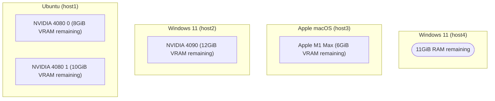
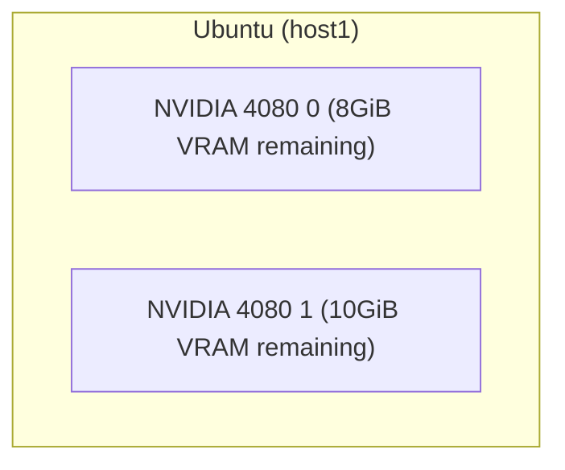
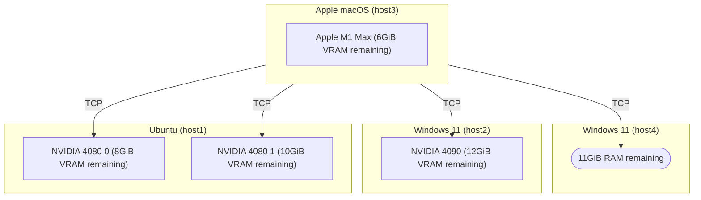

# GGUF Parser

> tl;dr, Review/Check [GGUF](https://github.com/ggerganov/ggml/blob/master/docs/gguf.md) files and estimate the memory
> usage.

[](https://goreportcard.com/report/github.com/gpustack/gguf-parser-go)
[](https://github.com/gpustack/gguf-parser-go/actions)
[](https://github.com/gpustack/gguf-parser-go#license)
[](https://github.com/gpustack/gguf-parser-go/releases)
[](https://hub.docker.com/r/gpustack/gguf-parser)
[](https://github.com/gpustack/gguf-parser-go/releases/latest)

[GGUF](https://github.com/ggerganov/ggml/blob/master/docs/gguf.md) is a file format for storing models for inference
with GGML and executors based on GGML. GGUF is a binary format that is designed for fast loading and saving of models,
and for ease of reading. Models are traditionally developed using PyTorch or another framework, and then converted to
GGUF for use in GGML.

GGUF Parser helps in reviewing and estimating the usage of a GGUF format model without download it.

## Key Features

- **No File Required**: GGUF Parser uses chunking reading to parse the metadata of remote GGUF file, which means you
  don't need to download the entire file and load it.
- **Accurate Prediction**: The evaluation results of GGUF Parser usually deviate from the actual usage by about 100MiB.
- **Fast**: GGUF Parser is written in Go, which is fast and efficient.

## Agenda

- [Notes](#notes)
- [Installation](#installation)
- [Overview](#overview)
    + [Parse](#parse)
        * [Local File](#parse-local-file)
        * [Remote File](#parse-remote-file)
        * [From HuggingFace](#parse-from-huggingface)
        * [From ModelScope](#parse-from-modelscope)
        * [From Ollama Library](#parse-from-ollama-library)
        * [None Model](#parse-none-model)
    + [Estimate](#estimate)
        * [Across Multiple GPU devices](#estimate-across-multiple-gpu-devices)
        * [Full Layers Offload (default)](#full-layers-offload-default)
        * [Zero Layers Offload](#zero-layers-offload)
        * [Specific Layers Offload](#specific-layers-offload)
        * [Specific Context Size](#specific-context-size)
        * [Enable Flash Attention](#enable-flash-attention)
        * [Disable MMap](#disable-mmap)
        * [With Adapter](#with-adapter)
        * [Get Proper Offload Layers](#get-proper-offload-layers)

## Notes

- Since v0.8.1, GGUF Parser supports to estimate the usage with LoRA/ControlVector adapters.
- Since v0.8.0, GGUF Parser distinguishes the remote devices from `--tensor-split` via `--rpc`.
    + For one host multiple GPU devices, you can use `--tensor-split` to get the estimated memory usage of each GPU.
    + For multiple hosts multiple GPU devices, you can use `--tensor-split` and `--rpc` to get the estimated memory
      usage of each GPU.
- The table result `DISTRIBUTABLE` indicates the GGUF file supports distribution inference or not,
  if the file doesn't support distribution inference, you can not offload it
  with [RPC servers](https://github.com/ggerganov/llama.cpp/tree/master/examples/rpc).
- Since v0.7.2, GGUF Parser supports retrieving the GGUF file's metadata via split file,
  which suffixes with something like `-00001-of-00009.gguf`.
- The `UMA` column indicates the memory usage of Apple macOS only. To estimate the macOS memory usage,
  you can sum the `UMA` results of `RAM` and `VRAM 0` columns.
- Since v0.7.0, GGUF Parser supports estimating the usage of multiple GPU devices.
    + The table result `RAM` means the system memory usage when
      running [LLaMA.Cpp](https://github.com/ggerganov/llama.cpp) or LLaMA.Cpp like application.
    + The `VRAM 0` columns means the first visible GPU memory usage when serving the GGUF file.
    + For example, `--tensor-split=1,1,1` means the GGUF file loading will be split into 3 parts with 33% each,
      and results in `VRAM 0`, `VRAM 1` and `VRAM 2` columns.

## Installation

Install from [releases](https://github.com/gpustack/gguf-parser-go/releases)
or `go install github.com/gpustack/gguf-parser-go/cmd/gguf-parser@latest`.

## Overview

### Parse

#### Parse Local File

```shell
$ gguf-parser --path="~/.cache/lm-studio/models/NousResearch/Hermes-2-Pro-Mistral-7B-GGUF/Hermes-2-Pro-Mistral-7B.Q5_K_M.gguf"
+-------------------------------------------------------------------------------------------+
| METADATA                                                                                  |
+-------+-------+-------+----------------+---------------+----------+------------+----------+
|  TYPE |  NAME |  ARCH |  QUANTIZATION  | LITTLE ENDIAN |   SIZE   | PARAMETERS |    BPW   |
+-------+-------+-------+----------------+---------------+----------+------------+----------+
| model | jeffq | llama | IQ3_XXS/Q5_K_M |      true     | 4.78 GiB |   7.24 B   | 5.67 bpw |
+-------+-------+-------+----------------+---------------+----------+------------+----------+

+---------------------------------------------------------------------------------------------------------------------------------------------------+
| ARCHITECTURE                                                                                                                                      |
+-----------------+---------------+---------------+------------------+--------------------+--------+------------------+------------+----------------+
| MAX CONTEXT LEN | EMBEDDING LEN | EMBEDDING GQA | ATTENTION CAUSAL | ATTENTION HEAD CNT | LAYERS | FEED FORWARD LEN | EXPERT CNT | VOCABULARY LEN |
+-----------------+---------------+---------------+------------------+--------------------+--------+------------------+------------+----------------+
|      32768      |      4096     |       4       |       true       |         32         |   32   |       14336      |      0     |      32032     |
+-----------------+---------------+---------------+------------------+--------------------+--------+------------------+------------+----------------+

+-------------------------------------------------------------------------------------------------------------------------------------------------------+
| TOKENIZER                                                                                                                                             |
+-------+-------------+------------+------------------+-----------+-----------+-----------+-----------+---------------+-----------------+---------------+
| MODEL | TOKENS SIZE | TOKENS LEN | ADDED TOKENS LEN | BOS TOKEN | EOS TOKEN | EOT TOKEN | EOM TOKEN | UNKNOWN TOKEN | SEPARATOR TOKEN | PADDING TOKEN |
+-------+-------------+------------+------------------+-----------+-----------+-----------+-----------+---------------+-----------------+---------------+
| llama |  450.50 KiB |    32032   |        N/A       |     1     |   32000   |    N/A    |    N/A    |      N/A      |       N/A       |      N/A      |
+-------+-------------+------------+------------------+-----------+-----------+-----------+-----------+---------------+-----------------+---------------+

+-------------------------------------------------------------------------------------------------------------------------------------------------------------------------------------------------------------+
| ESTIMATE                                                                                                                                                                                                    |
+-------+--------------+--------------------+-----------------+-----------+----------------+---------------+----------------+----------------+----------------------------------+-----------------------------+
|  ARCH | CONTEXT SIZE | BATCH SIZE (L / P) | FLASH ATTENTION | MMAP LOAD | EMBEDDING ONLY | DISTRIBUTABLE | OFFLOAD LAYERS | FULL OFFLOADED |                RAM               |            VRAM 0           |
|       |              |                    |                 |           |                |               |                |                +--------+------------+------------+--------+--------+-----------+
|       |              |                    |                 |           |                |               |                |                | LAYERS |     UMA    |   NONUMA   | LAYERS |   UMA  |   NONUMA  |
+-------+--------------+--------------------+-----------------+-----------+----------------+---------------+----------------+----------------+--------+------------+------------+--------+--------+-----------+
| llama |     32768    |     2048 / 512     |     Disabled    |  Enabled  |       No       |   Supported   |   33 (32 + 1)  |       Yes      |    0   | 168.25 MiB | 318.25 MiB | 32 + 1 |  4 GiB | 11.16 GiB |
+-------+--------------+--------------------+-----------------+-----------+----------------+---------------+----------------+----------------+--------+------------+------------+--------+--------+-----------+

$ # Retrieve the model's metadata via split file,
$ # which needs all split files has been downloaded.
$ gguf-parser --path="~/.cache/lm-studio/models/Qwen/Qwen2-72B-Instruct-GGUF/qwen2-72b-instruct-q6_k-00001-of-00002.gguf"

+------------------------------------------------------------------------------------------------------------+
| METADATA                                                                                                   |
+-------+-------------------------+-------+--------------+---------------+-----------+------------+----------+
|  TYPE |           NAME          |  ARCH | QUANTIZATION | LITTLE ENDIAN |    SIZE   | PARAMETERS |    BPW   |
+-------+-------------------------+-------+--------------+---------------+-----------+------------+----------+
| model | 72b.5000B--cmix31-ba... | qwen2 |  IQ1_S/Q6_K  |      true     | 59.92 GiB |   72.71 B  | 7.08 bpw |
+-------+-------------------------+-------+--------------+---------------+-----------+------------+----------+

+---------------------------------------------------------------------------------------------------------------------------------------------------+
| ARCHITECTURE                                                                                                                                      |
+-----------------+---------------+---------------+------------------+--------------------+--------+------------------+------------+----------------+
| MAX CONTEXT LEN | EMBEDDING LEN | EMBEDDING GQA | ATTENTION CAUSAL | ATTENTION HEAD CNT | LAYERS | FEED FORWARD LEN | EXPERT CNT | VOCABULARY LEN |
+-----------------+---------------+---------------+------------------+--------------------+--------+------------------+------------+----------------+
|      32768      |      8192     |       8       |       true       |         64         |   80   |       29568      |      0     |     152064     |
+-----------------+---------------+---------------+------------------+--------------------+--------+------------------+------------+----------------+

+-------------------------------------------------------------------------------------------------------------------------------------------------------+
| TOKENIZER                                                                                                                                             |
+-------+-------------+------------+------------------+-----------+-----------+-----------+-----------+---------------+-----------------+---------------+
| MODEL | TOKENS SIZE | TOKENS LEN | ADDED TOKENS LEN | BOS TOKEN | EOS TOKEN | EOT TOKEN | EOM TOKEN | UNKNOWN TOKEN | SEPARATOR TOKEN | PADDING TOKEN |
+-------+-------------+------------+------------------+-----------+-----------+-----------+-----------+---------------+-----------------+---------------+
|  gpt2 |   2.47 MiB  |   152064   |        N/A       |   151643  |   151645  |    N/A    |    N/A    |      N/A      |       N/A       |     151643    |
+-------+-------------+------------+------------------+-----------+-----------+-----------+-----------+---------------+-----------------+---------------+

+-------------------------------------------------------------------------------------------------------------------------------------------------------------------------------------------------------------+
| ESTIMATE                                                                                                                                                                                                    |
+-------+--------------+--------------------+-----------------+-----------+----------------+---------------+----------------+----------------+----------------------------------+-----------------------------+
|  ARCH | CONTEXT SIZE | BATCH SIZE (L / P) | FLASH ATTENTION | MMAP LOAD | EMBEDDING ONLY | DISTRIBUTABLE | OFFLOAD LAYERS | FULL OFFLOADED |                RAM               |            VRAM 0           |
|       |              |                    |                 |           |                |               |                |                +--------+------------+------------+--------+--------+-----------+
|       |              |                    |                 |           |                |               |                |                | LAYERS |     UMA    |   NONUMA   | LAYERS |   UMA  |   NONUMA  |
+-------+--------------+--------------------+-----------------+-----------+----------------+---------------+----------------+----------------+--------+------------+------------+--------+--------+-----------+
| qwen2 |     32768    |     2048 / 512     |     Disabled    |  Enabled  |       No       | Not Supported |   81 (80 + 1)  |       Yes      |    0   | 291.38 MiB | 441.38 MiB | 80 + 1 | 10 GiB | 73.47 GiB |
+-------+--------------+--------------------+-----------------+-----------+----------------+---------------+----------------+----------------+--------+------------+------------+--------+--------+-----------+

```

#### Parse Remote File

```shell
$ gguf-parser --url="https://huggingface.co/NousResearch/Nous-Hermes-2-Mixtral-8x7B-DPO-GGUF/resolve/main/Nous-Hermes-2-Mixtral-8x7B-DPO.Q3_K_M.gguf"
+------------------------------------------------------------------------------------------+
| METADATA                                                                                 |
+-------+----------+-------+--------------+---------------+--------+------------+----------+
|  TYPE |   NAME   |  ARCH | QUANTIZATION | LITTLE ENDIAN |  SIZE  | PARAMETERS |    BPW   |
+-------+----------+-------+--------------+---------------+--------+------------+----------+
| model | emozilla | llama |  Q4_K/Q3_K_M |      true     | 21 GiB |   46.70 B  | 3.86 bpw |
+-------+----------+-------+--------------+---------------+--------+------------+----------+

+---------------------------------------------------------------------------------------------------------------------------------------------------+
| ARCHITECTURE                                                                                                                                      |
+-----------------+---------------+---------------+------------------+--------------------+--------+------------------+------------+----------------+
| MAX CONTEXT LEN | EMBEDDING LEN | EMBEDDING GQA | ATTENTION CAUSAL | ATTENTION HEAD CNT | LAYERS | FEED FORWARD LEN | EXPERT CNT | VOCABULARY LEN |
+-----------------+---------------+---------------+------------------+--------------------+--------+------------------+------------+----------------+
|      32768      |      4096     |       4       |       true       |         32         |   32   |       14336      |      8     |      32002     |
+-----------------+---------------+---------------+------------------+--------------------+--------+------------------+------------+----------------+

+-------------------------------------------------------------------------------------------------------------------------------------------------------+
| TOKENIZER                                                                                                                                             |
+-------+-------------+------------+------------------+-----------+-----------+-----------+-----------+---------------+-----------------+---------------+
| MODEL | TOKENS SIZE | TOKENS LEN | ADDED TOKENS LEN | BOS TOKEN | EOS TOKEN | EOT TOKEN | EOM TOKEN | UNKNOWN TOKEN | SEPARATOR TOKEN | PADDING TOKEN |
+-------+-------------+------------+------------------+-----------+-----------+-----------+-----------+---------------+-----------------+---------------+
| llama |  449.91 KiB |    32002   |        N/A       |     1     |   32000   |    N/A    |    N/A    |       0       |       N/A       |       2       |
+-------+-------------+------------+------------------+-----------+-----------+-----------+-----------+---------------+-----------------+---------------+

+--------------------------------------------------------------------------------------------------------------------------------------------------------------------------------------------------------------------+
| ESTIMATE                                                                                                                                                                                                           |
+-------+--------------+--------------------+-----------------+---------------+----------------+---------------+----------------+----------------+----------------------------------+--------------------------------+
|  ARCH | CONTEXT SIZE | BATCH SIZE (L / P) | FLASH ATTENTION |   MMAP LOAD   | EMBEDDING ONLY | DISTRIBUTABLE | OFFLOAD LAYERS | FULL OFFLOADED |                RAM               |             VRAM 0             |
|       |              |                    |                 |               |                |               |                |                +--------+------------+------------+--------+-----------+-----------+
|       |              |                    |                 |               |                |               |                |                | LAYERS |     UMA    |   NONUMA   | LAYERS |    UMA    |   NONUMA  |
+-------+--------------+--------------------+-----------------+---------------+----------------+---------------+----------------+----------------+--------+------------+------------+--------+-----------+-----------+
| llama |     32768    |     2048 / 512     |     Disabled    | Not Supported |       No       |   Supported   |   33 (32 + 1)  |       Yes      |    0   | 269.10 MiB | 419.10 MiB | 32 + 1 | 24.94 GiB | 27.41 GiB |
+-------+--------------+--------------------+-----------------+---------------+----------------+---------------+----------------+----------------+--------+------------+------------+--------+-----------+-----------+

$ # Retrieve the model's metadata via split file

$ gguf-parser --url="https://huggingface.co/MaziyarPanahi/Meta-Llama-3.1-405B-Instruct-GGUF/resolve/main/Meta-Llama-3.1-405B-Instruct.Q2_K.gguf-00001-of-00009.gguf"
+-------------------------------------------------------------------------------------------------------------+
| METADATA                                                                                                    |
+-------+-------------------------+-------+--------------+---------------+------------+------------+----------+
|  TYPE |           NAME          |  ARCH | QUANTIZATION | LITTLE ENDIAN |    SIZE    | PARAMETERS |    BPW   |
+-------+-------------------------+-------+--------------+---------------+------------+------------+----------+
| model | Models Meta Llama Me... | llama |     Q2_K     |      true     | 140.81 GiB |  410.08 B  | 2.95 bpw |
+-------+-------------------------+-------+--------------+---------------+------------+------------+----------+

+---------------------------------------------------------------------------------------------------------------------------------------------------+
| ARCHITECTURE                                                                                                                                      |
+-----------------+---------------+---------------+------------------+--------------------+--------+------------------+------------+----------------+
| MAX CONTEXT LEN | EMBEDDING LEN | EMBEDDING GQA | ATTENTION CAUSAL | ATTENTION HEAD CNT | LAYERS | FEED FORWARD LEN | EXPERT CNT | VOCABULARY LEN |
+-----------------+---------------+---------------+------------------+--------------------+--------+------------------+------------+----------------+
|      131072     |     16384     |       8       |       true       |         128        |   126  |       53248      |      0     |     128256     |
+-----------------+---------------+---------------+------------------+--------------------+--------+------------------+------------+----------------+

+-------------------------------------------------------------------------------------------------------------------------------------------------------+
| TOKENIZER                                                                                                                                             |
+-------+-------------+------------+------------------+-----------+-----------+-----------+-----------+---------------+-----------------+---------------+
| MODEL | TOKENS SIZE | TOKENS LEN | ADDED TOKENS LEN | BOS TOKEN | EOS TOKEN | EOT TOKEN | EOM TOKEN | UNKNOWN TOKEN | SEPARATOR TOKEN | PADDING TOKEN |
+-------+-------------+------------+------------------+-----------+-----------+-----------+-----------+---------------+-----------------+---------------+
|  gpt2 |    2 MiB    |   128256   |        N/A       |   128000  |   128009  |    N/A    |    N/A    |      N/A      |       N/A       |      N/A      |
+-------+-------------+------------+------------------+-----------+-----------+-----------+-----------+---------------+-----------------+---------------+

+----------------------------------------------------------------------------------------------------------------------------------------------------------------------------------------------------------------+
| ESTIMATE                                                                                                                                                                                                       |
+-------+--------------+--------------------+-----------------+-----------+----------------+---------------+----------------+----------------+----------------------------------+--------------------------------+
|  ARCH | CONTEXT SIZE | BATCH SIZE (L / P) | FLASH ATTENTION | MMAP LOAD | EMBEDDING ONLY | DISTRIBUTABLE | OFFLOAD LAYERS | FULL OFFLOADED |                RAM               |             VRAM 0             |
|       |              |                    |                 |           |                |               |                |                +--------+------------+------------+---------+---------+------------+
|       |              |                    |                 |           |                |               |                |                | LAYERS |     UMA    |   NONUMA   |  LAYERS |   UMA   |   NONUMA   |
+-------+--------------+--------------------+-----------------+-----------+----------------+---------------+----------------+----------------+--------+------------+------------+---------+---------+------------+
| llama |    131072    |     2048 / 512     |     Disabled    |  Enabled  |       No       |   Supported   |  127 (126 + 1) |       Yes      |    0   | 652.53 MiB | 802.53 MiB | 126 + 1 | 126 GiB | 299.79 GiB |
+-------+--------------+--------------------+-----------------+-----------+----------------+---------------+----------------+----------------+--------+------------+------------+---------+---------+------------+

```

#### Parse From HuggingFace

```shell
$ gguf-parser --hf-repo="openbmb/MiniCPM-Llama3-V-2_5-gguf" --hf-file="ggml-model-Q5_K_M.gguf" --hf-mmproj-file="mmproj-model-f16.gguf"
+-------------------------------------------------------------------------------------------+
| METADATA                                                                                  |
+-------+-------+-------+----------------+---------------+----------+------------+----------+
|  TYPE |  NAME |  ARCH |  QUANTIZATION  | LITTLE ENDIAN |   SIZE   | PARAMETERS |    BPW   |
+-------+-------+-------+----------------+---------------+----------+------------+----------+
| model | model | llama | IQ3_XXS/Q5_K_M |      true     | 5.33 GiB |   8.03 B   | 5.70 bpw |
+-------+-------+-------+----------------+---------------+----------+------------+----------+

+---------------------------------------------------------------------------------------------------------------------------------------------------+
| ARCHITECTURE                                                                                                                                      |
+-----------------+---------------+---------------+------------------+--------------------+--------+------------------+------------+----------------+
| MAX CONTEXT LEN | EMBEDDING LEN | EMBEDDING GQA | ATTENTION CAUSAL | ATTENTION HEAD CNT | LAYERS | FEED FORWARD LEN | EXPERT CNT | VOCABULARY LEN |
+-----------------+---------------+---------------+------------------+--------------------+--------+------------------+------------+----------------+
|       8192      |      4096     |       4       |       true       |         32         |   32   |       14336      |      0     |     128256     |
+-----------------+---------------+---------------+------------------+--------------------+--------+------------------+------------+----------------+

+-------------------------------------------------------------------------------------------------------------------------------------------------------+
| TOKENIZER                                                                                                                                             |
+-------+-------------+------------+------------------+-----------+-----------+-----------+-----------+---------------+-----------------+---------------+
| MODEL | TOKENS SIZE | TOKENS LEN | ADDED TOKENS LEN | BOS TOKEN | EOS TOKEN | EOT TOKEN | EOM TOKEN | UNKNOWN TOKEN | SEPARATOR TOKEN | PADDING TOKEN |
+-------+-------------+------------+------------------+-----------+-----------+-----------+-----------+---------------+-----------------+---------------+
|  gpt2 |    2 MiB    |   128256   |        N/A       |   128000  |   128001  |    N/A    |    N/A    |     128002    |       N/A       |       0       |
+-------+-------------+------------+------------------+-----------+-----------+-----------+-----------+---------------+-----------------+---------------+

+------------------------------------------------------------------------------------------------------------------------------------------------------------------------------------------------------------+
| ESTIMATE                                                                                                                                                                                                   |
+-------+--------------+--------------------+-----------------+-----------+----------------+---------------+----------------+----------------+----------------------------------+----------------------------+
|  ARCH | CONTEXT SIZE | BATCH SIZE (L / P) | FLASH ATTENTION | MMAP LOAD | EMBEDDING ONLY | DISTRIBUTABLE | OFFLOAD LAYERS | FULL OFFLOADED |                RAM               |           VRAM 0           |
|       |              |                    |                 |           |                |               |                |                +--------+------------+------------+--------+--------+----------+
|       |              |                    |                 |           |                |               |                |                | LAYERS |     UMA    |   NONUMA   | LAYERS |   UMA  |  NONUMA  |
+-------+--------------+--------------------+-----------------+-----------+----------------+---------------+----------------+----------------+--------+------------+------------+--------+--------+----------+
| llama |     8192     |     2048 / 512     |     Disabled    |  Enabled  |       No       |   Supported   |   33 (32 + 1)  |       Yes      |    0   | 176.85 MiB | 326.85 MiB | 32 + 1 |  1 GiB | 7.78 GiB |
+-------+--------------+--------------------+-----------------+-----------+----------------+---------------+----------------+----------------+--------+------------+------------+--------+--------+----------+

$ # Retrieve the model's metadata via split file

$ gguf-parser --hf-repo="etemiz/Llama-3.1-405B-Inst-GGUF" --hf-file="llama-3.1-405b-IQ1_M-00019-of-00019.gguf"
+------------------------------------------------------------------------------------------------------------+
| METADATA                                                                                                   |
+-------+-------------------------+-------+--------------+---------------+-----------+------------+----------+
|  TYPE |           NAME          |  ARCH | QUANTIZATION | LITTLE ENDIAN |    SIZE   | PARAMETERS |    BPW   |
+-------+-------------------------+-------+--------------+---------------+-----------+------------+----------+
| model | Meta-Llama-3.1-405B-... | llama |     IQ1_M    |      true     | 88.61 GiB |  410.08 B  | 1.86 bpw |
+-------+-------------------------+-------+--------------+---------------+-----------+------------+----------+

+---------------------------------------------------------------------------------------------------------------------------------------------------+
| ARCHITECTURE                                                                                                                                      |
+-----------------+---------------+---------------+------------------+--------------------+--------+------------------+------------+----------------+
| MAX CONTEXT LEN | EMBEDDING LEN | EMBEDDING GQA | ATTENTION CAUSAL | ATTENTION HEAD CNT | LAYERS | FEED FORWARD LEN | EXPERT CNT | VOCABULARY LEN |
+-----------------+---------------+---------------+------------------+--------------------+--------+------------------+------------+----------------+
|      131072     |     16384     |       8       |       true       |         128        |   126  |       53248      |      0     |     128256     |
+-----------------+---------------+---------------+------------------+--------------------+--------+------------------+------------+----------------+

+-------------------------------------------------------------------------------------------------------------------------------------------------------+
| TOKENIZER                                                                                                                                             |
+-------+-------------+------------+------------------+-----------+-----------+-----------+-----------+---------------+-----------------+---------------+
| MODEL | TOKENS SIZE | TOKENS LEN | ADDED TOKENS LEN | BOS TOKEN | EOS TOKEN | EOT TOKEN | EOM TOKEN | UNKNOWN TOKEN | SEPARATOR TOKEN | PADDING TOKEN |
+-------+-------------+------------+------------------+-----------+-----------+-----------+-----------+---------------+-----------------+---------------+
|  gpt2 |    2 MiB    |   128256   |        N/A       |   128000  |   128009  |    N/A    |    N/A    |      N/A      |       N/A       |      N/A      |
+-------+-------------+------------+------------------+-----------+-----------+-----------+-----------+---------------+-----------------+---------------+

+----------------------------------------------------------------------------------------------------------------------------------------------------------------------------------------------------------------+
| ESTIMATE                                                                                                                                                                                                       |
+-------+--------------+--------------------+-----------------+-----------+----------------+---------------+----------------+----------------+----------------------------------+--------------------------------+
|  ARCH | CONTEXT SIZE | BATCH SIZE (L / P) | FLASH ATTENTION | MMAP LOAD | EMBEDDING ONLY | DISTRIBUTABLE | OFFLOAD LAYERS | FULL OFFLOADED |                RAM               |             VRAM 0             |
|       |              |                    |                 |           |                |               |                |                +--------+------------+------------+---------+---------+------------+
|       |              |                    |                 |           |                |               |                |                | LAYERS |     UMA    |   NONUMA   |  LAYERS |   UMA   |   NONUMA   |
+-------+--------------+--------------------+-----------------+-----------+----------------+---------------+----------------+----------------+--------+------------+------------+---------+---------+------------+
| llama |    131072    |     2048 / 512     |     Disabled    |  Enabled  |       No       |   Supported   |  127 (126 + 1) |       Yes      |    0   | 652.53 MiB | 802.53 MiB | 126 + 1 | 126 GiB | 247.59 GiB |
+-------+--------------+--------------------+-----------------+-----------+----------------+---------------+----------------+----------------+--------+------------+------------+---------+---------+------------+

```

#### Parse From ModelScope

```shell
$ gguf-parser --ms-repo="shaowenchen/chinese-alpaca-2-13b-16k-gguf" --ms-file="chinese-alpaca-2-13b-16k.Q5_K.gguf"
+------------------------------------------------------------------------------------------+
| METADATA                                                                                 |
+-------+------+-------+----------------+---------------+----------+------------+----------+
|  TYPE | NAME |  ARCH |  QUANTIZATION  | LITTLE ENDIAN |   SIZE   | PARAMETERS |    BPW   |
+-------+------+-------+----------------+---------------+----------+------------+----------+
| model |  ..  | llama | IQ3_XXS/Q5_K_M |      true     | 8.76 GiB |   13.25 B  | 5.68 bpw |
+-------+------+-------+----------------+---------------+----------+------------+----------+

+---------------------------------------------------------------------------------------------------------------------------------------------------+
| ARCHITECTURE                                                                                                                                      |
+-----------------+---------------+---------------+------------------+--------------------+--------+------------------+------------+----------------+
| MAX CONTEXT LEN | EMBEDDING LEN | EMBEDDING GQA | ATTENTION CAUSAL | ATTENTION HEAD CNT | LAYERS | FEED FORWARD LEN | EXPERT CNT | VOCABULARY LEN |
+-----------------+---------------+---------------+------------------+--------------------+--------+------------------+------------+----------------+
|      16384      |      5120     |       1       |       true       |         N/A        |   40   |       13824      |      0     |      55296     |
+-----------------+---------------+---------------+------------------+--------------------+--------+------------------+------------+----------------+

+-------------------------------------------------------------------------------------------------------------------------------------------------------+
| TOKENIZER                                                                                                                                             |
+-------+-------------+------------+------------------+-----------+-----------+-----------+-----------+---------------+-----------------+---------------+
| MODEL | TOKENS SIZE | TOKENS LEN | ADDED TOKENS LEN | BOS TOKEN | EOS TOKEN | EOT TOKEN | EOM TOKEN | UNKNOWN TOKEN | SEPARATOR TOKEN | PADDING TOKEN |
+-------+-------------+------------+------------------+-----------+-----------+-----------+-----------+---------------+-----------------+---------------+
| llama |  769.83 KiB |    55296   |        N/A       |     1     |     2     |    N/A    |    N/A    |      N/A      |       N/A       |      N/A      |
+-------+-------------+------------+------------------+-----------+-----------+-----------+-----------+---------------+-----------------+---------------+

+----------------------------------------------------------------------------------------------------------------------------------------------------------------------------------------------------------------+
| ESTIMATE                                                                                                                                                                                                       |
+-------+--------------+--------------------+-----------------+-----------+----------------+---------------+----------------+----------------+----------------------------------+--------------------------------+
|  ARCH | CONTEXT SIZE | BATCH SIZE (L / P) | FLASH ATTENTION | MMAP LOAD | EMBEDDING ONLY | DISTRIBUTABLE | OFFLOAD LAYERS | FULL OFFLOADED |                RAM               |             VRAM 0             |
|       |              |                    |                 |           |                |               |                |                +--------+------------+------------+--------+-----------+-----------+
|       |              |                    |                 |           |                |               |                |                | LAYERS |     UMA    |   NONUMA   | LAYERS |    UMA    |   NONUMA  |
+-------+--------------+--------------------+-----------------+-----------+----------------+---------------+----------------+----------------+--------+------------+------------+--------+-----------+-----------+
| llama |     16384    |     2048 / 512     |     Disabled    |  Enabled  |       No       |   Supported   |   41 (40 + 1)  |       Yes      |    0   | 144.95 MiB | 294.95 MiB | 40 + 1 | 12.50 GiB | 22.96 GiB |
+-------+--------------+--------------------+-----------------+-----------+----------------+---------------+----------------+----------------+--------+------------+------------+--------+-----------+-----------+

```

#### Parse From Ollama Library

```shell
$ gguf-parser --ol-model="llama3.1"
+-----------------------------------------------------------------------------------------------------------+
| METADATA                                                                                                  |
+-------+-------------------------+-------+--------------+---------------+----------+------------+----------+
|  TYPE |           NAME          |  ARCH | QUANTIZATION | LITTLE ENDIAN |   SIZE   | PARAMETERS |    BPW   |
+-------+-------------------------+-------+--------------+---------------+----------+------------+----------+
| model | Meta Llama 3.1 8B In... | llama |     Q4_0     |      true     | 4.33 GiB |   8.03 B   | 4.64 bpw |
+-------+-------------------------+-------+--------------+---------------+----------+------------+----------+

+---------------------------------------------------------------------------------------------------------------------------------------------------+
| ARCHITECTURE                                                                                                                                      |
+-----------------+---------------+---------------+------------------+--------------------+--------+------------------+------------+----------------+
| MAX CONTEXT LEN | EMBEDDING LEN | EMBEDDING GQA | ATTENTION CAUSAL | ATTENTION HEAD CNT | LAYERS | FEED FORWARD LEN | EXPERT CNT | VOCABULARY LEN |
+-----------------+---------------+---------------+------------------+--------------------+--------+------------------+------------+----------------+
|      131072     |      4096     |       4       |       true       |         32         |   32   |       14336      |      0     |     128256     |
+-----------------+---------------+---------------+------------------+--------------------+--------+------------------+------------+----------------+

+-------------------------------------------------------------------------------------------------------------------------------------------------------+
| TOKENIZER                                                                                                                                             |
+-------+-------------+------------+------------------+-----------+-----------+-----------+-----------+---------------+-----------------+---------------+
| MODEL | TOKENS SIZE | TOKENS LEN | ADDED TOKENS LEN | BOS TOKEN | EOS TOKEN | EOT TOKEN | EOM TOKEN | UNKNOWN TOKEN | SEPARATOR TOKEN | PADDING TOKEN |
+-------+-------------+------------+------------------+-----------+-----------+-----------+-----------+---------------+-----------------+---------------+
|  gpt2 |    2 MiB    |   128256   |        N/A       |   128000  |   128009  |    N/A    |    N/A    |      N/A      |       N/A       |      N/A      |
+-------+-------------+------------+------------------+-----------+-----------+-----------+-----------+---------------+-----------------+---------------+

+-------------------------------------------------------------------------------------------------------------------------------------------------------------------------------------------------------------+
| ESTIMATE                                                                                                                                                                                                    |
+-------+--------------+--------------------+-----------------+-----------+----------------+---------------+----------------+----------------+----------------------------------+-----------------------------+
|  ARCH | CONTEXT SIZE | BATCH SIZE (L / P) | FLASH ATTENTION | MMAP LOAD | EMBEDDING ONLY | DISTRIBUTABLE | OFFLOAD LAYERS | FULL OFFLOADED |                RAM               |            VRAM 0           |
|       |              |                    |                 |           |                |               |                |                +--------+------------+------------+--------+--------+-----------+
|       |              |                    |                 |           |                |               |                |                | LAYERS |     UMA    |   NONUMA   | LAYERS |   UMA  |   NONUMA  |
+-------+--------------+--------------------+-----------------+-----------+----------------+---------------+----------------+----------------+--------+------------+------------+--------+--------+-----------+
| llama |    131072    |     2048 / 512     |     Disabled    |  Enabled  |       No       |   Supported   |   33 (32 + 1)  |       Yes      |    0   | 403.62 MiB | 553.62 MiB | 32 + 1 | 16 GiB | 29.08 GiB |
+-------+--------------+--------------------+-----------------+-----------+----------------+---------------+----------------+----------------+--------+------------+------------+--------+--------+-----------+

$ # Ollama Model includes the preset params and other artifacts, like multimodal projectors or LoRA adapters, 
$ # you can get the usage of Ollama running by using `--ol-usage` option.

$ gguf-parser --ol-model="llama3.1" --ol-usage
+-----------------------------------------------------------------------------------------------------------+
| METADATA                                                                                                  |
+-------+-------------------------+-------+--------------+---------------+----------+------------+----------+
|  TYPE |           NAME          |  ARCH | QUANTIZATION | LITTLE ENDIAN |   SIZE   | PARAMETERS |    BPW   |
+-------+-------------------------+-------+--------------+---------------+----------+------------+----------+
| model | Meta Llama 3.1 8B In... | llama |     Q4_0     |      true     | 4.33 GiB |   8.03 B   | 4.64 bpw |
+-------+-------------------------+-------+--------------+---------------+----------+------------+----------+

+---------------------------------------------------------------------------------------------------------------------------------------------------+
| ARCHITECTURE                                                                                                                                      |
+-----------------+---------------+---------------+------------------+--------------------+--------+------------------+------------+----------------+
| MAX CONTEXT LEN | EMBEDDING LEN | EMBEDDING GQA | ATTENTION CAUSAL | ATTENTION HEAD CNT | LAYERS | FEED FORWARD LEN | EXPERT CNT | VOCABULARY LEN |
+-----------------+---------------+---------------+------------------+--------------------+--------+------------------+------------+----------------+
|      131072     |      4096     |       4       |       true       |         32         |   32   |       14336      |      0     |     128256     |
+-----------------+---------------+---------------+------------------+--------------------+--------+------------------+------------+----------------+

+-------------------------------------------------------------------------------------------------------------------------------------------------------+
| TOKENIZER                                                                                                                                             |
+-------+-------------+------------+------------------+-----------+-----------+-----------+-----------+---------------+-----------------+---------------+
| MODEL | TOKENS SIZE | TOKENS LEN | ADDED TOKENS LEN | BOS TOKEN | EOS TOKEN | EOT TOKEN | EOM TOKEN | UNKNOWN TOKEN | SEPARATOR TOKEN | PADDING TOKEN |
+-------+-------------+------------+------------------+-----------+-----------+-----------+-----------+---------------+-----------------+---------------+
|  gpt2 |    2 MiB    |   128256   |        N/A       |   128000  |   128009  |    N/A    |    N/A    |      N/A      |       N/A       |      N/A      |
+-------+-------------+------------+------------------+-----------+-----------+-----------+-----------+---------------+-----------------+---------------+

+----------------------------------------------------------------------------------------------------------------------------------------------------------------------------------------------------------------+
| ESTIMATE                                                                                                                                                                                                       |
+-------+--------------+--------------------+-----------------+-----------+----------------+---------------+----------------+----------------+----------------------------------+--------------------------------+
|  ARCH | CONTEXT SIZE | BATCH SIZE (L / P) | FLASH ATTENTION | MMAP LOAD | EMBEDDING ONLY | DISTRIBUTABLE | OFFLOAD LAYERS | FULL OFFLOADED |                RAM               |             VRAM 0             |
|       |              |                    |                 |           |                |               |                |                +--------+------------+------------+--------+------------+----------+
|       |              |                    |                 |           |                |               |                |                | LAYERS |     UMA    |   NONUMA   | LAYERS |     UMA    |  NONUMA  |
+-------+--------------+--------------------+-----------------+-----------+----------------+---------------+----------------+----------------+--------+------------+------------+--------+------------+----------+
| llama |     2048     |     2048 / 512     |     Disabled    |  Enabled  |       No       |   Supported   |   33 (32 + 1)  |       Yes      |    0   | 151.62 MiB | 301.62 MiB | 32 + 1 | 256.50 MiB | 4.82 GiB |
+-------+--------------+--------------------+-----------------+-----------+----------------+---------------+----------------+----------------+--------+------------+------------+--------+------------+----------+

```

#### Parse None Model

```shell
$ # Parse Multi-Modal Projector
$ gguf-parser --hf-repo="xtuner/llava-llama-3-8b-v1_1-gguf" --hf-file="llava-llama-3-8b-v1_1-mmproj-f16.gguf"                                                                        
+-----------------------------------------------------------------------------------------------------------------+
| METADATA                                                                                                        |
+-----------+-------------------------+------+--------------+---------------+------------+------------+-----------+
|    TYPE   |           NAME          | ARCH | QUANTIZATION | LITTLE ENDIAN |    SIZE    | PARAMETERS |    BPW    |
+-----------+-------------------------+------+--------------+---------------+------------+------------+-----------+
| projector | openai/clip-vit-larg... | clip |      F16     |      true     | 595.49 MiB |  311.89 M  | 16.02 bpw |
+-----------+-------------------------+------+--------------+---------------+------------+------------+-----------+

+----------------------------------------------------------------------+
| ARCHITECTURE                                                         |
+----------------+---------------+--------+------------------+---------+
| PROJECTOR TYPE | EMBEDDING LEN | LAYERS | FEED FORWARD LEN | ENCODER |
+----------------+---------------+--------+------------------+---------+
|       mlp      |      1024     |   23   |       4096       |  Vision |
+----------------+---------------+--------+------------------+---------+

$ # Parse LoRA Adapter
$ gguf-parser --hf-repo="ngxson/test_gguf_lora_adapter" --hf-file="lora-Llama-3-Instruct-abliteration-LoRA-8B-f16.gguf"
+---------------------------------------------------------------------------------------------+
| METADATA                                                                                    |
+---------+------+-------+--------------+---------------+------------+------------+-----------+
|   TYPE  | NAME |  ARCH | QUANTIZATION | LITTLE ENDIAN |    SIZE    | PARAMETERS |    BPW    |
+---------+------+-------+--------------+---------------+------------+------------+-----------+
| adapter |  N/A | llama |      F16     |      true     | 168.08 MiB |   88.12 M  | 16.00 bpw |
+---------+------+-------+--------------+---------------+------------+------------+-----------+

+---------------------------+
| ARCHITECTURE              |
+--------------+------------+
| ADAPTER TYPE | LORA ALPHA |
+--------------+------------+
|     lora     |     32     |
+--------------+------------+

```

### Estimate

#### Estimate Across Multiple GPU Devices

Imaging you're preparing to run
the [hierholzer/Llama-3.1-70B-Instruct-GGUF](https://huggingface.co/hierholzer/Llama-3.1-70B-Instruct-GGUF) model file
across several hosts in your local network. Some of these hosts are equipped with GPU devices, while others do not have
any GPU capabilities.



##### Single Host Multiple GPU Devices

Let's assume you plan to run the model on `host1` only.



```shell
$ gguf-parser --hf-repo="hierholzer/Llama-3.1-70B-Instruct-GGUF" --hf-file="Llama-3.1-70B-Instruct-Q4_K_M.gguf" --skip-metadata --skip-architecture --skip-tokenizer --ctx-size=1024 --tensor-split="8,10" --in-short
+------------------------------------------------------------------------------------------------------------------------------------+
| ESTIMATE                                                                                                                           |
+----------------+----------------+----------------------------------+------------------------------+--------------------------------+
| OFFLOAD LAYERS | FULL OFFLOADED |                RAM               |            VRAM 0            |             VRAM 1             |
|                |                +--------+------------+------------+--------+---------+-----------+--------+-----------+-----------+
|                |                | LAYERS |     UMA    |   NONUMA   | LAYERS |   UMA   |   NONUMA  | LAYERS |    UMA    |   NONUMA  |
+----------------+----------------+--------+------------+------------+--------+---------+-----------+--------+-----------+-----------+
|   81 (80 + 1)  |       Yes      |    0   | 238.08 MiB | 388.08 MiB |   36   | 144 MiB | 17.87 GiB | 44 + 1 | 22.01 GiB | 22.44 GiB |
+----------------+----------------+--------+------------+------------+--------+---------+-----------+--------+-----------+-----------+

```

Based on the output provided, serving the `hierholzer/Llama-3.1-70B-Instruct-GGUF` model on `host1` has the following
resource consumption:

| Host                  | Available RAM | Request RAM | Available VRAM | Request VRAM | Result     |
|-----------------------|---------------|-------------|----------------|--------------|------------|
| host1                 | ENOUGH        | 388.08 MiB  |                |              | :thumbsup: |
| host1 (NVIDIA 4080 0) |               |             | 8 GiB          | 17.87 GiB    |            |
| host1 (NVIDIA 4080 1) |               |             | 10 GiB         | 22.44 GiB    |            |

It appears that running the model on `host1` alone is not feasible.

##### Multiple Hosts Multiple GPU Devices

Next, let's consider the scenario where you plan to run the model on `host4`, while offloading all layers to `host1`,
`host2`,
and `host3`.


```shell
$ gguf-parser --hf-repo="hierholzer/Llama-3.1-70B-Instruct-GGUF" --hf-file="Llama-3.1-70B-Instruct-Q4_K_M.gguf" --skip-metadata --skip-architecture --skip-tokenizer --ctx-size=1024 --tensor-split="8,10,12,6" --rpc="host1:50052,host1:50053,host2:50052,host3:50052" --in-short
+----------------------------------------------------------------------------------------------------------------------------------------------------------------------------------------------------+
| ESTIMATE                                                                                                                                                                                           |
+----------------+----------------+----------------------------------+------------------------------+--------------------------------+--------------------------------+------------------------------+
| OFFLOAD LAYERS | FULL OFFLOADED |                RAM               |            VRAM 0            |             VRAM 1             |             VRAM 2             |            VRAM 3            |
|                |                +--------+------------+------------+--------+----------+----------+--------+-----------+-----------+--------+-----------+-----------+--------+----------+----------+
|                |                | LAYERS |     UMA    |   NONUMA   | LAYERS |    UMA   |  NONUMA  | LAYERS |    UMA    |   NONUMA  | LAYERS |    UMA    |   NONUMA  | LAYERS |    UMA   |  NONUMA  |
+----------------+----------------+--------+------------+------------+--------+----------+----------+--------+-----------+-----------+--------+-----------+-----------+--------+----------+----------+
|   81 (80 + 1)  |       Yes      |    0   | 238.08 MiB | 388.08 MiB |   18   | 8.85 GiB | 9.37 GiB |   23   | 10.88 GiB | 11.32 GiB |   27   | 12.75 GiB | 13.19 GiB | 12 + 1 | 6.87 GiB | 7.31 GiB |
+----------------+----------------+--------+------------+------------+--------+----------+----------+--------+-----------+-----------+--------+-----------+-----------+--------+----------+----------+

```

According to the output provided, serving the `hierholzer/Llama-3.1-70B-Instruct-GGUF` model on `host4` results in the
following resource consumption:

| Host                  | Available RAM | Request RAM | Available VRAM | Request VRAM | Result     |
|-----------------------|---------------|-------------|----------------|--------------|------------|
| host4                 | 11 GiB        | 388.08 MiB  |                |              | :thumbsup: |
| host1 (NVIDIA 4080 0) |               |             | 8 GiB          | 9.37 GiB     |            |
| host1 (NVIDIA 4080 1) |               |             | 10 GiB         | 11.32 GiB    |            |
| host2 (NVIDIA 4090)   |               |             | 12 GiB         | 13.19 GiB    |            |
| host3 (Apple M1 Max)  | ENOUGH        |             | 6 GiB          | 6.87 GiB     |            |

It seems that the model cannot be served on `host4`, even with all layers offloaded to `host1`, `host2`, and `host3`.

We should consider a different approach: running the model on `host3` while offloading all layers to `host1`, `host2`,
and `host4`.



```shell
$ gguf-parser --hf-repo="hierholzer/Llama-3.1-70B-Instruct-GGUF" --hf-file="Llama-3.1-70B-Instruct-Q4_K_M.gguf" --skip-metadata --skip-architecture --skip-tokenizer --ctx-size=1024 --tensor-split="6,11,12,8,10" --rpc="host4:50052,host2:50052,host1:50052,host1:50053" --in-short
+-----------------------------------------------------------------------------------------------------------------------------------------------------------------------------------------------------------------------------+
| ESTIMATE                                                                                                                                                                                                                    |
+----------------+----------------+----------------------------------+----------------------------+------------------------------+------------------------------+------------------------------+------------------------------+
| OFFLOAD LAYERS | FULL OFFLOADED |                RAM               |           VRAM 0           |            VRAM 1            |            VRAM 2            |            VRAM 3            |            VRAM 4            |
|                |                +--------+------------+------------+--------+--------+----------+--------+----------+----------+--------+----------+----------+--------+----------+----------+--------+----------+----------+
|                |                | LAYERS |     UMA    |   NONUMA   | LAYERS |   UMA  |  NONUMA  | LAYERS |    UMA   |  NONUMA  | LAYERS |    UMA   |  NONUMA  | LAYERS |    UMA   |  NONUMA  | LAYERS |    UMA   |  NONUMA  |
+----------------+----------------+--------+------------+------------+--------+--------+----------+--------+----------+----------+--------+----------+----------+--------+----------+----------+--------+----------+----------+
|   81 (80 + 1)  |       Yes      |    0   | 238.08 MiB | 388.08 MiB |   11   | 44 MiB | 6.08 GiB |   19   | 8.96 GiB | 9.39 GiB |   20   | 9.47 GiB | 9.90 GiB |   14   | 6.63 GiB | 7.07 GiB | 16 + 1 | 8.74 GiB | 9.18 GiB |
+----------------+----------------+--------+------------+------------+--------+--------+----------+--------+----------+----------+--------+----------+----------+--------+----------+----------+--------+----------+----------+

```

According to the output provided, serving the `hierholzer/Llama-3.1-70B-Instruct-GGUF` model on `host3` results in the
following resource consumption:

| Host                  | Available RAM | Request RAM | Available VRAM | Request VRAM | Result     |
|-----------------------|---------------|-------------|----------------|--------------|------------|
| host3 (Apple M1 Max)  | ENOUGH        | 238.08 MiB  |                |              | :thumbsup: |
| host3 (Apple M1 Max)  |               |             | 6 GiB          | 44 MiB       | :thumbsup: |
| host4                 | 11 GiB        | 9.39 GiB    |                |              | :thumbsup: |
| host1 (NVIDIA 4080 1) |               |             | 12 GiB         | 9.90 GiB     | :thumbsup: |
| host2 (NVIDIA 4080 0) |               |             | 8 GiB          | 7.07 GiB     | :thumbsup: |
| host3 (NVIDIA 4080 1) |               |             | 10 GiB         | 9.18 GiB     | :thumbsup: |

Now, the model can be successfully served on `host3`, with all layers offloaded to `host1`, `host2`, and `host4`.

#### Full Layers Offload (default)

```shell
$ gguf-parser --hf-repo="etemiz/Llama-3.1-405B-Inst-GGUF" --hf-file="llama-3.1-405b-IQ1_M-00019-of-00019.gguf" --skip-metadata --skip-architecture --skip-tokenizer --in-short
+-----------------------------------------------------------------------------------------------------+
| ESTIMATE                                                                                            |
+----------------+----------------+----------------------------------+--------------------------------+
| OFFLOAD LAYERS | FULL OFFLOADED |                RAM               |             VRAM 0             |
|                |                +--------+------------+------------+---------+---------+------------+
|                |                | LAYERS |     UMA    |   NONUMA   |  LAYERS |   UMA   |   NONUMA   |
+----------------+----------------+--------+------------+------------+---------+---------+------------+
|  127 (126 + 1) |       Yes      |    0   | 652.53 MiB | 802.53 MiB | 126 + 1 | 126 GiB | 247.59 GiB |
+----------------+----------------+--------+------------+------------+---------+---------+------------+

```

#### Zero Layers Offload

```shell
$ gguf-parser --hf-repo="etemiz/Llama-3.1-405B-Inst-GGUF" --hf-file="llama-3.1-405b-IQ1_M-00019-of-00019.gguf" --skip-metadata --skip-architecture --skip-tokenizer --gpu-layers=0
+---------------------------------------------------------------------------------------------------+
| ESTIMATE                                                                                          |
+----------------+----------------+-----------------------------------+-----------------------------+
| OFFLOAD LAYERS | FULL OFFLOADED |                RAM                |            VRAM 0           |
|                |                +---------+------------+------------+--------+--------+-----------+
|                |                |  LAYERS |     UMA    |   NONUMA   | LAYERS |   UMA  |   NONUMA  |
+----------------+----------------+---------+------------+------------+--------+--------+-----------+
|        0       |       No       | 126 + 1 | 126.37 GiB | 126.52 GiB |    0   |   0 B  | 33.34 GiB |
+----------------+----------------+---------+------------+------------+--------+--------+-----------+

```

#### Specific Layers Offload

```shell
$ gguf-parser --hf-repo="etemiz/Llama-3.1-405B-Inst-GGUF" --hf-file="llama-3.1-405b-IQ1_M-00019-of-00019.gguf" --skip-metadata --skip-architecture --skip-tokenizer --gpu-layers=10 --in-short
+---------------------------------------------------------------------------------------------------+
| ESTIMATE                                                                                          |
+----------------+----------------+-----------------------------------+-----------------------------+
| OFFLOAD LAYERS | FULL OFFLOADED |                RAM                |            VRAM 0           |
|                |                +---------+------------+------------+--------+--------+-----------+
|                |                |  LAYERS |     UMA    |   NONUMA   | LAYERS |   UMA  |   NONUMA  |
+----------------+----------------+---------+------------+------------+--------+--------+-----------+
|       10       |       No       | 116 + 1 | 116.64 GiB | 116.78 GiB |   10   | 10 GiB | 50.39 GiB |
+----------------+----------------+---------+------------+------------+--------+--------+-----------+

```

#### Specific Context Size

By default, the context size retrieved from the model's metadata.

Use `--ctx-size` to specify the context size.

```shell
$ gguf-parser --hf-repo="etemiz/Llama-3.1-405B-Inst-GGUF" --hf-file="llama-3.1-405b-IQ1_M-00019-of-00019.gguf" --skip-metadata --skip-architecture --skip-tokenizer --ctx-size=4096 --in-short
+-----------------------------------------------------------------------------------------------------+
| ESTIMATE                                                                                            |
+----------------+----------------+----------------------------------+--------------------------------+
| OFFLOAD LAYERS | FULL OFFLOADED |                RAM               |             VRAM 0             |
|                |                +--------+------------+------------+---------+----------+-----------+
|                |                | LAYERS |     UMA    |   NONUMA   |  LAYERS |    UMA   |   NONUMA  |
+----------------+----------------+--------+------------+------------+---------+----------+-----------+
|  127 (126 + 1) |       Yes      |    0   | 404.53 MiB | 554.53 MiB | 126 + 1 | 3.94 GiB | 93.31 GiB |
+----------------+----------------+--------+------------+------------+---------+----------+-----------+

```

#### Enable Flash Attention

By default, LLaMA.cpp disables the Flash Attention.

Enable Flash Attention will reduce the VRAM usage, but it also increases the GPU/CPU usage.

Use `--flash-attention` to enable the Flash Attention.

Please note that not all models support Flash Attention, if the model does not support, the "FLASH ATTENTION" shows "
Disabled" even if you enable it.

```shell
$ gguf-parser --hf-repo="etemiz/Llama-3.1-405B-Inst-GGUF" --hf-file="llama-3.1-405b-IQ1_M-00019-of-00019.gguf" --skip-metadata --skip-architecture --skip-tokenizer --flash-attention --in-short
+-----------------------------------------------------------------------------------------------------+
| ESTIMATE                                                                                            |
+----------------+----------------+----------------------------------+--------------------------------+
| OFFLOAD LAYERS | FULL OFFLOADED |                RAM               |             VRAM 0             |
|                |                +--------+------------+------------+---------+---------+------------+
|                |                | LAYERS |     UMA    |   NONUMA   |  LAYERS |   UMA   |   NONUMA   |
+----------------+----------------+--------+------------+------------+---------+---------+------------+
|  127 (126 + 1) |       Yes      |    0   | 620.53 MiB | 770.53 MiB | 126 + 1 | 126 GiB | 215.70 GiB |
+----------------+----------------+--------+------------+------------+---------+---------+------------+

```

#### Disable MMap

By default, LLaMA.cpp loads the model via Memory-Mapped.

For Apple MacOS, Memory-Mapped is an efficient way to load the model, and results in a lower VRAM usage.
For other platforms, Memory-Mapped affects the first-time model loading speed only.

Use `--no-mmap` to disable loading the model via Memory-Mapped.

Please note that some models require loading the whole weight into memory, if the model does not support MMap, the "MMAP
LOAD" shows "Not Supported".

```shell
$ gguf-parser --hf-repo="etemiz/Llama-3.1-405B-Inst-GGUF" --hf-file="llama-3.1-405b-IQ1_M-00019-of-00019.gguf" --skip-metadata --skip-architecture --skip-tokenizer --no-mmap --in-short
+----------------------------------------------------------------------------------------------------+
| ESTIMATE                                                                                           |
+----------------+----------------+------------------------------+-----------------------------------+
| OFFLOAD LAYERS | FULL OFFLOADED |              RAM             |               VRAM 0              |
|                |                +--------+----------+----------+---------+------------+------------+
|                |                | LAYERS |    UMA   |  NONUMA  |  LAYERS |     UMA    |   NONUMA   |
+----------------+----------------+--------+----------+----------+---------+------------+------------+
|  127 (126 + 1) |       Yes      |    0   | 1.98 GiB | 2.13 GiB | 126 + 1 | 213.97 GiB | 247.59 GiB |
+----------------+----------------+--------+----------+----------+---------+------------+------------+

```

#### With Adapter

Use `--lora`/`--control-vector` to estimate the usage when loading a model with adapters.

```shell
$ gguf-parser --hf-repo="QuantFactory/Meta-Llama-3-8B-Instruct-GGUF" --hf-file="Meta-Llama-3-8B-Instruct.Q5_K_M.gguf" --skip-metadata --skip-architecture --skip-tokenizer --in-short
+-------------------------------------------------------------------------------------------------+
| ESTIMATE                                                                                        |
+----------------+----------------+----------------------------------+----------------------------+
| OFFLOAD LAYERS | FULL OFFLOADED |                RAM               |           VRAM 0           |
|                |                +--------+------------+------------+--------+--------+----------+
|                |                | LAYERS |     UMA    |   NONUMA   | LAYERS |   UMA  |  NONUMA  |
+----------------+----------------+--------+------------+------------+--------+--------+----------+
|   33 (32 + 1)  |       Yes      |    0   | 163.62 MiB | 313.62 MiB | 32 + 1 |  1 GiB | 6.82 GiB |
+----------------+----------------+--------+------------+------------+--------+--------+----------+

$ # With a LoRA adapter.
$ gguf-parser --hf-repo="QuantFactory/Meta-Llama-3-8B-Instruct-GGUF" --hf-file="Meta-Llama-3-8B-Instruct.Q5_K_M.gguf" --lora-url="https://huggingface.co/ngxson/test_gguf_lora_adapter/resolve/main/lora-Llama-3-Instruct-abliteration-LoRA-8B-f16.gguf" --skip-metadata --skip-architecture --skip-tokenizer --in-short
+-------------------------------------------------------------------------------------------------+
| ESTIMATE                                                                                        |
+----------------+----------------+----------------------------------+----------------------------+
| OFFLOAD LAYERS | FULL OFFLOADED |                RAM               |           VRAM 0           |
|                |                +--------+------------+------------+--------+--------+----------+
|                |                | LAYERS |     UMA    |   NONUMA   | LAYERS |   UMA  |  NONUMA  |
+----------------+----------------+--------+------------+------------+--------+--------+----------+
|   33 (32 + 1)  |       Yes      |    0   | 176.30 MiB | 326.30 MiB | 32 + 1 |  1 GiB | 6.98 GiB |
+----------------+----------------+--------+------------+------------+--------+--------+----------+

```

#### Get Proper Offload Layers

Use `--gpu-layers-step` to get the proper offload layers number when the model is too large to fit into the GPUs memory.

```shell
$ gguf-parser --hf-repo="etemiz/Llama-3.1-405B-Inst-GGUF" --hf-file="llama-3.1-405b-IQ1_M-00019-of-00019.gguf" --skip-metadata --skip-architecture --skip-tokenizer --gpu-layers-step=1 --in-short
+------------------------------------------------------------------------------------------------------+
| ESTIMATE                                                                                             |
+----------------+----------------+-----------------------------------+--------------------------------+
| OFFLOAD LAYERS | FULL OFFLOADED |                RAM                |             VRAM 0             |
|                |                +---------+------------+------------+---------+---------+------------+
|                |                |  LAYERS |     UMA    |   NONUMA   |  LAYERS |   UMA   |   NONUMA   |
+----------------+----------------+---------+------------+------------+---------+---------+------------+
|        0       |       No       | 126 + 1 | 126.37 GiB | 126.52 GiB |    0    |   0 B   |  33.34 GiB |
+----------------+                +---------+------------+------------+---------+---------+------------+
|        1       |                | 125 + 1 | 125.64 GiB | 125.78 GiB |    1    |  1 GiB  |  35.30 GiB |
+----------------+                +---------+------------+------------+---------+---------+------------+
|        2       |                | 124 + 1 | 124.64 GiB | 124.78 GiB |    2    |  2 GiB  |  36.97 GiB |
+----------------+                +---------+------------+------------+---------+---------+------------+
|        3       |                | 123 + 1 | 123.64 GiB | 123.78 GiB |    3    |  3 GiB  |  38.65 GiB |
+----------------+                +---------+------------+------------+---------+---------+------------+
|        4       |                | 122 + 1 | 122.64 GiB | 122.78 GiB |    4    |  4 GiB  |  40.33 GiB |
+----------------+                +---------+------------+------------+---------+---------+------------+
|        5       |                | 121 + 1 | 121.64 GiB | 121.78 GiB |    5    |  5 GiB  |   42 GiB   |
+----------------+                +---------+------------+------------+---------+---------+------------+
|        6       |                | 120 + 1 | 120.64 GiB | 120.78 GiB |    6    |  6 GiB  |  43.68 GiB |
+----------------+                +---------+------------+------------+---------+---------+------------+
|        7       |                | 119 + 1 | 119.64 GiB | 119.78 GiB |    7    |  7 GiB  |  45.36 GiB |
+----------------+                +---------+------------+------------+---------+---------+------------+
|        8       |                | 118 + 1 | 118.64 GiB | 118.78 GiB |    8    |  8 GiB  |  47.03 GiB |
+----------------+                +---------+------------+------------+---------+---------+------------+
|        9       |                | 117 + 1 | 117.64 GiB | 117.78 GiB |    9    |  9 GiB  |  48.71 GiB |
+----------------+                +---------+------------+------------+---------+---------+------------+
|       10       |                | 116 + 1 | 116.64 GiB | 116.78 GiB |    10   |  10 GiB |  50.39 GiB |
+----------------+                +---------+------------+------------+---------+---------+------------+
|       11       |                | 115 + 1 | 115.64 GiB | 115.78 GiB |    11   |  11 GiB |  52.06 GiB |
+----------------+                +---------+------------+------------+---------+---------+------------+
|       12       |                | 114 + 1 | 114.64 GiB | 114.78 GiB |    12   |  12 GiB |  53.74 GiB |
+----------------+                +---------+------------+------------+---------+---------+------------+
|       13       |                | 113 + 1 | 113.64 GiB | 113.78 GiB |    13   |  13 GiB |  55.42 GiB |
+----------------+                +---------+------------+------------+---------+---------+------------+
|       14       |                | 112 + 1 | 112.64 GiB | 112.78 GiB |    14   |  14 GiB |  57.10 GiB |
+----------------+                +---------+------------+------------+---------+---------+------------+
|       15       |                | 111 + 1 | 111.64 GiB | 111.78 GiB |    15   |  15 GiB |  58.77 GiB |
+----------------+                +---------+------------+------------+---------+---------+------------+
|       16       |                | 110 + 1 | 110.64 GiB | 110.78 GiB |    16   |  16 GiB |  60.45 GiB |
+----------------+                +---------+------------+------------+---------+---------+------------+
|       17       |                | 109 + 1 | 109.64 GiB | 109.78 GiB |    17   |  17 GiB |  62.13 GiB |
+----------------+                +---------+------------+------------+---------+---------+------------+
|       18       |                | 108 + 1 | 108.64 GiB | 108.78 GiB |    18   |  18 GiB |  63.80 GiB |
+----------------+                +---------+------------+------------+---------+---------+------------+
|       19       |                | 107 + 1 | 107.64 GiB | 107.78 GiB |    19   |  19 GiB |  65.48 GiB |
+----------------+                +---------+------------+------------+---------+---------+------------+
|       20       |                | 106 + 1 | 106.64 GiB | 106.78 GiB |    20   |  20 GiB |  67.16 GiB |
+----------------+                +---------+------------+------------+---------+---------+------------+
|       21       |                | 105 + 1 | 105.64 GiB | 105.78 GiB |    21   |  21 GiB |  68.83 GiB |
+----------------+                +---------+------------+------------+---------+---------+------------+
|       22       |                | 104 + 1 | 104.64 GiB | 104.78 GiB |    22   |  22 GiB |  70.51 GiB |
+----------------+                +---------+------------+------------+---------+---------+------------+
|       23       |                | 103 + 1 | 103.64 GiB | 103.78 GiB |    23   |  23 GiB |  72.19 GiB |
+----------------+                +---------+------------+------------+---------+---------+------------+
|       24       |                | 102 + 1 | 102.64 GiB | 102.78 GiB |    24   |  24 GiB |  73.86 GiB |
+----------------+                +---------+------------+------------+---------+---------+------------+
|       25       |                | 101 + 1 | 101.64 GiB | 101.78 GiB |    25   |  25 GiB |  75.54 GiB |
+----------------+                +---------+------------+------------+---------+---------+------------+
|       26       |                | 100 + 1 | 100.64 GiB | 100.78 GiB |    26   |  26 GiB |  77.22 GiB |
+----------------+                +---------+------------+------------+---------+---------+------------+
|       27       |                |  99 + 1 |  99.64 GiB |  99.78 GiB |    27   |  27 GiB |  78.89 GiB |
+----------------+                +---------+------------+------------+---------+---------+------------+
|       28       |                |  98 + 1 |  98.64 GiB |  98.78 GiB |    28   |  28 GiB |  80.57 GiB |
+----------------+                +---------+------------+------------+---------+---------+------------+
|       29       |                |  97 + 1 |  97.64 GiB |  97.78 GiB |    29   |  29 GiB |  82.25 GiB |
+----------------+                +---------+------------+------------+---------+---------+------------+
|       30       |                |  96 + 1 |  96.64 GiB |  96.78 GiB |    30   |  30 GiB |  83.93 GiB |
+----------------+                +---------+------------+------------+---------+---------+------------+
|       31       |                |  95 + 1 |  95.64 GiB |  95.78 GiB |    31   |  31 GiB |  85.60 GiB |
+----------------+                +---------+------------+------------+---------+---------+------------+
|       32       |                |  94 + 1 |  94.64 GiB |  94.78 GiB |    32   |  32 GiB |  87.28 GiB |
+----------------+                +---------+------------+------------+---------+---------+------------+
|       33       |                |  93 + 1 |  93.64 GiB |  93.78 GiB |    33   |  33 GiB |  88.96 GiB |
+----------------+                +---------+------------+------------+---------+---------+------------+
|       34       |                |  92 + 1 |  92.64 GiB |  92.78 GiB |    34   |  34 GiB |  90.63 GiB |
+----------------+                +---------+------------+------------+---------+---------+------------+
|       35       |                |  91 + 1 |  91.64 GiB |  91.78 GiB |    35   |  35 GiB |  92.31 GiB |
+----------------+                +---------+------------+------------+---------+---------+------------+
|       36       |                |  90 + 1 |  90.64 GiB |  90.78 GiB |    36   |  36 GiB |  93.99 GiB |
+----------------+                +---------+------------+------------+---------+---------+------------+
|       37       |                |  89 + 1 |  89.64 GiB |  89.78 GiB |    37   |  37 GiB |  95.66 GiB |
+----------------+                +---------+------------+------------+---------+---------+------------+
|       38       |                |  88 + 1 |  88.64 GiB |  88.78 GiB |    38   |  38 GiB |  97.34 GiB |
+----------------+                +---------+------------+------------+---------+---------+------------+
|       39       |                |  87 + 1 |  87.64 GiB |  87.78 GiB |    39   |  39 GiB |  99.02 GiB |
+----------------+                +---------+------------+------------+---------+---------+------------+
|       40       |                |  86 + 1 |  86.64 GiB |  86.78 GiB |    40   |  40 GiB | 100.69 GiB |
+----------------+                +---------+------------+------------+---------+---------+------------+
|       41       |                |  85 + 1 |  85.64 GiB |  85.78 GiB |    41   |  41 GiB | 102.37 GiB |
+----------------+                +---------+------------+------------+---------+---------+------------+
|       42       |                |  84 + 1 |  84.64 GiB |  84.78 GiB |    42   |  42 GiB | 104.05 GiB |
+----------------+                +---------+------------+------------+---------+---------+------------+
|       43       |                |  83 + 1 |  83.64 GiB |  83.78 GiB |    43   |  43 GiB | 105.72 GiB |
+----------------+                +---------+------------+------------+---------+---------+------------+
|       44       |                |  82 + 1 |  82.64 GiB |  82.78 GiB |    44   |  44 GiB | 107.40 GiB |
+----------------+                +---------+------------+------------+---------+---------+------------+
|       45       |                |  81 + 1 |  81.64 GiB |  81.78 GiB |    45   |  45 GiB | 109.08 GiB |
+----------------+                +---------+------------+------------+---------+---------+------------+
|       46       |                |  80 + 1 |  80.64 GiB |  80.78 GiB |    46   |  46 GiB | 110.76 GiB |
+----------------+                +---------+------------+------------+---------+---------+------------+
|       47       |                |  79 + 1 |  79.64 GiB |  79.78 GiB |    47   |  47 GiB | 112.43 GiB |
+----------------+                +---------+------------+------------+---------+---------+------------+
|       48       |                |  78 + 1 |  78.64 GiB |  78.78 GiB |    48   |  48 GiB | 114.11 GiB |
+----------------+                +---------+------------+------------+---------+---------+------------+
|       49       |                |  77 + 1 |  77.64 GiB |  77.78 GiB |    49   |  49 GiB | 115.79 GiB |
+----------------+                +---------+------------+------------+---------+---------+------------+
|       50       |                |  76 + 1 |  76.64 GiB |  76.78 GiB |    50   |  50 GiB | 117.46 GiB |
+----------------+                +---------+------------+------------+---------+---------+------------+
|       51       |                |  75 + 1 |  75.64 GiB |  75.78 GiB |    51   |  51 GiB | 119.14 GiB |
+----------------+                +---------+------------+------------+---------+---------+------------+
|       52       |                |  74 + 1 |  74.64 GiB |  74.78 GiB |    52   |  52 GiB | 120.82 GiB |
+----------------+                +---------+------------+------------+---------+---------+------------+
|       53       |                |  73 + 1 |  73.64 GiB |  73.78 GiB |    53   |  53 GiB | 122.49 GiB |
+----------------+                +---------+------------+------------+---------+---------+------------+
|       54       |                |  72 + 1 |  72.64 GiB |  72.78 GiB |    54   |  54 GiB | 124.17 GiB |
+----------------+                +---------+------------+------------+---------+---------+------------+
|       55       |                |  71 + 1 |  71.64 GiB |  71.78 GiB |    55   |  55 GiB | 125.85 GiB |
+----------------+                +---------+------------+------------+---------+---------+------------+
|       56       |                |  70 + 1 |  70.64 GiB |  70.78 GiB |    56   |  56 GiB | 127.52 GiB |
+----------------+                +---------+------------+------------+---------+---------+------------+
|       57       |                |  69 + 1 |  69.64 GiB |  69.78 GiB |    57   |  57 GiB | 129.20 GiB |
+----------------+                +---------+------------+------------+---------+---------+------------+
|       58       |                |  68 + 1 |  68.64 GiB |  68.78 GiB |    58   |  58 GiB | 130.88 GiB |
+----------------+                +---------+------------+------------+---------+---------+------------+
|       59       |                |  67 + 1 |  67.64 GiB |  67.78 GiB |    59   |  59 GiB | 132.56 GiB |
+----------------+                +---------+------------+------------+---------+---------+------------+
|       60       |                |  66 + 1 |  66.64 GiB |  66.78 GiB |    60   |  60 GiB | 134.23 GiB |
+----------------+                +---------+------------+------------+---------+---------+------------+
|       61       |                |  65 + 1 |  65.64 GiB |  65.78 GiB |    61   |  61 GiB | 135.91 GiB |
+----------------+                +---------+------------+------------+---------+---------+------------+
|       62       |                |  64 + 1 |  64.64 GiB |  64.78 GiB |    62   |  62 GiB | 137.59 GiB |
+----------------+                +---------+------------+------------+---------+---------+------------+
|       63       |                |  63 + 1 |  63.64 GiB |  63.78 GiB |    63   |  63 GiB | 139.26 GiB |
+----------------+                +---------+------------+------------+---------+---------+------------+
|       64       |                |  62 + 1 |  62.64 GiB |  62.78 GiB |    64   |  64 GiB | 140.94 GiB |
+----------------+                +---------+------------+------------+---------+---------+------------+
|       65       |                |  61 + 1 |  61.64 GiB |  61.78 GiB |    65   |  65 GiB | 142.62 GiB |
+----------------+                +---------+------------+------------+---------+---------+------------+
|       66       |                |  60 + 1 |  60.64 GiB |  60.78 GiB |    66   |  66 GiB | 144.29 GiB |
+----------------+                +---------+------------+------------+---------+---------+------------+
|       67       |                |  59 + 1 |  59.64 GiB |  59.78 GiB |    67   |  67 GiB | 145.97 GiB |
+----------------+                +---------+------------+------------+---------+---------+------------+
|       68       |                |  58 + 1 |  58.64 GiB |  58.78 GiB |    68   |  68 GiB | 147.65 GiB |
+----------------+                +---------+------------+------------+---------+---------+------------+
|       69       |                |  57 + 1 |  57.64 GiB |  57.78 GiB |    69   |  69 GiB | 149.32 GiB |
+----------------+                +---------+------------+------------+---------+---------+------------+
|       70       |                |  56 + 1 |  56.64 GiB |  56.78 GiB |    70   |  70 GiB |   151 GiB  |
+----------------+                +---------+------------+------------+---------+---------+------------+
|       71       |                |  55 + 1 |  55.64 GiB |  55.78 GiB |    71   |  71 GiB | 152.68 GiB |
+----------------+                +---------+------------+------------+---------+---------+------------+
|       72       |                |  54 + 1 |  54.64 GiB |  54.78 GiB |    72   |  72 GiB | 154.35 GiB |
+----------------+                +---------+------------+------------+---------+---------+------------+
|       73       |                |  53 + 1 |  53.64 GiB |  53.78 GiB |    73   |  73 GiB | 156.03 GiB |
+----------------+                +---------+------------+------------+---------+---------+------------+
|       74       |                |  52 + 1 |  52.64 GiB |  52.78 GiB |    74   |  74 GiB | 157.71 GiB |
+----------------+                +---------+------------+------------+---------+---------+------------+
|       75       |                |  51 + 1 |  51.64 GiB |  51.78 GiB |    75   |  75 GiB | 159.39 GiB |
+----------------+                +---------+------------+------------+---------+---------+------------+
|       76       |                |  50 + 1 |  50.64 GiB |  50.78 GiB |    76   |  76 GiB | 161.06 GiB |
+----------------+                +---------+------------+------------+---------+---------+------------+
|       77       |                |  49 + 1 |  49.64 GiB |  49.78 GiB |    77   |  77 GiB | 162.74 GiB |
+----------------+                +---------+------------+------------+---------+---------+------------+
|       78       |                |  48 + 1 |  48.64 GiB |  48.78 GiB |    78   |  78 GiB | 164.42 GiB |
+----------------+                +---------+------------+------------+---------+---------+------------+
|       79       |                |  47 + 1 |  47.64 GiB |  47.78 GiB |    79   |  79 GiB | 166.09 GiB |
+----------------+                +---------+------------+------------+---------+---------+------------+
|       80       |                |  46 + 1 |  46.64 GiB |  46.78 GiB |    80   |  80 GiB | 167.77 GiB |
+----------------+                +---------+------------+------------+---------+---------+------------+
|       81       |                |  45 + 1 |  45.64 GiB |  45.78 GiB |    81   |  81 GiB | 169.45 GiB |
+----------------+                +---------+------------+------------+---------+---------+------------+
|       82       |                |  44 + 1 |  44.64 GiB |  44.78 GiB |    82   |  82 GiB | 171.12 GiB |
+----------------+                +---------+------------+------------+---------+---------+------------+
|       83       |                |  43 + 1 |  43.64 GiB |  43.78 GiB |    83   |  83 GiB | 172.80 GiB |
+----------------+                +---------+------------+------------+---------+---------+------------+
|       84       |                |  42 + 1 |  42.64 GiB |  42.78 GiB |    84   |  84 GiB | 174.48 GiB |
+----------------+                +---------+------------+------------+---------+---------+------------+
|       85       |                |  41 + 1 |  41.64 GiB |  41.78 GiB |    85   |  85 GiB | 176.15 GiB |
+----------------+                +---------+------------+------------+---------+---------+------------+
|       86       |                |  40 + 1 |  40.64 GiB |  40.78 GiB |    86   |  86 GiB | 177.83 GiB |
+----------------+                +---------+------------+------------+---------+---------+------------+
|       87       |                |  39 + 1 |  39.64 GiB |  39.78 GiB |    87   |  87 GiB | 179.51 GiB |
+----------------+                +---------+------------+------------+---------+---------+------------+
|       88       |                |  38 + 1 |  38.64 GiB |  38.78 GiB |    88   |  88 GiB | 181.18 GiB |
+----------------+                +---------+------------+------------+---------+---------+------------+
|       89       |                |  37 + 1 |  37.64 GiB |  37.78 GiB |    89   |  89 GiB | 182.86 GiB |
+----------------+                +---------+------------+------------+---------+---------+------------+
|       90       |                |  36 + 1 |  36.64 GiB |  36.78 GiB |    90   |  90 GiB | 184.54 GiB |
+----------------+                +---------+------------+------------+---------+---------+------------+
|       91       |                |  35 + 1 |  35.64 GiB |  35.78 GiB |    91   |  91 GiB | 186.22 GiB |
+----------------+                +---------+------------+------------+---------+---------+------------+
|       92       |                |  34 + 1 |  34.64 GiB |  34.78 GiB |    92   |  92 GiB | 187.89 GiB |
+----------------+                +---------+------------+------------+---------+---------+------------+
|       93       |                |  33 + 1 |  33.64 GiB |  33.78 GiB |    93   |  93 GiB | 189.57 GiB |
+----------------+                +---------+------------+------------+---------+---------+------------+
|       94       |                |  32 + 1 |  32.64 GiB |  32.78 GiB |    94   |  94 GiB | 191.25 GiB |
+----------------+                +---------+------------+------------+---------+---------+------------+
|       95       |                |  31 + 1 |  31.64 GiB |  31.78 GiB |    95   |  95 GiB | 192.92 GiB |
+----------------+                +---------+------------+------------+---------+---------+------------+
|       96       |                |  30 + 1 |  30.64 GiB |  30.78 GiB |    96   |  96 GiB | 194.60 GiB |
+----------------+                +---------+------------+------------+---------+---------+------------+
|       97       |                |  29 + 1 |  29.64 GiB |  29.78 GiB |    97   |  97 GiB | 196.28 GiB |
+----------------+                +---------+------------+------------+---------+---------+------------+
|       98       |                |  28 + 1 |  28.64 GiB |  28.78 GiB |    98   |  98 GiB | 197.95 GiB |
+----------------+                +---------+------------+------------+---------+---------+------------+
|       99       |                |  27 + 1 |  27.64 GiB |  27.78 GiB |    99   |  99 GiB | 199.63 GiB |
+----------------+                +---------+------------+------------+---------+---------+------------+
|       100      |                |  26 + 1 |  26.64 GiB |  26.78 GiB |   100   | 100 GiB | 201.31 GiB |
+----------------+                +---------+------------+------------+---------+---------+------------+
|       101      |                |  25 + 1 |  25.64 GiB |  25.78 GiB |   101   | 101 GiB | 202.98 GiB |
+----------------+                +---------+------------+------------+---------+---------+------------+
|       102      |                |  24 + 1 |  24.64 GiB |  24.78 GiB |   102   | 102 GiB | 204.66 GiB |
+----------------+                +---------+------------+------------+---------+---------+------------+
|       103      |                |  23 + 1 |  23.64 GiB |  23.78 GiB |   103   | 103 GiB | 206.34 GiB |
+----------------+                +---------+------------+------------+---------+---------+------------+
|       104      |                |  22 + 1 |  22.64 GiB |  22.78 GiB |   104   | 104 GiB | 208.01 GiB |
+----------------+                +---------+------------+------------+---------+---------+------------+
|       105      |                |  21 + 1 |  21.64 GiB |  21.78 GiB |   105   | 105 GiB | 209.69 GiB |
+----------------+                +---------+------------+------------+---------+---------+------------+
|       106      |                |  20 + 1 |  20.64 GiB |  20.78 GiB |   106   | 106 GiB | 211.37 GiB |
+----------------+                +---------+------------+------------+---------+---------+------------+
|       107      |                |  19 + 1 |  19.64 GiB |  19.78 GiB |   107   | 107 GiB | 213.05 GiB |
+----------------+                +---------+------------+------------+---------+---------+------------+
|       108      |                |  18 + 1 |  18.64 GiB |  18.78 GiB |   108   | 108 GiB | 214.72 GiB |
+----------------+                +---------+------------+------------+---------+---------+------------+
|       109      |                |  17 + 1 |  17.64 GiB |  17.78 GiB |   109   | 109 GiB | 216.40 GiB |
+----------------+                +---------+------------+------------+---------+---------+------------+
|       110      |                |  16 + 1 |  16.64 GiB |  16.78 GiB |   110   | 110 GiB | 218.08 GiB |
+----------------+                +---------+------------+------------+---------+---------+------------+
|       111      |                |  15 + 1 |  15.64 GiB |  15.78 GiB |   111   | 111 GiB | 219.75 GiB |
+----------------+                +---------+------------+------------+---------+---------+------------+
|       112      |                |  14 + 1 |  14.64 GiB |  14.78 GiB |   112   | 112 GiB | 221.52 GiB |
+----------------+                +---------+------------+------------+---------+---------+------------+
|       113      |                |  13 + 1 |  13.64 GiB |  13.78 GiB |   113   | 113 GiB | 223.28 GiB |
+----------------+                +---------+------------+------------+---------+---------+------------+
|       114      |                |  12 + 1 |  12.64 GiB |  12.78 GiB |   114   | 114 GiB | 225.05 GiB |
+----------------+                +---------+------------+------------+---------+---------+------------+
|       115      |                |  11 + 1 |  11.64 GiB |  11.78 GiB |   115   | 115 GiB | 226.82 GiB |
+----------------+                +---------+------------+------------+---------+---------+------------+
|       116      |                |  10 + 1 |  10.64 GiB |  10.78 GiB |   116   | 116 GiB | 228.58 GiB |
+----------------+                +---------+------------+------------+---------+---------+------------+
|       117      |                |  9 + 1  |  9.64 GiB  |  9.78 GiB  |   117   | 117 GiB | 230.35 GiB |
+----------------+                +---------+------------+------------+---------+---------+------------+
|       118      |                |  8 + 1  |  8.64 GiB  |  8.78 GiB  |   118   | 118 GiB | 232.11 GiB |
+----------------+                +---------+------------+------------+---------+---------+------------+
|       119      |                |  7 + 1  |  7.64 GiB  |  7.78 GiB  |   119   | 119 GiB | 233.88 GiB |
+----------------+                +---------+------------+------------+---------+---------+------------+
|       120      |                |  6 + 1  |  6.64 GiB  |  6.78 GiB  |   120   | 120 GiB | 235.64 GiB |
+----------------+                +---------+------------+------------+---------+---------+------------+
|       121      |                |  5 + 1  |  5.64 GiB  |  5.78 GiB  |   121   | 121 GiB | 237.41 GiB |
+----------------+                +---------+------------+------------+---------+---------+------------+
|       122      |                |  4 + 1  |  4.64 GiB  |  4.78 GiB  |   122   | 122 GiB | 239.18 GiB |
+----------------+                +---------+------------+------------+---------+---------+------------+
|       123      |                |  3 + 1  |  3.64 GiB  |  3.78 GiB  |   123   | 123 GiB | 240.94 GiB |
+----------------+                +---------+------------+------------+---------+---------+------------+
|       124      |                |  2 + 1  |  2.64 GiB  |  2.78 GiB  |   124   | 124 GiB | 242.71 GiB |
+----------------+                +---------+------------+------------+---------+---------+------------+
|       125      |                |  1 + 1  |  1.64 GiB  |  1.78 GiB  |   125   | 125 GiB | 244.47 GiB |
+----------------+                +---------+------------+------------+---------+---------+------------+
|       126      |                |  0 + 1  | 653.08 MiB | 803.08 MiB |   126   | 126 GiB | 246.24 GiB |
+----------------+----------------+---------+------------+------------+---------+---------+------------+
|  127 (126 + 1) |       Yes      |    0    | 652.53 MiB | 802.53 MiB | 126 + 1 | 126 GiB | 247.59 GiB |
+----------------+----------------+---------+------------+------------+---------+---------+------------+

```

## License

MIT
