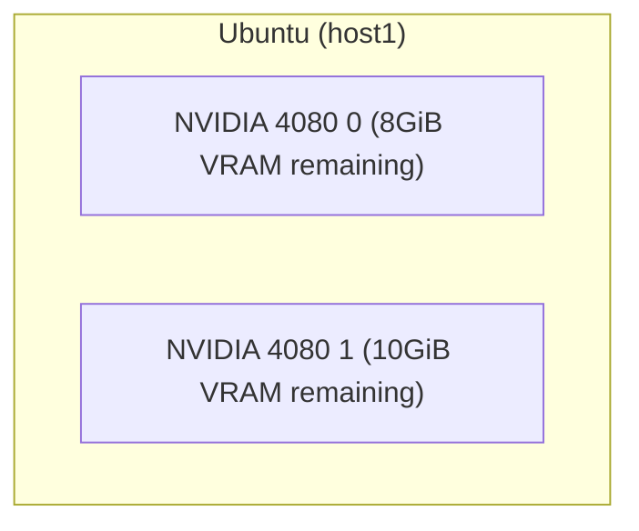
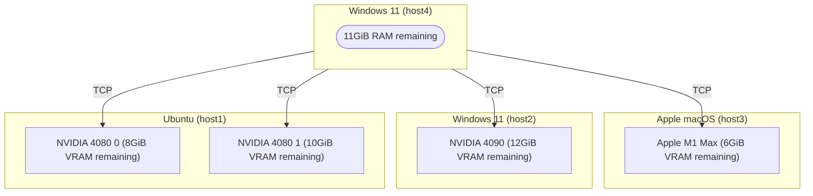

# GGUF Parser

> tl;dr, Review/Check [GGUF](https://github.com/ggerganov/ggml/blob/master/docs/gguf.md) files and estimate the memory
> usage.

[](https://goreportcard.com/report/github.com/gpustack/gguf-parser-go)
[](https://github.com/gpustack/gguf-parser-go/actions)
[](https://github.com/gpustack/gguf-parser-go#license)
[](https://github.com/gpustack/gguf-parser-go/releases)
[](https://hub.docker.com/r/gpustack/gguf-parser)
[](https://github.com/gpustack/gguf-parser-go/releases/latest)

[GGUF](https://github.com/ggerganov/ggml/blob/master/docs/gguf.md) is a file format for storing models for inference
with GGML and executors based on GGML. GGUF is a binary format that is designed for fast loading and saving of models,
and for ease of reading. Models are traditionally developed using PyTorch or another framework, and then converted to
GGUF for use in GGML.

GGUF Parser helps in reviewing and estimating the usage of a GGUF format model without download it.

## Key Features

- **No File Required**: GGUF Parser uses chunking reading to parse the metadata of remote GGUF file, which means you
  don't need to download the entire file and load it.
- **Accurate Prediction**: The evaluation results of GGUF Parser usually deviate from the actual usage by about 100MiB.
- **Fast**: GGUF Parser is written in Go, which is fast and efficient.

## Agenda

- [Notes](#notes)
- [Installation](#installation)
- [Overview](#overview)
    + [Parse](#parse)
        * [Local File](#parse-local-file)
        * [Remote File](#parse-remote-file)
        * [From HuggingFace](#parse-from-huggingface)
        * [From ModelScope](#parse-from-modelscope)
        * [From Ollama Library](#parse-from-ollama-library)
        * [None Model](#parse-none-model)
    + [Estimate](#estimate)
        * [Across Multiple GPU devices](#estimate-across-multiple-gpu-devices)
        * [Full Layers Offload (default)](#full-layers-offload-default)
        * [Zero Layers Offload](#zero-layers-offload)
        * [Specific Layers Offload](#specific-layers-offload)
        * [Specific Context Size](#specific-context-size)
        * [Enable Flash Attention](#enable-flash-attention)
        * [Disable MMap](#disable-mmap)
        * [With Adapter](#with-adapter)
        * [Get Proper Offload Layers](#get-proper-offload-layers)

## Notes

- Since v0.8.1, GGUF Parser supports to estimate the usage with LoRA/ControlVector adapters.
- Since v0.8.0, GGUF Parser distinguishes the remote devices from `--tensor-split` via `--rpc`.
    + For one host multiple GPU devices, you can use `--tensor-split` to get the estimated memory usage of each GPU.
    + For multiple hosts multiple GPU devices, you can use `--tensor-split` and `--rpc` to get the estimated memory
      usage of each GPU.
- The table result `DISTRIBUTABLE` indicates the GGUF file supports distribution inference or not,
  if the file doesn't support distribution inference, you can not offload it
  with [RPC servers](https://github.com/ggerganov/llama.cpp/tree/master/examples/rpc).
- Since v0.7.2, GGUF Parser supports retrieving the GGUF file's metadata via split file,
  which suffixes with something like `-00001-of-00009.gguf`.
- The `UMA` column indicates the memory usage of Apple macOS only. To estimate the macOS memory usage,
  you can sum the `UMA` results of `RAM` and `VRAM 0` columns.
- Since v0.7.0, GGUF Parser supports estimating the usage of multiple GPU devices.
    + The table result `RAM` means the system memory usage when
      running [LLaMA.Cpp](https://github.com/ggerganov/llama.cpp) or LLaMA.Cpp like application.
    + The `VRAM 0` columns means the first visible GPU memory usage when serving the GGUF file.
    + For example, `--tensor-split=1,1,1` means the GGUF file loading will be split into 3 parts with 33% each,
      and results in `VRAM 0`, `VRAM 1` and `VRAM 2` columns.

## Installation

Install from [releases](https://github.com/gpustack/gguf-parser-go/releases)
or `go install github.com/gpustack/gguf-parser-go/cmd/gguf-parser@latest`.

## Overview

### Parse

#### Parse Local File

```shell
$ gguf-parser --path="~/.cache/lm-studio/models/NousResearch/Hermes-2-Pro-Mistral-7B-GGUF/Hermes-2-Pro-Mistral-7B.Q5_K_M.gguf"
+-------------------------------------------------------------------------------------------+
| METADATA                                                                                  |
+-------+-------+-------+----------------+---------------+----------+------------+----------+
|  TYPE |  NAME |  ARCH |  QUANTIZATION  | LITTLE ENDIAN |   SIZE   | PARAMETERS |    BPW   |
+-------+-------+-------+----------------+---------------+----------+------------+----------+
| model | jeffq | llama | IQ3_XXS/Q5_K_M |      true     | 4.78 GiB |   7.24 B   | 5.67 bpw |
+-------+-------+-------+----------------+---------------+----------+------------+----------+

+---------------------------------------------------------------------------------------------------------------------------------------------------+
| ARCHITECTURE                                                                                                                                      |
+-----------------+---------------+---------------+------------------+--------------------+--------+------------------+------------+----------------+
| MAX CONTEXT LEN | EMBEDDING LEN | EMBEDDING GQA | ATTENTION CAUSAL | ATTENTION HEAD CNT | LAYERS | FEED FORWARD LEN | EXPERT CNT | VOCABULARY LEN |
+-----------------+---------------+---------------+------------------+--------------------+--------+------------------+------------+----------------+
|      32768      |      4096     |       4       |       true       |         32         |   32   |       14336      |      0     |      32032     |
+-----------------+---------------+---------------+------------------+--------------------+--------+------------------+------------+----------------+

+-------------------------------------------------------------------------------------------------------------------------------------------------------+
| TOKENIZER                                                                                                                                             |
+-------+-------------+------------+------------------+-----------+-----------+-----------+-----------+---------------+-----------------+---------------+
| MODEL | TOKENS SIZE | TOKENS LEN | ADDED TOKENS LEN | BOS TOKEN | EOS TOKEN | EOT TOKEN | EOM TOKEN | UNKNOWN TOKEN | SEPARATOR TOKEN | PADDING TOKEN |
+-------+-------------+------------+------------------+-----------+-----------+-----------+-----------+---------------+-----------------+---------------+
| llama |  450.50 KiB |    32032   |        N/A       |     1     |   32000   |    N/A    |    N/A    |      N/A      |       N/A       |      N/A      |
+-------+-------------+------------+------------------+-----------+-----------+-----------+-----------+---------------+-----------------+---------------+

+-------------------------------------------------------------------------------------------------------------------------------------------------------------------------------------------------------------+
| ESTIMATE                                                                                                                                                                                                    |
+-------+--------------+--------------------+-----------------+-----------+----------------+---------------+----------------+----------------+----------------------------------+-----------------------------+
|  ARCH | CONTEXT SIZE | BATCH SIZE (L / P) | FLASH ATTENTION | MMAP LOAD | EMBEDDING ONLY | DISTRIBUTABLE | OFFLOAD LAYERS | FULL OFFLOADED |                RAM               |            VRAM 0           |
|       |              |                    |                 |           |                |               |                |                +--------+------------+------------+--------+--------+-----------+
|       |              |                    |                 |           |                |               |                |                | LAYERS |     UMA    |   NONUMA   | LAYERS |   UMA  |   NONUMA  |
+-------+--------------+--------------------+-----------------+-----------+----------------+---------------+----------------+----------------+--------+------------+------------+--------+--------+-----------+
| llama |     32768    |     2048 / 512     |     Disabled    |  Enabled  |       No       |   Supported   |   33 (32 + 1)  |       Yes      |    0   | 176.25 MiB | 326.25 MiB | 32 + 1 |  4 GiB | 11.16 GiB |
+-------+--------------+--------------------+-----------------+-----------+----------------+---------------+----------------+----------------+--------+------------+------------+--------+--------+-----------+

$ # Retrieve the model's metadata via split file,
$ # which needs all split files has been downloaded.
$ gguf-parser --path="~/.cache/lm-studio/models/Qwen/Qwen2-72B-Instruct-GGUF/qwen2-72b-instruct-q6_k-00001-of-00002.gguf"

+------------------------------------------------------------------------------------------------------------+
| METADATA                                                                                                   |
+-------+-------------------------+-------+--------------+---------------+-----------+------------+----------+
|  TYPE |           NAME          |  ARCH | QUANTIZATION | LITTLE ENDIAN |    SIZE   | PARAMETERS |    BPW   |
+-------+-------------------------+-------+--------------+---------------+-----------+------------+----------+
| model | 72b.5000B--cmix31-ba... | qwen2 |  IQ1_S/Q6_K  |      true     | 59.92 GiB |   72.71 B  | 7.08 bpw |
+-------+-------------------------+-------+--------------+---------------+-----------+------------+----------+

+---------------------------------------------------------------------------------------------------------------------------------------------------+
| ARCHITECTURE                                                                                                                                      |
+-----------------+---------------+---------------+------------------+--------------------+--------+------------------+------------+----------------+
| MAX CONTEXT LEN | EMBEDDING LEN | EMBEDDING GQA | ATTENTION CAUSAL | ATTENTION HEAD CNT | LAYERS | FEED FORWARD LEN | EXPERT CNT | VOCABULARY LEN |
+-----------------+---------------+---------------+------------------+--------------------+--------+------------------+------------+----------------+
|      32768      |      8192     |       8       |       true       |         64         |   80   |       29568      |      0     |     152064     |
+-----------------+---------------+---------------+------------------+--------------------+--------+------------------+------------+----------------+

+-------------------------------------------------------------------------------------------------------------------------------------------------------+
| TOKENIZER                                                                                                                                             |
+-------+-------------+------------+------------------+-----------+-----------+-----------+-----------+---------------+-----------------+---------------+
| MODEL | TOKENS SIZE | TOKENS LEN | ADDED TOKENS LEN | BOS TOKEN | EOS TOKEN | EOT TOKEN | EOM TOKEN | UNKNOWN TOKEN | SEPARATOR TOKEN | PADDING TOKEN |
+-------+-------------+------------+------------------+-----------+-----------+-----------+-----------+---------------+-----------------+---------------+
|  gpt2 |   2.47 MiB  |   152064   |        N/A       |   151643  |   151645  |    N/A    |    N/A    |      N/A      |       N/A       |     151643    |
+-------+-------------+------------+------------------+-----------+-----------+-----------+-----------+---------------+-----------------+---------------+

+-------------------------------------------------------------------------------------------------------------------------------------------------------------------------------------------------------------+
| ESTIMATE                                                                                                                                                                                                    |
+-------+--------------+--------------------+-----------------+-----------+----------------+---------------+----------------+----------------+----------------------------------+-----------------------------+
|  ARCH | CONTEXT SIZE | BATCH SIZE (L / P) | FLASH ATTENTION | MMAP LOAD | EMBEDDING ONLY | DISTRIBUTABLE | OFFLOAD LAYERS | FULL OFFLOADED |                RAM               |            VRAM 0           |
|       |              |                    |                 |           |                |               |                |                +--------+------------+------------+--------+--------+-----------+
|       |              |                    |                 |           |                |               |                |                | LAYERS |     UMA    |   NONUMA   | LAYERS |   UMA  |   NONUMA  |
+-------+--------------+--------------------+-----------------+-----------+----------------+---------------+----------------+----------------+--------+------------+------------+--------+--------+-----------+
| qwen2 |     32768    |     2048 / 512     |     Disabled    |  Enabled  |       No       | Not Supported |   81 (80 + 1)  |       Yes      |    0   | 307.38 MiB | 457.38 MiB | 80 + 1 | 10 GiB | 73.47 GiB |
+-------+--------------+--------------------+-----------------+-----------+----------------+---------------+----------------+----------------+--------+------------+------------+--------+--------+-----------+

```

#### Parse Remote File

```shell
$ gguf-parser --url="https://huggingface.co/NousResearch/Nous-Hermes-2-Mixtral-8x7B-DPO-GGUF/resolve/main/Nous-Hermes-2-Mixtral-8x7B-DPO.Q3_K_M.gguf"
+------------------------------------------------------------------------------------------+
| METADATA                                                                                 |
+-------+----------+-------+--------------+---------------+--------+------------+----------+
|  TYPE |   NAME   |  ARCH | QUANTIZATION | LITTLE ENDIAN |  SIZE  | PARAMETERS |    BPW   |
+-------+----------+-------+--------------+---------------+--------+------------+----------+
| model | emozilla | llama |  Q4_K/Q3_K_M |      true     | 21 GiB |   46.70 B  | 3.86 bpw |
+-------+----------+-------+--------------+---------------+--------+------------+----------+

+---------------------------------------------------------------------------------------------------------------------------------------------------+
| ARCHITECTURE                                                                                                                                      |
+-----------------+---------------+---------------+------------------+--------------------+--------+------------------+------------+----------------+
| MAX CONTEXT LEN | EMBEDDING LEN | EMBEDDING GQA | ATTENTION CAUSAL | ATTENTION HEAD CNT | LAYERS | FEED FORWARD LEN | EXPERT CNT | VOCABULARY LEN |
+-----------------+---------------+---------------+------------------+--------------------+--------+------------------+------------+----------------+
|      32768      |      4096     |       4       |       true       |         32         |   32   |       14336      |      8     |      32002     |
+-----------------+---------------+---------------+------------------+--------------------+--------+------------------+------------+----------------+

+-------------------------------------------------------------------------------------------------------------------------------------------------------+
| TOKENIZER                                                                                                                                             |
+-------+-------------+------------+------------------+-----------+-----------+-----------+-----------+---------------+-----------------+---------------+
| MODEL | TOKENS SIZE | TOKENS LEN | ADDED TOKENS LEN | BOS TOKEN | EOS TOKEN | EOT TOKEN | EOM TOKEN | UNKNOWN TOKEN | SEPARATOR TOKEN | PADDING TOKEN |
+-------+-------------+------------+------------------+-----------+-----------+-----------+-----------+---------------+-----------------+---------------+
| llama |  449.91 KiB |    32002   |        N/A       |     1     |   32000   |    N/A    |    N/A    |       0       |       N/A       |       2       |
+-------+-------------+------------+------------------+-----------+-----------+-----------+-----------+---------------+-----------------+---------------+

+--------------------------------------------------------------------------------------------------------------------------------------------------------------------------------------------------------------------+
| ESTIMATE                                                                                                                                                                                                           |
+-------+--------------+--------------------+-----------------+---------------+----------------+---------------+----------------+----------------+----------------------------------+--------------------------------+
|  ARCH | CONTEXT SIZE | BATCH SIZE (L / P) | FLASH ATTENTION |   MMAP LOAD   | EMBEDDING ONLY | DISTRIBUTABLE | OFFLOAD LAYERS | FULL OFFLOADED |                RAM               |             VRAM 0             |
|       |              |                    |                 |               |                |               |                |                +--------+------------+------------+--------+-----------+-----------+
|       |              |                    |                 |               |                |               |                |                | LAYERS |     UMA    |   NONUMA   | LAYERS |    UMA    |   NONUMA  |
+-------+--------------+--------------------+-----------------+---------------+----------------+---------------+----------------+----------------+--------+------------+------------+--------+-----------+-----------+
| llama |     32768    |     2048 / 512     |     Disabled    | Not Supported |       No       |   Supported   |   33 (32 + 1)  |       Yes      |    0   | 277.10 MiB | 427.10 MiB | 32 + 1 | 24.94 GiB | 27.41 GiB |
+-------+--------------+--------------------+-----------------+---------------+----------------+---------------+----------------+----------------+--------+------------+------------+--------+-----------+-----------+

$ # Retrieve the model's metadata via split file

$ gguf-parser --url="https://huggingface.co/MaziyarPanahi/Meta-Llama-3.1-405B-Instruct-GGUF/resolve/main/Meta-Llama-3.1-405B-Instruct.Q2_K.gguf-00001-of-00009.gguf"
+-------------------------------------------------------------------------------------------------------------+
| METADATA                                                                                                    |
+-------+-------------------------+-------+--------------+---------------+------------+------------+----------+
|  TYPE |           NAME          |  ARCH | QUANTIZATION | LITTLE ENDIAN |    SIZE    | PARAMETERS |    BPW   |
+-------+-------------------------+-------+--------------+---------------+------------+------------+----------+
| model | Models Meta Llama Me... | llama |     Q2_K     |      true     | 140.81 GiB |  410.08 B  | 2.95 bpw |
+-------+-------------------------+-------+--------------+---------------+------------+------------+----------+

+---------------------------------------------------------------------------------------------------------------------------------------------------+
| ARCHITECTURE                                                                                                                                      |
+-----------------+---------------+---------------+------------------+--------------------+--------+------------------+------------+----------------+
| MAX CONTEXT LEN | EMBEDDING LEN | EMBEDDING GQA | ATTENTION CAUSAL | ATTENTION HEAD CNT | LAYERS | FEED FORWARD LEN | EXPERT CNT | VOCABULARY LEN |
+-----------------+---------------+---------------+------------------+--------------------+--------+------------------+------------+----------------+
|      131072     |     16384     |       8       |       true       |         128        |   126  |       53248      |      0     |     128256     |
+-----------------+---------------+---------------+------------------+--------------------+--------+------------------+------------+----------------+

+-------------------------------------------------------------------------------------------------------------------------------------------------------+
| TOKENIZER                                                                                                                                             |
+-------+-------------+------------+------------------+-----------+-----------+-----------+-----------+---------------+-----------------+---------------+
| MODEL | TOKENS SIZE | TOKENS LEN | ADDED TOKENS LEN | BOS TOKEN | EOS TOKEN | EOT TOKEN | EOM TOKEN | UNKNOWN TOKEN | SEPARATOR TOKEN | PADDING TOKEN |
+-------+-------------+------------+------------------+-----------+-----------+-----------+-----------+---------------+-----------------+---------------+
|  gpt2 |    2 MiB    |   128256   |        N/A       |   128000  |   128009  |    N/A    |    N/A    |      N/A      |       N/A       |      N/A      |
+-------+-------------+------------+------------------+-----------+-----------+-----------+-----------+---------------+-----------------+---------------+

+----------------------------------------------------------------------------------------------------------------------------------------------------------------------------------------------------------------+
| ESTIMATE                                                                                                                                                                                                       |
+-------+--------------+--------------------+-----------------+-----------+----------------+---------------+----------------+----------------+----------------------------------+--------------------------------+
|  ARCH | CONTEXT SIZE | BATCH SIZE (L / P) | FLASH ATTENTION | MMAP LOAD | EMBEDDING ONLY | DISTRIBUTABLE | OFFLOAD LAYERS | FULL OFFLOADED |                RAM               |             VRAM 0             |
|       |              |                    |                 |           |                |               |                |                +--------+------------+------------+---------+---------+------------+
|       |              |                    |                 |           |                |               |                |                | LAYERS |     UMA    |   NONUMA   |  LAYERS |   UMA   |   NONUMA   |
+-------+--------------+--------------------+-----------------+-----------+----------------+---------------+----------------+----------------+--------+------------+------------+---------+---------+------------+
| llama |    131072    |     2048 / 512     |     Disabled    |  Enabled  |       No       |   Supported   |  127 (126 + 1) |       Yes      |    0   | 684.53 MiB | 834.53 MiB | 126 + 1 | 126 GiB | 299.79 GiB |
+-------+--------------+--------------------+-----------------+-----------+----------------+---------------+----------------+----------------+--------+------------+------------+---------+---------+------------+

```

#### Parse From HuggingFace

```shell
$ gguf-parser --hf-repo="openbmb/MiniCPM-Llama3-V-2_5-gguf" --hf-file="ggml-model-Q5_K_M.gguf" --hf-mmproj-file="mmproj-model-f16.gguf"
+-------------------------------------------------------------------------------------------+
| METADATA                                                                                  |
+-------+-------+-------+----------------+---------------+----------+------------+----------+
|  TYPE |  NAME |  ARCH |  QUANTIZATION  | LITTLE ENDIAN |   SIZE   | PARAMETERS |    BPW   |
+-------+-------+-------+----------------+---------------+----------+------------+----------+
| model | model | llama | IQ3_XXS/Q5_K_M |      true     | 5.33 GiB |   8.03 B   | 5.70 bpw |
+-------+-------+-------+----------------+---------------+----------+------------+----------+

+---------------------------------------------------------------------------------------------------------------------------------------------------+
| ARCHITECTURE                                                                                                                                      |
+-----------------+---------------+---------------+------------------+--------------------+--------+------------------+------------+----------------+
| MAX CONTEXT LEN | EMBEDDING LEN | EMBEDDING GQA | ATTENTION CAUSAL | ATTENTION HEAD CNT | LAYERS | FEED FORWARD LEN | EXPERT CNT | VOCABULARY LEN |
+-----------------+---------------+---------------+------------------+--------------------+--------+------------------+------------+----------------+
|       8192      |      4096     |       4       |       true       |         32         |   32   |       14336      |      0     |     128256     |
+-----------------+---------------+---------------+------------------+--------------------+--------+------------------+------------+----------------+

+-------------------------------------------------------------------------------------------------------------------------------------------------------+
| TOKENIZER                                                                                                                                             |
+-------+-------------+------------+------------------+-----------+-----------+-----------+-----------+---------------+-----------------+---------------+
| MODEL | TOKENS SIZE | TOKENS LEN | ADDED TOKENS LEN | BOS TOKEN | EOS TOKEN | EOT TOKEN | EOM TOKEN | UNKNOWN TOKEN | SEPARATOR TOKEN | PADDING TOKEN |
+-------+-------------+------------+------------------+-----------+-----------+-----------+-----------+---------------+-----------------+---------------+
|  gpt2 |    2 MiB    |   128256   |        N/A       |   128000  |   128001  |    N/A    |    N/A    |     128002    |       N/A       |       0       |
+-------+-------------+------------+------------------+-----------+-----------+-----------+-----------+---------------+-----------------+---------------+

+------------------------------------------------------------------------------------------------------------------------------------------------------------------------------------------------------------+
| ESTIMATE                                                                                                                                                                                                   |
+-------+--------------+--------------------+-----------------+-----------+----------------+---------------+----------------+----------------+----------------------------------+----------------------------+
|  ARCH | CONTEXT SIZE | BATCH SIZE (L / P) | FLASH ATTENTION | MMAP LOAD | EMBEDDING ONLY | DISTRIBUTABLE | OFFLOAD LAYERS | FULL OFFLOADED |                RAM               |           VRAM 0           |
|       |              |                    |                 |           |                |               |                |                +--------+------------+------------+--------+--------+----------+
|       |              |                    |                 |           |                |               |                |                | LAYERS |     UMA    |   NONUMA   | LAYERS |   UMA  |  NONUMA  |
+-------+--------------+--------------------+-----------------+-----------+----------------+---------------+----------------+----------------+--------+------------+------------+--------+--------+----------+
| llama |     8192     |     2048 / 512     |     Disabled    |  Enabled  |       No       |   Supported   |   33 (32 + 1)  |       Yes      |    0   | 184.85 MiB | 334.85 MiB | 32 + 1 |  1 GiB | 7.88 GiB |
+-------+--------------+--------------------+-----------------+-----------+----------------+---------------+----------------+----------------+--------+------------+------------+--------+--------+----------+

$ # Retrieve the model's metadata via split file

$ gguf-parser --hf-repo="etemiz/Llama-3.1-405B-Inst-GGUF" --hf-file="llama-3.1-405b-IQ1_M-00019-of-00019.gguf"
+------------------------------------------------------------------------------------------------------------+
| METADATA                                                                                                   |
+-------+-------------------------+-------+--------------+---------------+-----------+------------+----------+
|  TYPE |           NAME          |  ARCH | QUANTIZATION | LITTLE ENDIAN |    SIZE   | PARAMETERS |    BPW   |
+-------+-------------------------+-------+--------------+---------------+-----------+------------+----------+
| model | Meta-Llama-3.1-405B-... | llama |     IQ1_M    |      true     | 88.61 GiB |  410.08 B  | 1.86 bpw |
+-------+-------------------------+-------+--------------+---------------+-----------+------------+----------+

+---------------------------------------------------------------------------------------------------------------------------------------------------+
| ARCHITECTURE                                                                                                                                      |
+-----------------+---------------+---------------+------------------+--------------------+--------+------------------+------------+----------------+
| MAX CONTEXT LEN | EMBEDDING LEN | EMBEDDING GQA | ATTENTION CAUSAL | ATTENTION HEAD CNT | LAYERS | FEED FORWARD LEN | EXPERT CNT | VOCABULARY LEN |
+-----------------+---------------+---------------+------------------+--------------------+--------+------------------+------------+----------------+
|      131072     |     16384     |       8       |       true       |         128        |   126  |       53248      |      0     |     128256     |
+-----------------+---------------+---------------+------------------+--------------------+--------+------------------+------------+----------------+

+-------------------------------------------------------------------------------------------------------------------------------------------------------+
| TOKENIZER                                                                                                                                             |
+-------+-------------+------------+------------------+-----------+-----------+-----------+-----------+---------------+-----------------+---------------+
| MODEL | TOKENS SIZE | TOKENS LEN | ADDED TOKENS LEN | BOS TOKEN | EOS TOKEN | EOT TOKEN | EOM TOKEN | UNKNOWN TOKEN | SEPARATOR TOKEN | PADDING TOKEN |
+-------+-------------+------------+------------------+-----------+-----------+-----------+-----------+---------------+-----------------+---------------+
|  gpt2 |    2 MiB    |   128256   |        N/A       |   128000  |   128009  |    N/A    |    N/A    |      N/A      |       N/A       |      N/A      |
+-------+-------------+------------+------------------+-----------+-----------+-----------+-----------+---------------+-----------------+---------------+

+----------------------------------------------------------------------------------------------------------------------------------------------------------------------------------------------------------------+
| ESTIMATE                                                                                                                                                                                                       |
+-------+--------------+--------------------+-----------------+-----------+----------------+---------------+----------------+----------------+----------------------------------+--------------------------------+
|  ARCH | CONTEXT SIZE | BATCH SIZE (L / P) | FLASH ATTENTION | MMAP LOAD | EMBEDDING ONLY | DISTRIBUTABLE | OFFLOAD LAYERS | FULL OFFLOADED |                RAM               |             VRAM 0             |
|       |              |                    |                 |           |                |               |                |                +--------+------------+------------+---------+---------+------------+
|       |              |                    |                 |           |                |               |                |                | LAYERS |     UMA    |   NONUMA   |  LAYERS |   UMA   |   NONUMA   |
+-------+--------------+--------------------+-----------------+-----------+----------------+---------------+----------------+----------------+--------+------------+------------+---------+---------+------------+
| llama |    131072    |     2048 / 512     |     Disabled    |  Enabled  |       No       |   Supported   |  127 (126 + 1) |       Yes      |    0   | 684.53 MiB | 834.53 MiB | 126 + 1 | 126 GiB | 247.59 GiB |
+-------+--------------+--------------------+-----------------+-----------+----------------+---------------+----------------+----------------+--------+------------+------------+---------+---------+------------+

```

#### Parse From ModelScope

```shell
$ gguf-parser --ms-repo="shaowenchen/chinese-alpaca-2-13b-16k-gguf" --ms-file="chinese-alpaca-2-13b-16k.Q5_K.gguf"
+------------------------------------------------------------------------------------------+
| METADATA                                                                                 |
+-------+------+-------+----------------+---------------+----------+------------+----------+
|  TYPE | NAME |  ARCH |  QUANTIZATION  | LITTLE ENDIAN |   SIZE   | PARAMETERS |    BPW   |
+-------+------+-------+----------------+---------------+----------+------------+----------+
| model |  ..  | llama | IQ3_XXS/Q5_K_M |      true     | 8.76 GiB |   13.25 B  | 5.68 bpw |
+-------+------+-------+----------------+---------------+----------+------------+----------+

+---------------------------------------------------------------------------------------------------------------------------------------------------+
| ARCHITECTURE                                                                                                                                      |
+-----------------+---------------+---------------+------------------+--------------------+--------+------------------+------------+----------------+
| MAX CONTEXT LEN | EMBEDDING LEN | EMBEDDING GQA | ATTENTION CAUSAL | ATTENTION HEAD CNT | LAYERS | FEED FORWARD LEN | EXPERT CNT | VOCABULARY LEN |
+-----------------+---------------+---------------+------------------+--------------------+--------+------------------+------------+----------------+
|      16384      |      5120     |       1       |       true       |         N/A        |   40   |       13824      |      0     |      55296     |
+-----------------+---------------+---------------+------------------+--------------------+--------+------------------+------------+----------------+

+-------------------------------------------------------------------------------------------------------------------------------------------------------+
| TOKENIZER                                                                                                                                             |
+-------+-------------+------------+------------------+-----------+-----------+-----------+-----------+---------------+-----------------+---------------+
| MODEL | TOKENS SIZE | TOKENS LEN | ADDED TOKENS LEN | BOS TOKEN | EOS TOKEN | EOT TOKEN | EOM TOKEN | UNKNOWN TOKEN | SEPARATOR TOKEN | PADDING TOKEN |
+-------+-------------+------------+------------------+-----------+-----------+-----------+-----------+---------------+-----------------+---------------+
| llama |  769.83 KiB |    55296   |        N/A       |     1     |     2     |    N/A    |    N/A    |      N/A      |       N/A       |      N/A      |
+-------+-------------+------------+------------------+-----------+-----------+-----------+-----------+---------------+-----------------+---------------+

+----------------------------------------------------------------------------------------------------------------------------------------------------------------------------------------------------------------+
| ESTIMATE                                                                                                                                                                                                       |
+-------+--------------+--------------------+-----------------+-----------+----------------+---------------+----------------+----------------+----------------------------------+--------------------------------+
|  ARCH | CONTEXT SIZE | BATCH SIZE (L / P) | FLASH ATTENTION | MMAP LOAD | EMBEDDING ONLY | DISTRIBUTABLE | OFFLOAD LAYERS | FULL OFFLOADED |                RAM               |             VRAM 0             |
|       |              |                    |                 |           |                |               |                |                +--------+------------+------------+--------+-----------+-----------+
|       |              |                    |                 |           |                |               |                |                | LAYERS |     UMA    |   NONUMA   | LAYERS |    UMA    |   NONUMA  |
+-------+--------------+--------------------+-----------------+-----------+----------------+---------------+----------------+----------------+--------+------------+------------+--------+-----------+-----------+
| llama |     16384    |     2048 / 512     |     Disabled    |  Enabled  |       No       |   Supported   |   41 (40 + 1)  |       Yes      |    0   | 154.95 MiB | 304.95 MiB | 40 + 1 | 12.50 GiB | 22.96 GiB |
+-------+--------------+--------------------+-----------------+-----------+----------------+---------------+----------------+----------------+--------+------------+------------+--------+-----------+-----------+

```

#### Parse From Ollama Library

```shell
$ gguf-parser --ol-model="llama3.1"
+-----------------------------------------------------------------------------------------------------------+
| METADATA                                                                                                  |
+-------+-------------------------+-------+--------------+---------------+----------+------------+----------+
|  TYPE |           NAME          |  ARCH | QUANTIZATION | LITTLE ENDIAN |   SIZE   | PARAMETERS |    BPW   |
+-------+-------------------------+-------+--------------+---------------+----------+------------+----------+
| model | Meta Llama 3.1 8B In... | llama |     Q4_0     |      true     | 4.33 GiB |   8.03 B   | 4.64 bpw |
+-------+-------------------------+-------+--------------+---------------+----------+------------+----------+

+---------------------------------------------------------------------------------------------------------------------------------------------------+
| ARCHITECTURE                                                                                                                                      |
+-----------------+---------------+---------------+------------------+--------------------+--------+------------------+------------+----------------+
| MAX CONTEXT LEN | EMBEDDING LEN | EMBEDDING GQA | ATTENTION CAUSAL | ATTENTION HEAD CNT | LAYERS | FEED FORWARD LEN | EXPERT CNT | VOCABULARY LEN |
+-----------------+---------------+---------------+------------------+--------------------+--------+------------------+------------+----------------+
|      131072     |      4096     |       4       |       true       |         32         |   32   |       14336      |      0     |     128256     |
+-----------------+---------------+---------------+------------------+--------------------+--------+------------------+------------+----------------+

+-------------------------------------------------------------------------------------------------------------------------------------------------------+
| TOKENIZER                                                                                                                                             |
+-------+-------------+------------+------------------+-----------+-----------+-----------+-----------+---------------+-----------------+---------------+
| MODEL | TOKENS SIZE | TOKENS LEN | ADDED TOKENS LEN | BOS TOKEN | EOS TOKEN | EOT TOKEN | EOM TOKEN | UNKNOWN TOKEN | SEPARATOR TOKEN | PADDING TOKEN |
+-------+-------------+------------+------------------+-----------+-----------+-----------+-----------+---------------+-----------------+---------------+
|  gpt2 |    2 MiB    |   128256   |        N/A       |   128000  |   128009  |    N/A    |    N/A    |      N/A      |       N/A       |      N/A      |
+-------+-------------+------------+------------------+-----------+-----------+-----------+-----------+---------------+-----------------+---------------+

+-------------------------------------------------------------------------------------------------------------------------------------------------------------------------------------------+
| ESTIMATE                                                                                                                                                                                  |
+-------+--------------+--------------------+-----------------+-----------+----------------+---------------+----------------+----------------+-------------------------+--------------------+
|  ARCH | CONTEXT SIZE | BATCH SIZE (L / P) | FLASH ATTENTION | MMAP LOAD | EMBEDDING ONLY | DISTRIBUTABLE | OFFLOAD LAYERS | FULL OFFLOADED |           RAM           |       VRAM 0       |
|       |              |                    |                 |           |                |               |                |                +------------+------------+--------+-----------+
|       |              |                    |                 |           |                |               |                |                |     UMA    |   NONUMA   |   UMA  |   NONUMA  |
+-------+--------------+--------------------+-----------------+-----------+----------------+---------------+----------------+----------------+------------+------------+--------+-----------+
| llama |    131072    |     2048 / 512     |     Disabled    |  Enabled  |       No       |   Supported   |   33 (32 + 1)  |       Yes      | 411.62 MiB | 561.62 MiB | 16 GiB | 29.08 GiB |
+-------+--------------+--------------------+-----------------+-----------+----------------+---------------+----------------+----------------+------------+------------+--------+-----------+

$ # Ollama Model includes the preset params and other artifacts, like multimodal projectors or LoRA adapters, 
$ # you can get the usage of Ollama running by using `--ol-usage` option.

$ gguf-parser --ol-model="llama3.1" --ol-usage
+-----------------------------------------------------------------------------------------------------------+
| METADATA                                                                                                  |
+-------+-------------------------+-------+--------------+---------------+----------+------------+----------+
|  TYPE |           NAME          |  ARCH | QUANTIZATION | LITTLE ENDIAN |   SIZE   | PARAMETERS |    BPW   |
+-------+-------------------------+-------+--------------+---------------+----------+------------+----------+
| model | Meta Llama 3.1 8B In... | llama |     Q4_0     |      true     | 4.33 GiB |   8.03 B   | 4.64 bpw |
+-------+-------------------------+-------+--------------+---------------+----------+------------+----------+

+---------------------------------------------------------------------------------------------------------------------------------------------------+
| ARCHITECTURE                                                                                                                                      |
+-----------------+---------------+---------------+------------------+--------------------+--------+------------------+------------+----------------+
| MAX CONTEXT LEN | EMBEDDING LEN | EMBEDDING GQA | ATTENTION CAUSAL | ATTENTION HEAD CNT | LAYERS | FEED FORWARD LEN | EXPERT CNT | VOCABULARY LEN |
+-----------------+---------------+---------------+------------------+--------------------+--------+------------------+------------+----------------+
|      131072     |      4096     |       4       |       true       |         32         |   32   |       14336      |      0     |     128256     |
+-----------------+---------------+---------------+------------------+--------------------+--------+------------------+------------+----------------+

+-------------------------------------------------------------------------------------------------------------------------------------------------------+
| TOKENIZER                                                                                                                                             |
+-------+-------------+------------+------------------+-----------+-----------+-----------+-----------+---------------+-----------------+---------------+
| MODEL | TOKENS SIZE | TOKENS LEN | ADDED TOKENS LEN | BOS TOKEN | EOS TOKEN | EOT TOKEN | EOM TOKEN | UNKNOWN TOKEN | SEPARATOR TOKEN | PADDING TOKEN |
+-------+-------------+------------+------------------+-----------+-----------+-----------+-----------+---------------+-----------------+---------------+
|  gpt2 |    2 MiB    |   128256   |        N/A       |   128000  |   128009  |    N/A    |    N/A    |      N/A      |       N/A       |      N/A      |
+-------+-------------+------------+------------------+-----------+-----------+-----------+-----------+---------------+-----------------+---------------+

+----------------------------------------------------------------------------------------------------------------------------------------------------------------------------------------------+
| ESTIMATE                                                                                                                                                                                     |
+-------+--------------+--------------------+-----------------+-----------+----------------+---------------+----------------+----------------+-------------------------+-----------------------+
|  ARCH | CONTEXT SIZE | BATCH SIZE (L / P) | FLASH ATTENTION | MMAP LOAD | EMBEDDING ONLY | DISTRIBUTABLE | OFFLOAD LAYERS | FULL OFFLOADED |           RAM           |         VRAM 0        |
|       |              |                    |                 |           |                |               |                |                +------------+------------+------------+----------+
|       |              |                    |                 |           |                |               |                |                |     UMA    |   NONUMA   |     UMA    |  NONUMA  |
+-------+--------------+--------------------+-----------------+-----------+----------------+---------------+----------------+----------------+------------+------------+------------+----------+
| llama |     2048     |     2048 / 512     |     Disabled    |  Enabled  |       No       |   Supported   |   33 (32 + 1)  |       Yes      | 159.62 MiB | 309.62 MiB | 256.50 MiB | 4.82 GiB |
+-------+--------------+--------------------+-----------------+-----------+----------------+---------------+----------------+----------------+------------+------------+------------+----------+

```

#### Parse None Model

```shell
$ # Parse Multi-Modal Projector
$ gguf-parser --hf-repo="xtuner/llava-llama-3-8b-v1_1-gguf" --hf-file="llava-llama-3-8b-v1_1-mmproj-f16.gguf"                                                                        
+-----------------------------------------------------------------------------------------------------------------+
| METADATA                                                                                                        |
+-----------+-------------------------+------+--------------+---------------+------------+------------+-----------+
|    TYPE   |           NAME          | ARCH | QUANTIZATION | LITTLE ENDIAN |    SIZE    | PARAMETERS |    BPW    |
+-----------+-------------------------+------+--------------+---------------+------------+------------+-----------+
| projector | openai/clip-vit-larg... | clip |      F16     |      true     | 595.49 MiB |  311.89 M  | 16.02 bpw |
+-----------+-------------------------+------+--------------+---------------+------------+------------+-----------+

+----------------------------------------------------------------------+
| ARCHITECTURE                                                         |
+----------------+---------------+--------+------------------+---------+
| PROJECTOR TYPE | EMBEDDING LEN | LAYERS | FEED FORWARD LEN | ENCODER |
+----------------+---------------+--------+------------------+---------+
|       mlp      |      1024     |   23   |       4096       |  Vision |
+----------------+---------------+--------+------------------+---------+

$ # Parse LoRA Adapter
$ gguf-parser --hf-repo="ngxson/test_gguf_lora_adapter" --hf-file="lora-Llama-3-Instruct-abliteration-LoRA-8B-f16.gguf"
+---------------------------------------------------------------------------------------------+
| METADATA                                                                                    |
+---------+------+-------+--------------+---------------+------------+------------+-----------+
|   TYPE  | NAME |  ARCH | QUANTIZATION | LITTLE ENDIAN |    SIZE    | PARAMETERS |    BPW    |
+---------+------+-------+--------------+---------------+------------+------------+-----------+
| adapter |  N/A | llama |      F16     |      true     | 168.08 MiB |   88.12 M  | 16.00 bpw |
+---------+------+-------+--------------+---------------+------------+------------+-----------+

+---------------------------+
| ARCHITECTURE              |
+--------------+------------+
| ADAPTER TYPE | LORA ALPHA |
+--------------+------------+
|     lora     |     32     |
+--------------+------------+

```

### Estimate

#### Estimate Across Multiple GPU Devices

Imaging you're preparing to run
the [hierholzer/Llama-3.1-70B-Instruct-GGUF](https://huggingface.co/hierholzer/Llama-3.1-70B-Instruct-GGUF) model file
across several hosts in your local network. Some of these hosts are equipped with GPU devices, while others do not have
any GPU capabilities.


##### Single Host Multiple GPU Devices

Let's assume you plan to run the model on `host1` only.



```shell
$ gguf-parser --hf-repo="hierholzer/Llama-3.1-70B-Instruct-GGUF" --hf-file="Llama-3.1-70B-Instruct-Q4_K_M.gguf" --skip-metadata --skip-architecture --skip-tokenizer --ctx-size=1024 --tensor-split="8,10"
+-----------------------------------------------------------------------------------------------------------------------------------------------------------------------------------------------------------------------------------------------+
| ESTIMATE                                                                                                                                                                                                                                      |
+-------+--------------+--------------------+-----------------+-----------+----------------+---------------+----------------+----------------+----------------------------------+------------------------------+--------------------------------+
|  ARCH | CONTEXT SIZE | BATCH SIZE (L / P) | FLASH ATTENTION | MMAP LOAD | EMBEDDING ONLY | DISTRIBUTABLE | OFFLOAD LAYERS | FULL OFFLOADED |                RAM               |            VRAM 0            |             VRAM 1             |
|       |              |                    |                 |           |                |               |                |                +--------+------------+------------+--------+---------+-----------+--------+-----------+-----------+
|       |              |                    |                 |           |                |               |                |                | LAYERS |     UMA    |   NONUMA   | LAYERS |   UMA   |   NONUMA  | LAYERS |    UMA    |   NONUMA  |
+-------+--------------+--------------------+-----------------+-----------+----------------+---------------+----------------+----------------+--------+------------+------------+--------+---------+-----------+--------+-----------+-----------+
| llama |     1024     |     2048 / 512     |     Disabled    |  Enabled  |       No       |   Supported   |   81 (80 + 1)  |       Yes      |    0   | 270.08 MiB | 420.08 MiB |   36   | 144 MiB | 18.67 GiB | 44 + 1 | 21.40 GiB | 22.44 GiB |
+-------+--------------+--------------------+-----------------+-----------+----------------+---------------+----------------+----------------+--------+------------+------------+--------+---------+-----------+--------+-----------+-----------+

```

Based on the output provided, serving the `hierholzer/Llama-3.1-70B-Instruct-GGUF` model on `host1` has the following
resource consumption:

| Host                  | Available RAM | Request RAM | Available VRAM | Request VRAM | Result     |
|-----------------------|---------------|-------------|----------------|--------------|------------|
| host1                 |               | 420.08 MiB  |                |              | :thumbsup: |
| host1 (NVIDIA 4080 0) |               |             | 8 GiB          | 18.67 GiB    |            |
| host1 (NVIDIA 4080 1) |               |             | 10 GiB         | 22.44 GiB    |            |

It appears that running the model on `host1` alone is not feasible.

##### Multiple Hosts Multiple GPU Devices

Next, let's consider the scenario where you plan to run the model on `host4`, while offloading all layers to `host1`,
`host2`,
and `host3`.



```shell
$ gguf-parser --hf-repo="hierholzer/Llama-3.1-70B-Instruct-GGUF" --hf-file="Llama-3.1-70B-Instruct-Q4_K_M.gguf" --skip-metadata --skip-architecture --skip-tokenizer --ctx-size=1024 --tensor-split="8,10,12,6" --rpc="host1:50052,host1:50053,host2:50052,host3:50052"
+----------------------------------------------------------------------------------------------------------------------------------------------------------------------------------------------------------------------------------------------------------------------------------------------------------------+
| ESTIMATE                                                                                                                                                                                                                                                                                                       |
+-------+--------------+--------------------+-----------------+-----------+----------------+---------------+----------------+----------------+----------------------------------+-------------------------------+--------------------------------+--------------------------------+------------------------------+
|  ARCH | CONTEXT SIZE | BATCH SIZE (L / P) | FLASH ATTENTION | MMAP LOAD | EMBEDDING ONLY | DISTRIBUTABLE | OFFLOAD LAYERS | FULL OFFLOADED |                RAM               |             VRAM 0            |             VRAM 1             |             VRAM 2             |            VRAM 3            |
|       |              |                    |                 |           |                |               |                |                +--------+------------+------------+--------+----------+-----------+--------+-----------+-----------+--------+-----------+-----------+--------+----------+----------+
|       |              |                    |                 |           |                |               |                |                | LAYERS |     UMA    |   NONUMA   | LAYERS |    UMA   |   NONUMA  | LAYERS |    UMA    |   NONUMA  | LAYERS |    UMA    |   NONUMA  | LAYERS |    UMA   |  NONUMA  |
+-------+--------------+--------------------+-----------------+-----------+----------------+---------------+----------------+----------------+--------+------------+------------+--------+----------+-----------+--------+-----------+-----------+--------+-----------+-----------+--------+----------+----------+
| llama |     1024     |     2048 / 512     |     Disabled    |  Enabled  |       No       |   Supported   |   81 (80 + 1)  |       Yes      |    0   | 302.08 MiB | 452.08 MiB |   18   | 9.93 GiB | 10.17 GiB |   23   | 11.08 GiB | 11.23 GiB |   27   | 12.95 GiB | 13.08 GiB | 12 + 1 | 6.26 GiB | 7.26 GiB |
+-------+--------------+--------------------+-----------------+-----------+----------------+---------------+----------------+----------------+--------+------------+------------+--------+----------+-----------+--------+-----------+-----------+--------+-----------+-----------+--------+----------+----------+

```

According to the output provided, serving the `hierholzer/Llama-3.1-70B-Instruct-GGUF` model on `host4` results in the
following resource consumption:

| Host                  | Available RAM | Request RAM | Available VRAM | Request VRAM | Result     |
|-----------------------|---------------|-------------|----------------|--------------|------------|
| host4                 | 11 GiB        | 452.08 MiB  |                |              | :thumbsup: |
| host1 (NVIDIA 4080 0) |               |             | 8 GiB          | 10.17 GiB    |            |
| host1 (NVIDIA 4080 1) |               |             | 10 GiB         | 11.23 GiB    |            |
| host2 (NVIDIA 4090)   |               |             | 12 GiB         | 13.08 GiB    |            |
| host3 (Apple M1 Max)  | ENOUGH        |             | 6 GiB          | 6.26 GiB     |            |

It seems that the model cannot be served on `host4`, even with all layers offloaded to `host1`, `host2`, and `host3`.

We should consider a different approach: running the model on `host3` while offloading all layers to `host1`, `host2`,
and `host4`.


```shell
$ gguf-parser --hf-repo="hierholzer/Llama-3.1-70B-Instruct-GGUF" --hf-file="Llama-3.1-70B-Instruct-Q4_K_M.gguf" --skip-metadata --skip-architecture --skip-tokenizer --ctx-size=1024 --tensor-split="6,11,12,8,10" --rpc="host4:50052,host2:50052,host1:50052,host1:50053"
+----------------------------------------------------------------------------------------------------------------------------------------------------------------------------------------------------------------------------------------------------------------------------------------------------------------------------------------+
| ESTIMATE                                                                                                                                                                                                                                                                                                                               |
+-------+--------------+--------------------+-----------------+-----------+----------------+---------------+----------------+----------------+----------------------------------+----------------------------+------------------------------+------------------------------+------------------------------+------------------------------+
|  ARCH | CONTEXT SIZE | BATCH SIZE (L / P) | FLASH ATTENTION | MMAP LOAD | EMBEDDING ONLY | DISTRIBUTABLE | OFFLOAD LAYERS | FULL OFFLOADED |                RAM               |           VRAM 0           |            VRAM 1            |            VRAM 2            |            VRAM 3            |            VRAM 4            |
|       |              |                    |                 |           |                |               |                |                +--------+------------+------------+--------+--------+----------+--------+----------+----------+--------+----------+----------+--------+----------+----------+--------+----------+----------+
|       |              |                    |                 |           |                |               |                |                | LAYERS |     UMA    |   NONUMA   | LAYERS |   UMA  |  NONUMA  | LAYERS |    UMA   |  NONUMA  | LAYERS |    UMA   |  NONUMA  | LAYERS |    UMA   |  NONUMA  | LAYERS |    UMA   |  NONUMA  |
+-------+--------------+--------------------+-----------------+-----------+----------------+---------------+----------------+----------------+--------+------------+------------+--------+--------+----------+--------+----------+----------+--------+----------+----------+--------+----------+----------+--------+----------+----------+
| llama |     1024     |     2048 / 512     |     Disabled    |  Enabled  |       No       |   Supported   |   81 (80 + 1)  |       Yes      |    0   | 318.08 MiB | 468.08 MiB |   11   | 44 MiB | 6.88 GiB |   19   | 9.15 GiB | 9.32 GiB |   20   | 9.66 GiB | 9.83 GiB |   14   | 6.83 GiB | 7.01 GiB | 16 + 1 | 8.13 GiB | 9.12 GiB |
+-------+--------------+--------------------+-----------------+-----------+----------------+---------------+----------------+----------------+--------+------------+------------+--------+--------+----------+--------+----------+----------+--------+----------+----------+--------+----------+----------+--------+----------+----------+

```

According to the output provided, serving the `hierholzer/Llama-3.1-70B-Instruct-GGUF` model on `host3` results in the
following resource consumption:

| Host                  | Available RAM | Request RAM | Available VRAM | Request VRAM | Result     |
|-----------------------|---------------|-------------|----------------|--------------|------------|
| host3 (Apple M1 Max)  | ENOUGH        | 318.08 MiB  |                |              | :thumbsup: |
| host3 (Apple M1 Max)  |               |             | 6 GiB          | 44 MiB       | :thumbsup: |
| host4                 | 11 GiB        | 9.15 GiB    |                |              | :thumbsup: |
| host1 (NVIDIA 4080 1) |               |             | 12 GiB         | 9.83 GiB     | :thumbsup: |
| host2 (NVIDIA 4080 0) |               |             | 8 GiB          | 7.01 GiB     | :thumbsup: |
| host3 (NVIDIA 4080 1) |               |             | 10 GiB         | 9.12 GiB     | :thumbsup: |

Now, the model can be successfully served on `host3`, with all layers offloaded to `host1`, `host2`, and `host4`.

#### Full Layers Offload (default)

```shell
$ gguf-parser --hf-repo="etemiz/Llama-3.1-405B-Inst-GGUF" --hf-file="llama-3.1-405b-IQ1_M-00019-of-00019.gguf" --skip-metadata --skip-architecture --skip-tokenizer
+----------------------------------------------------------------------------------------------------------------------------------------------------------------------------------------------------------------+
| ESTIMATE                                                                                                                                                                                                       |
+-------+--------------+--------------------+-----------------+-----------+----------------+---------------+----------------+----------------+----------------------------------+--------------------------------+
|  ARCH | CONTEXT SIZE | BATCH SIZE (L / P) | FLASH ATTENTION | MMAP LOAD | EMBEDDING ONLY | DISTRIBUTABLE | OFFLOAD LAYERS | FULL OFFLOADED |                RAM               |             VRAM 0             |
|       |              |                    |                 |           |                |               |                |                +--------+------------+------------+---------+---------+------------+
|       |              |                    |                 |           |                |               |                |                | LAYERS |     UMA    |   NONUMA   |  LAYERS |   UMA   |   NONUMA   |
+-------+--------------+--------------------+-----------------+-----------+----------------+---------------+----------------+----------------+--------+------------+------------+---------+---------+------------+
| llama |    131072    |     2048 / 512     |     Disabled    |  Enabled  |       No       |   Supported   |  127 (126 + 1) |       Yes      |    0   | 684.53 MiB | 834.53 MiB | 126 + 1 | 126 GiB | 247.59 GiB |
+-------+--------------+--------------------+-----------------+-----------+----------------+---------------+----------------+----------------+--------+------------+------------+---------+---------+------------+

```

#### Zero Layers Offload

```shell
$ gguf-parser --hf-repo="etemiz/Llama-3.1-405B-Inst-GGUF" --hf-file="llama-3.1-405b-IQ1_M-00019-of-00019.gguf" --skip-metadata --skip-architecture --skip-tokenizer --gpu-layers=0
+--------------------------------------------------------------------------------------------------------------------------------------------------------------------------------------------------------------+
| ESTIMATE                                                                                                                                                                                                     |
+-------+--------------+--------------------+-----------------+-----------+----------------+---------------+----------------+----------------+-----------------------------------+-----------------------------+
|  ARCH | CONTEXT SIZE | BATCH SIZE (L / P) | FLASH ATTENTION | MMAP LOAD | EMBEDDING ONLY | DISTRIBUTABLE | OFFLOAD LAYERS | FULL OFFLOADED |                RAM                |            VRAM 0           |
|       |              |                    |                 |           |                |               |                |                +---------+------------+------------+--------+--------+-----------+
|       |              |                    |                 |           |                |               |                |                |  LAYERS |     UMA    |   NONUMA   | LAYERS |   UMA  |   NONUMA  |
+-------+--------------+--------------------+-----------------+-----------+----------------+---------------+----------------+----------------+---------+------------+------------+--------+--------+-----------+
| llama |    131072    |     2048 / 512     |     Disabled    |  Enabled  |       No       |   Supported   |        0       |       No       | 126 + 1 | 126.64 GiB | 126.78 GiB |    0   |   0 B  | 33.34 GiB |
+-------+--------------+--------------------+-----------------+-----------+----------------+---------------+----------------+----------------+---------+------------+------------+--------+--------+-----------+

```

#### Specific Layers Offload

```shell
$ gguf-parser --hf-repo="etemiz/Llama-3.1-405B-Inst-GGUF" --hf-file="llama-3.1-405b-IQ1_M-00019-of-00019.gguf" --skip-metadata --skip-architecture --skip-tokenizer --gpu-layers=10
+--------------------------------------------------------------------------------------------------------------------------------------------------------------------------------------------------------------+
| ESTIMATE                                                                                                                                                                                                     |
+-------+--------------+--------------------+-----------------+-----------+----------------+---------------+----------------+----------------+-----------------------------------+-----------------------------+
|  ARCH | CONTEXT SIZE | BATCH SIZE (L / P) | FLASH ATTENTION | MMAP LOAD | EMBEDDING ONLY | DISTRIBUTABLE | OFFLOAD LAYERS | FULL OFFLOADED |                RAM                |            VRAM 0           |
|       |              |                    |                 |           |                |               |                |                +---------+------------+------------+--------+--------+-----------+
|       |              |                    |                 |           |                |               |                |                |  LAYERS |     UMA    |   NONUMA   | LAYERS |   UMA  |   NONUMA  |
+-------+--------------+--------------------+-----------------+-----------+----------------+---------------+----------------+----------------+---------+------------+------------+--------+--------+-----------+
| llama |    131072    |     2048 / 512     |     Disabled    |  Enabled  |       No       |   Supported   |       10       |       No       | 116 + 1 | 116.64 GiB | 116.78 GiB |   10   | 10 GiB | 50.39 GiB |
+-------+--------------+--------------------+-----------------+-----------+----------------+---------------+----------------+----------------+---------+------------+------------+--------+--------+-----------+

```

#### Specific Context Size

By default, the context size retrieved from the model's metadata.

Use `--ctx-size` to specify the context size.

```shell
$ gguf-parser --hf-repo="etemiz/Llama-3.1-405B-Inst-GGUF" --hf-file="llama-3.1-405b-IQ1_M-00019-of-00019.gguf" --skip-metadata --skip-architecture --skip-tokenizer --ctx-size=4096
+----------------------------------------------------------------------------------------------------------------------------------------------------------------------------------------------------------------+
| ESTIMATE                                                                                                                                                                                                       |
+-------+--------------+--------------------+-----------------+-----------+----------------+---------------+----------------+----------------+----------------------------------+--------------------------------+
|  ARCH | CONTEXT SIZE | BATCH SIZE (L / P) | FLASH ATTENTION | MMAP LOAD | EMBEDDING ONLY | DISTRIBUTABLE | OFFLOAD LAYERS | FULL OFFLOADED |                RAM               |             VRAM 0             |
|       |              |                    |                 |           |                |               |                |                +--------+------------+------------+---------+----------+-----------+
|       |              |                    |                 |           |                |               |                |                | LAYERS |     UMA    |   NONUMA   |  LAYERS |    UMA   |   NONUMA  |
+-------+--------------+--------------------+-----------------+-----------+----------------+---------------+----------------+----------------+--------+------------+------------+---------+----------+-----------+
| llama |     4096     |     2048 / 512     |     Disabled    |  Enabled  |       No       |   Supported   |  127 (126 + 1) |       Yes      |    0   | 436.53 MiB | 586.53 MiB | 126 + 1 | 3.94 GiB | 93.81 GiB |
+-------+--------------+--------------------+-----------------+-----------+----------------+---------------+----------------+----------------+--------+------------+------------+---------+----------+-----------+

```

#### Enable Flash Attention

By default, LLaMA.cpp disables the Flash Attention.

Enable Flash Attention will reduce the VRAM usage, but it also increases the GPU/CPU usage.

Use `--flash-attention` to enable the Flash Attention.

Please note that not all models support Flash Attention, if the model does not support, the "FLASH ATTENTION" shows "
Disabled" even if you enable it.

```shell
$ gguf-parser --hf-repo="etemiz/Llama-3.1-405B-Inst-GGUF" --hf-file="llama-3.1-405b-IQ1_M-00019-of-00019.gguf" --skip-metadata --skip-architecture --skip-tokenizer --flash-attention
+----------------------------------------------------------------------------------------------------------------------------------------------------------------------------------------------------------------+
| ESTIMATE                                                                                                                                                                                                       |
+-------+--------------+--------------------+-----------------+-----------+----------------+---------------+----------------+----------------+----------------------------------+--------------------------------+
|  ARCH | CONTEXT SIZE | BATCH SIZE (L / P) | FLASH ATTENTION | MMAP LOAD | EMBEDDING ONLY | DISTRIBUTABLE | OFFLOAD LAYERS | FULL OFFLOADED |                RAM               |             VRAM 0             |
|       |              |                    |                 |           |                |               |                |                +--------+------------+------------+---------+---------+------------+
|       |              |                    |                 |           |                |               |                |                | LAYERS |     UMA    |   NONUMA   |  LAYERS |   UMA   |   NONUMA   |
+-------+--------------+--------------------+-----------------+-----------+----------------+---------------+----------------+----------------+--------+------------+------------+---------+---------+------------+
| llama |    131072    |     2048 / 512     |     Enabled     |  Enabled  |       No       |   Supported   |  127 (126 + 1) |       Yes      |    0   | 620.53 MiB | 770.53 MiB | 126 + 1 | 126 GiB | 216.11 GiB |
+-------+--------------+--------------------+-----------------+-----------+----------------+---------------+----------------+----------------+--------+------------+------------+---------+---------+------------+

```

#### Disable MMap

By default, LLaMA.cpp loads the model via Memory-Mapped.

For Apple MacOS, Memory-Mapped is an efficient way to load the model, and results in a lower VRAM usage.
For other platforms, Memory-Mapped affects the first-time model loading speed only.

Use `--no-mmap` to disable loading the model via Memory-Mapped.

Please note that some models require loading the whole weight into memory, if the model does not support MMap, the "MMAP
LOAD" shows "Not Supported".

```shell
$ gguf-parser --hf-repo="etemiz/Llama-3.1-405B-Inst-GGUF" --hf-file="llama-3.1-405b-IQ1_M-00019-of-00019.gguf" --skip-metadata --skip-architecture --skip-tokenizer --no-mmap
+---------------------------------------------------------------------------------------------------------------------------------------------------------------------------------------------------------------+
| ESTIMATE                                                                                                                                                                                                      |
+-------+--------------+--------------------+-----------------+-----------+----------------+---------------+----------------+----------------+------------------------------+-----------------------------------+
|  ARCH | CONTEXT SIZE | BATCH SIZE (L / P) | FLASH ATTENTION | MMAP LOAD | EMBEDDING ONLY | DISTRIBUTABLE | OFFLOAD LAYERS | FULL OFFLOADED |              RAM             |               VRAM 0              |
|       |              |                    |                 |           |                |               |                |                +--------+----------+----------+---------+------------+------------+
|       |              |                    |                 |           |                |               |                |                | LAYERS |    UMA   |  NONUMA  |  LAYERS |     UMA    |   NONUMA   |
+-------+--------------+--------------------+-----------------+-----------+----------------+---------------+----------------+----------------+--------+----------+----------+---------+------------+------------+
| llama |    131072    |     2048 / 512     |     Disabled    |  Disabled |       No       |   Supported   |  127 (126 + 1) |       Yes      |    0   | 2.01 GiB | 2.16 GiB | 126 + 1 | 213.97 GiB | 247.59 GiB |
+-------+--------------+--------------------+-----------------+-----------+----------------+---------------+----------------+----------------+--------+----------+----------+---------+------------+------------+

```

#### With Adapter

Use `--lora`/`--control-vector` to estimate the usage when loading a model with adapters.

```shell
$ gguf-parser --hf-repo="QuantFactory/Meta-Llama-3-8B-Instruct-GGUF" --hf-file="Meta-Llama-3-8B-Instruct.Q5_K_M.gguf" --skip-metadata --skip-architecture --skip-tokenizer
+------------------------------------------------------------------------------------------------------------------------------------------------------------------------------------------------------------+
| ESTIMATE                                                                                                                                                                                                   |
+-------+--------------+--------------------+-----------------+-----------+----------------+---------------+----------------+----------------+----------------------------------+----------------------------+
|  ARCH | CONTEXT SIZE | BATCH SIZE (L / P) | FLASH ATTENTION | MMAP LOAD | EMBEDDING ONLY | DISTRIBUTABLE | OFFLOAD LAYERS | FULL OFFLOADED |                RAM               |           VRAM 0           |
|       |              |                    |                 |           |                |               |                |                +--------+------------+------------+--------+--------+----------+
|       |              |                    |                 |           |                |               |                |                | LAYERS |     UMA    |   NONUMA   | LAYERS |   UMA  |  NONUMA  |
+-------+--------------+--------------------+-----------------+-----------+----------------+---------------+----------------+----------------+--------+------------+------------+--------+--------+----------+
| llama |     8192     |     2048 / 512     |     Disabled    |  Enabled  |       No       |   Supported   |   33 (32 + 1)  |       Yes      |    0   | 171.62 MiB | 321.62 MiB | 32 + 1 |  1 GiB | 6.92 GiB |
+-------+--------------+--------------------+-----------------+-----------+----------------+---------------+----------------+----------------+--------+------------+------------+--------+--------+----------+

$ # With a LoRA adapter.
$ gguf-parser --hf-repo="QuantFactory/Meta-Llama-3-8B-Instruct-GGUF" --hf-file="Meta-Llama-3-8B-Instruct.Q5_K_M.gguf" --lora-url="https://huggingface.co/ngxson/test_gguf_lora_adapter/resolve/main/lora-Llama-3-Instruct-abliteration-LoRA-8B-f16.gguf" --skip-metadata --skip-architecture --skip-tokenizer
+------------------------------------------------------------------------------------------------------------------------------------------------------------------------------------------------------------+
| ESTIMATE                                                                                                                                                                                                   |
+-------+--------------+--------------------+-----------------+-----------+----------------+---------------+----------------+----------------+----------------------------------+----------------------------+
|  ARCH | CONTEXT SIZE | BATCH SIZE (L / P) | FLASH ATTENTION | MMAP LOAD | EMBEDDING ONLY | DISTRIBUTABLE | OFFLOAD LAYERS | FULL OFFLOADED |                RAM               |           VRAM 0           |
|       |              |                    |                 |           |                |               |                |                +--------+------------+------------+--------+--------+----------+
|       |              |                    |                 |           |                |               |                |                | LAYERS |     UMA    |   NONUMA   | LAYERS |   UMA  |  NONUMA  |
+-------+--------------+--------------------+-----------------+-----------+----------------+---------------+----------------+----------------+--------+------------+------------+--------+--------+----------+
| llama |     8192     |     2048 / 512     |     Disabled    |  Enabled  |       No       |   Supported   |   33 (32 + 1)  |       Yes      |    0   | 184.30 MiB | 334.30 MiB | 32 + 1 |  1 GiB | 7.08 GiB |
+-------+--------------+--------------------+-----------------+-----------+----------------+---------------+----------------+----------------+--------+------------+------------+--------+--------+----------+

```

#### Get Proper Offload Layers

Use `--gpu-layers-step` to get the proper offload layers number when the model is too large to fit into the GPUs memory.

```shell
$ gguf-parser --hf-repo="etemiz/Llama-3.1-405B-Inst-GGUF" --hf-file="llama-3.1-405b-IQ1_M-00019-of-00019.gguf" --skip-metadata --skip-architecture --skip-tokenizer --gpu-layers-step=10
+-----------------------------------------------------------------------------------------------------------------------------------------------------------------------------------------------------------------+
| ESTIMATE                                                                                                                                                                                                        |
+-------+--------------+--------------------+-----------------+-----------+----------------+---------------+----------------+----------------+-----------------------------------+--------------------------------+
|  ARCH | CONTEXT SIZE | BATCH SIZE (L / P) | FLASH ATTENTION | MMAP LOAD | EMBEDDING ONLY | DISTRIBUTABLE | OFFLOAD LAYERS | FULL OFFLOADED |                RAM                |             VRAM 0             |
|       |              |                    |                 |           |                |               |                |                +---------+------------+------------+---------+---------+------------+
|       |              |                    |                 |           |                |               |                |                |  LAYERS |     UMA    |   NONUMA   |  LAYERS |   UMA   |   NONUMA   |
+-------+--------------+--------------------+-----------------+-----------+----------------+---------------+----------------+----------------+---------+------------+------------+---------+---------+------------+
| llama |    131072    |     2048 / 512     |     Disabled    |  Enabled  |       No       |   Supported   |        0       |       No       | 126 + 1 | 126.64 GiB | 126.78 GiB |    0    |   0 B   |  33.34 GiB |
|       |              |                    |                 |           |                |               +----------------+                +---------+------------+------------+---------+---------+------------+
|       |              |                    |                 |           |                |               |       10       |                | 116 + 1 | 116.64 GiB | 116.78 GiB |    10   |  10 GiB |  50.39 GiB |
|       |              |                    |                 |           |                |               +----------------+                +---------+------------+------------+---------+---------+------------+
|       |              |                    |                 |           |                |               |       20       |                | 106 + 1 | 106.64 GiB | 106.78 GiB |    20   |  20 GiB |  67.16 GiB |
|       |              |                    |                 |           |                |               +----------------+                +---------+------------+------------+---------+---------+------------+
|       |              |                    |                 |           |                |               |       30       |                |  96 + 1 |  96.64 GiB |  96.78 GiB |    30   |  30 GiB |  83.93 GiB |
|       |              |                    |                 |           |                |               +----------------+                +---------+------------+------------+---------+---------+------------+
|       |              |                    |                 |           |                |               |       40       |                |  86 + 1 |  86.64 GiB |  86.78 GiB |    40   |  40 GiB | 100.69 GiB |
|       |              |                    |                 |           |                |               +----------------+                +---------+------------+------------+---------+---------+------------+
|       |              |                    |                 |           |                |               |       50       |                |  76 + 1 |  76.64 GiB |  76.78 GiB |    50   |  50 GiB | 117.46 GiB |
|       |              |                    |                 |           |                |               +----------------+                +---------+------------+------------+---------+---------+------------+
|       |              |                    |                 |           |                |               |       60       |                |  66 + 1 |  66.64 GiB |  66.78 GiB |    60   |  60 GiB | 134.23 GiB |
|       |              |                    |                 |           |                |               +----------------+                +---------+------------+------------+---------+---------+------------+
|       |              |                    |                 |           |                |               |       70       |                |  56 + 1 |  56.64 GiB |  56.78 GiB |    70   |  70 GiB |   151 GiB  |
|       |              |                    |                 |           |                |               +----------------+                +---------+------------+------------+---------+---------+------------+
|       |              |                    |                 |           |                |               |       80       |                |  46 + 1 |  46.64 GiB |  46.78 GiB |    80   |  80 GiB | 167.77 GiB |
|       |              |                    |                 |           |                |               +----------------+                +---------+------------+------------+---------+---------+------------+
|       |              |                    |                 |           |                |               |       90       |                |  36 + 1 |  36.64 GiB |  36.78 GiB |    90   |  90 GiB | 184.54 GiB |
|       |              |                    |                 |           |                |               +----------------+                +---------+------------+------------+---------+---------+------------+
|       |              |                    |                 |           |                |               |       100      |                |  26 + 1 |  26.64 GiB |  26.78 GiB |   100   | 100 GiB | 201.31 GiB |
|       |              |                    |                 |           |                |               +----------------+                +---------+------------+------------+---------+---------+------------+
|       |              |                    |                 |           |                |               |       110      |                |  16 + 1 |  16.64 GiB |  16.78 GiB |   110   | 110 GiB | 218.08 GiB |
|       |              |                    |                 |           |                |               +----------------+                +---------+------------+------------+---------+---------+------------+
|       |              |                    |                 |           |                |               |       120      |                |  6 + 1  |  6.64 GiB  |  6.78 GiB  |   120   | 120 GiB | 235.64 GiB |
|       |              |                    |                 |           |                |               +----------------+----------------+---------+------------+------------+---------+---------+------------+
|       |              |                    |                 |           |                |               |  127 (126 + 1) |       Yes      |    0    | 684.53 MiB | 834.53 MiB | 126 + 1 | 126 GiB | 247.59 GiB |
+-------+--------------+--------------------+-----------------+-----------+----------------+---------------+----------------+----------------+---------+------------+------------+---------+---------+------------+

```

## License

MIT
